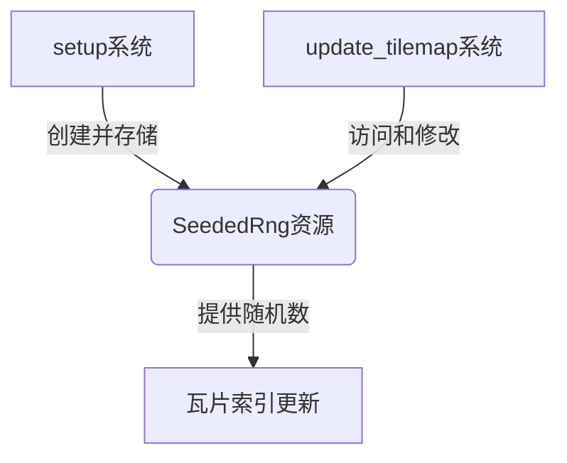

+++
title = "#19812 Reuse seeded rng in tilemap_chunk for more determinism"
date = "2025-06-25T00:00:00"
draft = false
template = "pull_request_page.html"
in_search_index = false

[extra]
current_language = "zh-cn"
available_languages = {"en" = { name = "English", url = "/pull_request/bevy/2025-06/pr-19812-en-20250625" }, "zh-cn" = { name = "中文", url = "/pull_request/bevy/2025-06/pr-19812-zh-cn-20250625" }}
labels = ["A-Rendering", "C-Examples", "C-Testing"]
+++

# Reuse seeded rng in tilemap_chunk for more determinism

## Basic Information
- **Title**: Reuse seeded rng in tilemap_chunk for more determinism
- **PR Link**: https://github.com/bevyengine/bevy/pull/19812
- **Author**: rparrett
- **Status**: MERGED
- **Labels**: A-Rendering, C-Examples, S-Ready-For-Final-Review, C-Testing
- **Created**: 2025-06-25T15:53:00Z
- **Merged**: 2025-06-25T16:30:59Z
- **Merged By**: alice-i-cecile

## Description Translation
该示例在初始设置时使用了固定种子的RNG，但在每次定时更新时使用了未设定种子的新RNG。

这导致示例在[example report](https://bevyengine.github.io/bevy-example-runner/)中每次运行时产生不同的输出。


### 解决方案

遵循其他示例中的模式，存储并重用RNG。

### 测试方法

`cargo run --example tilemap_chunk`

## The Story of This Pull Request

### 问题背景
在分析Bevy引擎的`tilemap_chunk`示例时，发现一个影响结果确定性的问题。该示例使用随机数生成器(RNG)来生成瓦片地图块，初始设置时使用了固定种子的RNG（通过`ChaCha8Rng::seed_from_u64(42)`实现），这保证了初始状态的确定性。然而，在每次定时更新时，系统会创建新的未设定种子的RNG（使用`ChaCha8Rng::from_entropy()`），这导致每次运行示例时更新阶段的输出结果不同。

这种非确定性行为影响了示例的测试可靠性。在Bevy的示例运行报告中，每次运行都会产生不同的输出结果，如PR描述中的截图所示。对于需要确定性的测试场景（如自动化测试或基准测试），这种行为是不可接受的，因为它使结果比较变得困难。

### 解决方案
为了解决这个问题，PR采用了资源复用的模式，这也是Bevy其他示例中常见的做法：
1. 创建新的资源类型`SeededRng`来包装RNG实例
2. 在初始化系统(setup)中将初始化的RNG存储为资源
3. 在更新系统(update_tilemap)中通过资源系统访问同一个RNG实例

这种方法确保整个示例生命周期中使用同一个RNG实例，从而保证更新阶段的随机操作具有与初始状态相同的确定性。

### 实现细节
关键修改是在ECS中添加新的资源类型：
```rust
#[derive(Resource, Deref, DerefMut)]
struct SeededRng(ChaCha8Rng);
```
在初始化系统中，完成RNG初始化后将其存储为资源：
```rust
commands.insert_resource(SeededRng(rng));
```
更新系统被修改为接受该资源作为参数：
```rust
fn update_tilemap(
    time: Res<Time>,
    mut query: Query<(&mut TilemapChunkIndices, &mut UpdateTimer)>,
    mut rng: ResMut<SeededRng>,  // 新增资源参数
) 
```
在更新逻辑中，直接使用传入的RNG资源而不是创建新实例：
```rust
// 之前: let mut rng = ChaCha8Rng::from_entropy();
// 现在: 直接使用 rng 资源
for _ in 0..50 {
    let index = rng.gen_range(0..indices.len());
    indices[index] = Some(rng.gen_range(0..5));
}
```

### 技术考量
1. **确定性保证**：使用固定种子的RNG并保持其状态延续，确保整个示例执行路径完全确定
2. **ECS资源模式**：遵循Bevy推荐的做法，将共享状态封装为资源，通过系统参数访问
3. **性能影响**：避免重复创建RNG实例的开销，虽然微小但符合优化原则
4. **代码一致性**：与其他Bevy示例保持相同模式，降低理解成本

### 影响
1. 修复了示例的非确定性行为，确保相同条件下始终产生相同输出
2. 提升示例的测试价值，特别适合用于渲染管线的回归测试
3. 展示Bevy资源系统的正确使用模式，为其他开发者提供参考

## Visual Representation



## Key Files Changed

### 文件：examples/2d/tilemap_chunk.rs
**修改目的**：修复示例的非确定性行为，确保每次运行产生相同输出

#### 关键变更1：定义RNG资源类型
```rust
// 新增资源类型
#[derive(Resource, Deref, DerefMut)]
struct SeededRng(ChaCha8Rng);
```

#### 关键变更2：初始化系统中存储RNG
```rust
fn setup(mut commands: Commands, assets: Res<AssetServer>) {
    let mut rng = ChaCha8Rng::seed_from_u64(42);
    // ...初始化代码...
    commands.insert_resource(SeededRng(rng));  // 存储为资源
}
```

#### 关键变更3：更新系统使用资源
```diff
 fn update_tilemap(
     time: Res<Time>,
     mut query: Query<(&mut TilemapChunkIndices, &mut UpdateTimer)>,
+    mut rng: ResMut<SeededRng>,
 ) {
     for (mut indices, mut timer) in query.iter_mut() {
         timer.tick(time.delta());
 
         if timer.just_finished() {
-            let mut rng = ChaCha8Rng::from_entropy();
             for _ in 0..50 {
                 let index = rng.gen_range(0..indices.len());
                 indices[index] = Some(rng.gen_range(0..5));
```

#### 次要优化：插件注册语法
```diff
-        .add_plugins((DefaultPlugins.set(ImagePlugin::default_nearest()),))
+        .add_plugins(DefaultPlugins.set(ImagePlugin::default_nearest()))
```

## Further Reading
1. Bevy ECS资源系统文档：https://bevyengine.org/learn/book/getting-started/resources/
2. rand_chacha crate文档：https://docs.rs/rand_chacha/latest/rand_chacha/
3. 确定性模拟概念：https://gafferongames.com/post/deterministic_lockstep/