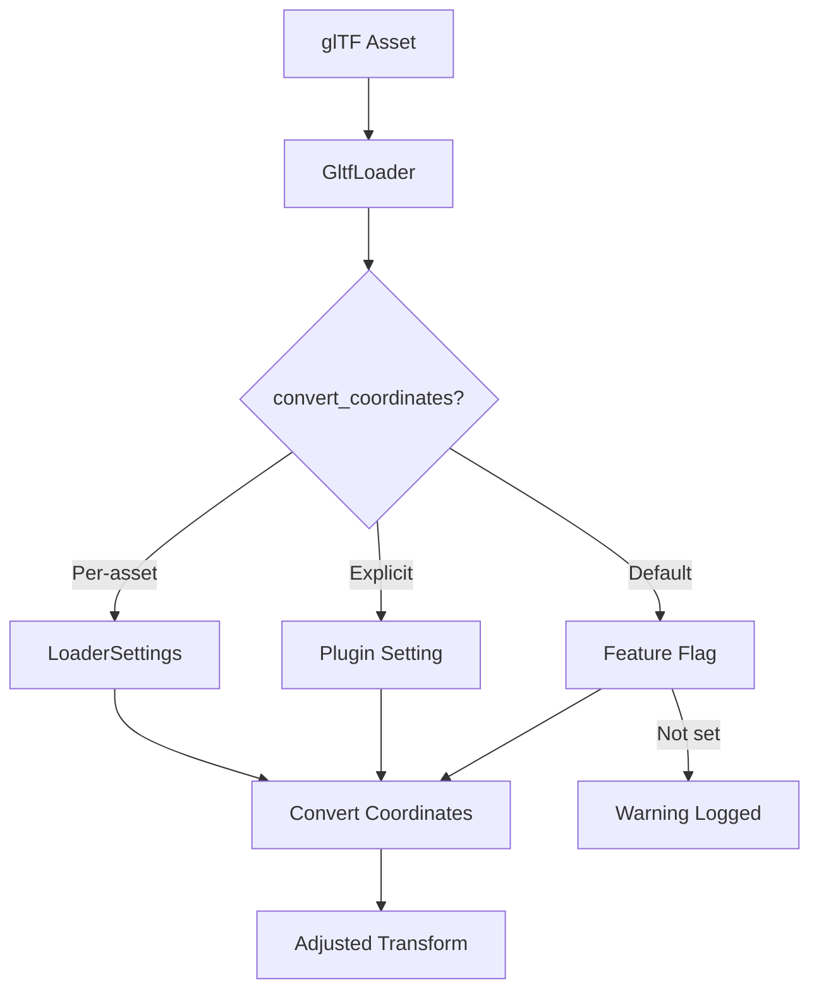

+++
title = "#19816 Nudge users into migrating to new default glTF coordinate conversion"
date = "2025-06-28T00:00:00"
draft = false
template = "pull_request_page.html"
in_search_index = true

[taxonomies]
list_display = ["show"]

[extra]
current_language = "en"
available_languages = {"en" = { name = "English", url = "/pull_request/bevy/2025-06/pr-19816-en-20250628" }, "zh-cn" = { name = "中文", url = "/pull_request/bevy/2025-06/pr-19816-zh-cn-20250628" }}
labels = ["A-Assets", "X-Blessed", "D-Straightforward", "A-glTF"]
+++

## Nudge users into migrating to new default glTF coordinate conversion

### Basic Information
- **Title**: Nudge users into migrating to new default glTF coordinate conversion
- **PR Link**: https://github.com/bevyengine/bevy/pull/19816
- **Author**: janhohenheim
- **Status**: MERGED
- **Labels**: A-Assets, S-Ready-For-Final-Review, M-Needs-Migration-Guide, M-Needs-Release-Note, X-Blessed, D-Straightforward, A-glTF
- **Created**: 2025-06-25T22:54:41Z
- **Merged**: 2025-06-28T18:55:41Z
- **Merged By**: alice-i-cecile

### Description Translation
# Objective

*Step towards https://github.com/bevyengine/bevy/issues/19686*

We now have all the infrastructure in place to migrate Bevy's default behavior when loading glTF files to respect their coordinate system. Let's start migrating! For motivation, see the issue linked above

## Solution

- Introduce a feature flag called `gltf_convert_coordinates_default`
- Currently,`GltfPlugin::convert_coordinates` defaults to `false`
- If `gltf_convert_coordinates_default` is enabled, `GltfPlugin::convert_coordinates` will default to `true`
- If `gltf_convert_coordinates_default` is not enabled *and* `GltfPlugin::convert_coordinates` is false, we assume the user is implicitly using the old behavior. Print a warning *once* in that case, but only when a glTF was actually loaded
- A user can opt into the new behavior either
  - Globally, by enabling `gltf_convert_coordinates_default` in their `Cargo.toml`
  - Globally, by enabling `GltfPlugin::convert_coordinates`
  - Per asset, by enabling `GltfLoaderSettings::convert_coordinates`
- A user can explicitly opt out of the new behavior and silence the warning by
  - Enabling `gltf_convert_coordinates_default` in their `Cargo.toml` and disabling `GltfPlugin::convert_coordinates`
- This PR also moves the existing release note into a migration guide
 
Note that I'm very open to change any features, mechanisms, warning texts, etc. as needed :)

## Future Work

- This PR leaves all examples fully functional by not enabling this flag internally yet. A followup PR will enable it as a `dev-dependency` and migrate all of our examples involving glTFs to the new behavior.
- After 0.17 (and the RC before) lands, we'll gather feedback to see if anything breaks or the suggested migration is inconvenient in some way
- If all goes well, we'll kill this flag and change the default of `GltfPlugin::convert_coordinates` to `true` in 0.18


## Testing

- Ran examples with and without the flag

### The Story of This Pull Request

The core issue addressed in this PR stems from the fundamental mismatch between Bevy's coordinate system and the glTF specification. Bevy uses a Y-up, right-handed coordinate system with -Z as forward, while glTF uses Y-up, right-handed with +Z as forward. This discrepancy causes imported glTF models to appear rotated 180 degrees around the Y-axis relative to their orientation in modeling software.

The challenge was to migrate users to the corrected coordinate handling without breaking existing projects. Previous PRs (#19633, #19685) had implemented the technical conversion capability, but changing the default behavior would immediately break scenes for all users. A gradual migration path was needed.

The solution introduces a feature flag `gltf_convert_coordinates_default` that controls the default behavior of the glTF loader. When enabled, it sets `GltfPlugin::convert_coordinates` to `true` by default. More importantly, when users load glTF assets without explicitly opting into either behavior, the system detects this and issues a one-time warning:

```rust
if !convert_by_default && !cfg!(feature = "gltf_convert_coordinates_default") {
    warn_once!(
        "Starting from Bevy 0.18, by default all imported glTF models will be rotated by 180 degrees around the Y axis to align with Bevy's coordinate system. \
        You are currently importing glTF files using the old behavior. Consider opting-in to the new import behavior by enabling the `gltf_convert_coordinates_default` feature. \
        If you encounter any issues please file a bug! \
        If you want to continue using the old behavior going forward (even when the default changes in 0.18), manually set the corresponding option in the `GltfPlugin` or `GltfLoaderSettings`. See the migration guide for more details."
    );
}
```

This warning serves multiple purposes: it informs users about the upcoming change, provides immediate migration options, and offers an escape hatch for those who need to maintain the old behavior. The `warn_once!` macro ensures the message appears only once per application run to avoid log spam.

The implementation required coordinated changes across several files. The feature flag was added to the top-level Cargo.toml and propagated through the crate hierarchy:

```toml
# Cargo.toml
gltf_convert_coordinates_default = [
  "bevy_internal/gltf_convert_coordinates_default",
]

# crates/bevy_internal/Cargo.toml
gltf_convert_coordinates_default = [
  "bevy_gltf?/gltf_convert_coordinates_default",
]
```

The default behavior in `GltfPlugin` was modified to respect the feature flag:

```rust
// crates/bevy_gltf/src/lib.rs
impl Default for GltfPlugin {
    fn default() -> Self {
        GltfPlugin {
            default_sampler: ImageSamplerDescriptor::linear(),
            custom_vertex_attributes: HashMap::default(),
            convert_coordinates: cfg!(feature = "gltf_convert_coordinates_default"),
        }
    }
}
```

The migration guide was significantly expanded with concrete examples of both global and per-asset configuration options, providing clear migration paths:

```markdown
# release-content/migration-guides/convert-coordinates.md
As the warning says, you can opt into the new behavior by enabling the `gltf_convert_coordinates_default` feature in your `Cargo.toml`:

```toml
# new behavior, converts the coordinate system of all glTF assets into Bevy's coordinate system
[dependencies]
bevy = { version = "0.17.0", features = ["gltf_convert_coordinates_default"] }
```

You can also control this on a per-asset-level:

```rust
let handle = asset_server.load_with_settings(
    "scene.gltf#Scene0",
    |s: &mut GltfLoaderSettings| {
        s.convert_coordinates = true;
    },
);
```

The approach demonstrates several good practices for breaking changes: feature flags for gradual rollout, clear warnings with actionable advice, multiple migration paths, and comprehensive documentation. The warning system in particular is well-designed - it triggers only when actual glTF assets are loaded using the old defaults, avoiding false positives.

The PR maintains backward compatibility while clearly signaling future changes. The next steps include enabling the feature in examples (as a dev-dependency), gathering user feedback during the 0.17 release cycle, and finally changing the default behavior in 0.18 after sufficient testing.

### Visual Representation



### Key Files Changed

1. **`release-content/migration-guides/convert-coordinates.md` (+26/-3)**  
   Expanded the migration guide with detailed instructions and examples for different migration scenarios.  
   ```markdown
   # Before:
   [dependencies]
   bevy = "0.17.0"
   
   # After:
   [dependencies]
   bevy = { version = "0.17.0", features = ["gltf_convert_coordinates_default"] }
   ```

2. **`crates/bevy_gltf/src/loader/mod.rs` (+13/-1)**  
   Added warning logic when old behavior is detected.  
   ```rust
   // Before:
   let convert_coordinates = match settings.convert_coordinates {
       Some(convert_coordinates) => convert_coordinates,
       None => loader.default_convert_coordinates,
   };
   
   // After:
   let convert_coordinates = match settings.convert_coordinates {
       Some(convert_coordinates) => convert_coordinates,
       None => {
           let convert_by_default = loader.default_convert_coordinates;
           if !convert_by_default && !cfg!(feature = "gltf_convert_coordinates_default") {
               warn_once!(...);
           }
           convert_by_default
       }
   };
   ```

3. **`Cargo.toml` (+5/-0)**  
   Added top-level feature flag definition.  
   ```toml
   # Added:
   gltf_convert_coordinates_default = [
     "bevy_internal/gltf_convert_coordinates_default",
   ]
   ```

4. **`crates/bevy_internal/Cargo.toml` (+4/-0)**  
   Propagated feature flag to internal crates.  
   ```toml
   # Added:
   gltf_convert_coordinates_default = [
     "bevy_gltf?/gltf_convert_coordinates_default",
   ]
   ```

5. **`crates/bevy_gltf/src/lib.rs` (+1/-1)**  
   Modified default behavior to respect feature flag.  
   ```rust
   // Before:
   convert_coordinates: false,
   
   // After:
   convert_coordinates: cfg!(feature = "gltf_convert_coordinates_default"),
   ```

### Further Reading
1. [glTF Coordinate System Specification](https://registry.khronos.org/glTF/specs/2.0/glTF-2.0.html#coordinate-system-and-units)  
2. [Bevy Feature Flags Documentation](https://github.com/bevyengine/bevy/blob/main/docs/cargo_features.md)  
3. [Gradual Migration Patterns in Rust](https://rust-lang.github.io/api-guidelines/future-proofing.html)  
4. [Original Coordinate System Issue (#19686)](https://github.com/bevyengine/bevy/issues/19686)