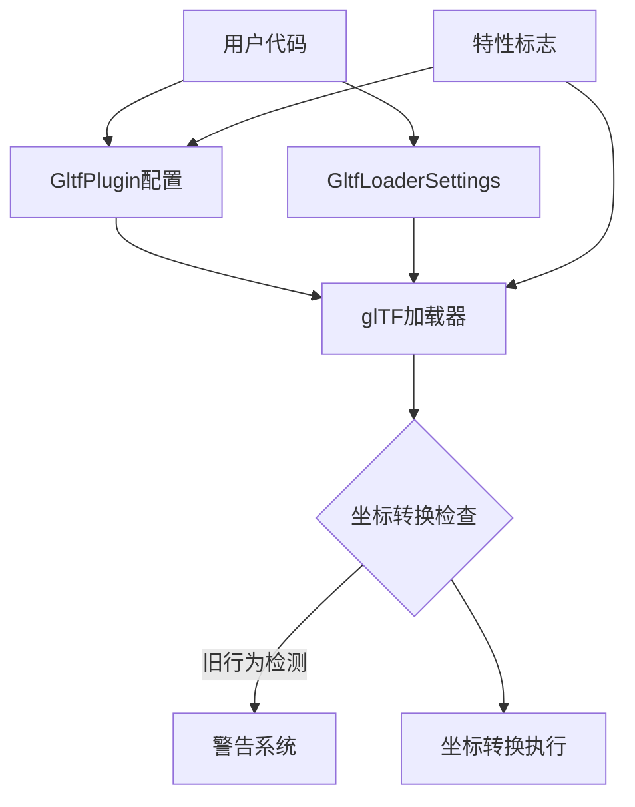

+++
title = "#19816 Nudge users into migrating to new default glTF coordinate conversion"
date = "2025-06-28T00:00:00"
draft = false
template = "pull_request_page.html"
in_search_index = false

[extra]
current_language = "zh-cn"
available_languages = {"en" = { name = "English", url = "/pull_request/bevy/2025-06/pr-19816-en-20250628" }, "zh-cn" = { name = "中文", url = "/pull_request/bevy/2025-06/pr-19816-zh-cn-20250628" }}
+++

### 标题
Nudge users into migrating to new default glTF coordinate conversion

### 基本信息
- **标题**: Nudge users into migrating to new default glTF coordinate conversion  
- **PR链接**: https://github.com/bevyengine/bevy/pull/19816  
- **作者**: janhohenheim  
- **状态**: 已合并  
- **标签**: A-Assets, S-Ready-For-Final-Review, M-Needs-Migration-Guide, M-Needs-Release-Note, X-Blessed, D-Straightforward, A-glTF  
- **创建时间**: 2025-06-25T22:54:41Z  
- **合并时间**: 2025-06-28T18:55:41Z  
- **合并者**: alice-i-cecile  

### 描述翻译
#### 目标
*实现 https://github.com/bevyengine/bevy/issues/19686 的阶段性进展*  

我们现已具备完整基础设施，可将Bevy加载glTF文件的默认行为迁移为尊重其坐标系。动机详见上述issue。

#### 解决方案
- 引入特性标志 `gltf_convert_coordinates_default`
- 当前 `GltfPlugin::convert_coordinates` 默认为 `false`
- 若启用 `gltf_convert_coordinates_default`，则 `GltfPlugin::convert_coordinates` 将默认设为 `true`
- 若未启用 `gltf_convert_coordinates_default` 且 `GltfPlugin::convert_coordinates` 为 false，则假定用户隐式使用旧行为。当实际加载glTF时打印**单次警告**
- 用户可通过以下方式启用新行为：
  - 全局：在 `Cargo.toml` 中启用 `gltf_convert_coordinates_default`
  - 全局：启用 `GltfPlugin::convert_coordinates`
  - 按资源：启用 `GltfLoaderSettings::convert_coordinates`
- 用户可通过以下方式显式禁用新行为并关闭警告：
  - 在 `Cargo.toml` 中启用 `gltf_convert_coordinates_default` 并禁用 `GltfPlugin::convert_coordinates`
- 本PR将现有发布说明迁移至指南文档

欢迎对特性机制、警告文本等进行调整。

#### 后续工作
- 本PR暂不在内部启用此标志，所有示例保持功能完整。后续PR将作为 `dev-dependency` 启用并迁移涉及glTF的示例
- 0.17版本（及RC版）发布后收集反馈
- 若一切正常，将在0.18移除该标志并将 `GltfPlugin::convert_coordinates` 默认值改为 `true`

#### 测试
- 带标志和不带标志运行示例

---

### PR技术分析

#### 问题背景
Bevy长期存在glTF坐标系不匹配问题：glTF采用右手坐标系（+Y向上, +Z向前），而Bevy使用左手坐标系（+Y向上, -Z向前）。这导致导入的glTF模型方向错误，需用户手动旋转修正（如绕Y轴旋转180度）。直接修改默认行为会破坏现有项目，需渐进式迁移方案。

#### 解决方案
引入特性标志控制默认行为，分阶段迁移：
1. 添加 `gltf_convert_coordinates_default` 特性标志
2. 当用户未显式配置且使用旧行为时触发单次警告
3. 提供三种迁移路径（全局特性/全局配置/资源级配置）
4. 保留显式禁用新行为的逃生通道

#### 实现细节
**核心变更在glTF加载流程**：当未在 `GltfLoaderSettings` 指定 `convert_coordinates` 时，检查全局默认值。若检测到用户隐式使用旧行为（未启用特性且未配置插件），通过 `warn_once!` 打印迁移提示：

```rust
// crates/bevy_gltf/src/loader/mod.rs
let convert_coordinates = match settings.convert_coordinates {
    Some(convert_coordinates) => convert_coordinates,
    None => {
        let convert_by_default = loader.default_convert_coordinates;
        if !convert_by_default && !cfg!(feature = "gltf_convert_coordinates_default") {
            warn_once!( // 关键警告逻辑
                "Starting from Bevy 0.18, by default all imported glTF models will be rotated..."
            );
        }
        convert_by_default
    }
};
```

**特性标志联动**：在 `GltfPlugin` 默认实现中绑定特性状态，实现"启用特性即启用新行为"：
```rust
// crates/bevy_gltf/src/lib.rs
impl Default for GltfPlugin {
    fn default() -> Self {
        GltfPlugin {
            ...
            convert_coordinates: cfg!(feature = "gltf_convert_coordinates_default"), // 特性控制默认值
        }
    }
}
```

**文档强化**：将原发布说明转为迁移指南，明确三种配置方式：
```markdown
# 迁移指南
## 通过Cargo特性全局启用
```toml
[dependencies]
bevy = { version = "0.17.0", features = ["gltf_convert_coordinates_default"] }
````

## 通过插件配置全局启用
```rust
app.add_plugins(GltfPlugin { convert_coordinates: true, ..default() })
````

## 按资源配置
```rust
asset_server.load_with_settings("model.gltf", |s: &mut GltfLoaderSettings| {
    s.convert_coordinates = true;
});
````
```

#### 技术考量
1. **渐进式迁移**：通过特性标志而非直接修改默认值，降低升级风险
2. **警告精准触发**：`warn_once!` 确保仅首次加载glTF时提示，避免日志刷屏
3. **逃生机制**：允许用户同时启用特性和禁用插件来保持旧行为
4. **版本路径**：明确规划0.17（过渡期）→0.18（正式切换）的迁移路线

#### 影响评估
- **用户影响**：现有项目不受影响，但会收到迁移提示
- **维护性**：新增特性标志为临时方案，计划在0.18移除
- **扩展性**：为后续完全切换默认行为建立基础设施
- **文档**：迁移指南提供清晰的操作路径，降低用户迁移成本

---

### 关键文件变更

#### `crates/bevy_gltf/src/loader/mod.rs` (+13/-1)
**变更原因**：实现警告逻辑和默认行为检测  
**关键代码**：
```rust
// 修改后
let convert_coordinates = match settings.convert_coordinates {
    Some(convert_coordinates) => convert_coordinates,
    None => {
        let convert_by_default = loader.default_convert_coordinates;
        // 检测隐式使用旧行为的情况
        if !convert_by_default && !cfg!(feature = "gltf_convert_coordinates_default") {
            warn_once!(...); // 详细警告信息
        }
        convert_by_default
    }
};
```

#### `release-content/migration-guides/convert-coordinates.md` (+26/-3)
**变更原因**：将发布说明转为正式迁移指南  
**关键增强**：
- 添加特性标志启用方式
- 明确逃生通道配置
- 增强代码示例

#### `Cargo.toml` (+5/-0) 和 `crates/bevy_internal/Cargo.toml` (+4/-0)
**变更原因**：声明新特性标志  
**关键代码**：
```toml
# 根Cargo.toml
[features]
gltf_convert_coordinates_default = ["bevy_internal/gltf_convert_coordinates_default"]

# bevy_internal/Cargo.toml
gltf_convert_coordinates_default = [
  "bevy_gltf?/gltf_convert_coordinates_default"
]
```

#### `crates/bevy_gltf/src/lib.rs` (+1/-1)
**变更原因**：绑定特性标志与插件默认值  
**关键修改**：
```rust
// 修改后
convert_coordinates: cfg!(feature = "gltf_convert_coordinates_default") // 特性控制默认值
```

---

### 组件关系图


### 延伸阅读
1. [glTF坐标系规范](https://github.com/KhronosGroup/glTF/tree/master/specification/2.0#coordinate-system-and-units)
2. [Bevy坐标系统文档](https://bevyengine.org/learn/book/getting-started/coordinate-system/)
3. [特性标志最佳实践](https://doc.rust-lang.org/cargo/reference/features.html)