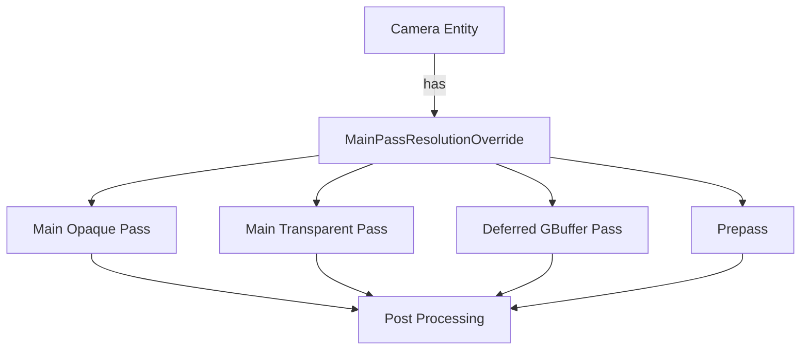

+++
title = "#19817 Resolution override"
date = "2025-06-27T00:00:00"
draft = false
template = "pull_request_page.html"
in_search_index = true

[taxonomies]
list_display = ["show"]

[extra]
current_language = "en"
available_languages = {"en" = { name = "English", url = "/pull_request/bevy/2025-06/pr-19817-en-20250627" }, "zh-cn" = { name = "中文", url = "/pull_request/bevy/2025-06/pr-19817-zh-cn-20250627" }}
labels = ["C-Bug", "A-Rendering"]
+++

### Resolution override

## Basic Information
- **Title**: Resolution override
- **PR Link**: https://github.com/bevyengine/bevy/pull/19817
- **Author**: tychedelia
- **Status**: MERGED
- **Labels**: C-Bug, A-Rendering, S-Ready-For-Final-Review
- **Created**: 2025-06-26T00:55:00Z
- **Merged**: 2025-06-27T16:50:47Z
- **Merged By**: alice-i-cecile

## Description Translation
This PR adds a `MainPassResolutionOverride` component for 3D cameras that allows rendering the main pass at a different resolution than the camera's viewport. This is useful for performance optimization where the main geometry pass can be rendered at lower resolution while keeping post-processing at full resolution.

## The Story of This Pull Request

The core problem addressed in this PR is the inability to decouple a 3D camera's main pass resolution from its viewport size. Previously, all render passes used the camera's full viewport resolution. This created a limitation when developers wanted to optimize performance by rendering the main geometry pass at lower resolution while maintaining full-resolution post-processing effects.

The solution introduces a new `MainPassResolutionOverride` component. When added to a camera entity, this component specifies an alternative resolution (in physical pixels) for the main geometry passes. The implementation required modifying all main render pass nodes to conditionally apply this resolution override when setting their viewports.

The key technical insight is that viewport handling needed to become conditional. Each render pass node was updated to:
1. Include an optional `MainPassResolutionOverride` reference in its query
2. Apply the resolution override when configuring the render pass viewport
3. Maintain original behavior when no override exists

A new method `with_override()` was added to the `Viewport` struct to handle the resolution replacement cleanly:

```rust
// crates/bevy_render/src/camera/camera.rs
impl Viewport {
    pub fn with_override(
        &self,
        main_pass_resolution_override: Option<&MainPassResolutionOverride>,
    ) -> Self {
        let mut viewport = self.clone();
        if let Some(override_size) = main_pass_resolution_override {
            viewport.physical_size = **override_size;
        }
        viewport
    }
}
```

This change affects multiple rendering subsystems including core 3D passes, deferred rendering, prepass, and meshlet rendering. Each required similar modifications to their viewport handling logic. For example, in the main opaque pass:

```rust
// crates/bevy_core_pipeline/src/core_3d/main_opaque_pass_3d_node.rs
// Before:
if let Some(viewport) = camera.viewport.as_ref() {
    render_pass.set_camera_viewport(viewport);
}

// After:
if let Some(viewport) = camera.viewport.as_ref() {
    render_pass.set_camera_viewport(&viewport.with_override(resolution_override));
}
```

The component was registered in the camera module to ensure proper reflection support:

```rust
// crates/bevy_render/src/camera/mod.rs
app.register_type::<MainPassResolutionOverride>()
```

An important constraint is that the override resolution must be smaller than the camera's viewport size. This prevents upscaling artifacts and maintains the expectation that post-processing operates at the full viewport resolution. The implementation deliberately avoids affecting post-processing passes by only applying the override to geometry-rendering stages.

This change enables significant performance optimizations for GPU-bound applications by reducing fragment shader workload in the main geometry passes. It maintains compatibility with existing rendering features while introducing minimal complexity - a single new component and a small helper method. The component-based approach follows Bevy's ECS patterns, making it straightforward to integrate into existing projects.

## Visual Representation



## Key Files Changed

1. `crates/bevy_render/src/camera/camera.rs` (+24/-0)
   - Added `MainPassResolutionOverride` component
   - Implemented `with_override()` method for `Viewport`

```rust
// File: crates/bevy_render/src/camera/camera.rs
// New component:
#[derive(Component, Reflect, Deref)]
#[reflect(Component)]
pub struct MainPassResolutionOverride(pub UVec2);

// New method:
impl Viewport {
    pub fn with_override(
        &self,
        main_pass_resolution_override: Option<&MainPassResolutionOverride>,
    ) -> Self {
        let mut viewport = self.clone();
        if let Some(override_size) = main_pass_resolution_override {
            viewport.physical_size = **override_size;
        }
        viewport
    }
}
```

2. `crates/bevy_pbr/src/meshlet/material_shade_nodes.rs` (+10/-4)
   - Added resolution override to meshlet render passes

```rust
// File: crates/bevy_pbr/src/meshlet/material_shade_nodes.rs
// Before:
if let Some(viewport) = camera.viewport.as_ref() {
    render_pass.set_camera_viewport(viewport);
}

// After:
if let Some(viewport) = camera.viewport.as_ref() {
    render_pass.set_camera_viewport(&viewport.with_override(resolution_override));
}
```

3. `crates/bevy_core_pipeline/src/core_3d/main_transmissive_pass_3d_node.rs` (+6/-3)
   - Updated transmissive pass to support resolution override

```rust
// File: crates/bevy_core_pipeline/src/core_3d/main_transmissive_pass_3d_node.rs
// Query updated:
(
    // ...existing fields
    Option<&'static MainPassResolutionOverride>,
)

// Viewport setting updated:
if let Some(viewport) = camera.viewport.as_ref() {
    render_pass.set_camera_viewport(&viewport.with_override(resolution_override));
}
```

4. `crates/bevy_core_pipeline/src/deferred/node.rs` (+5/-3)
   - Added override to deferred rendering pass

```rust
// File: crates/bevy_core_pipeline/src/deferred/node.rs
// Query updated:
(
    // ...existing fields
    Option<&'static MainPassResolutionOverride>,
)

// Viewport setting updated:
if let Some(viewport) = camera.viewport.as_ref() {
    render_pass.set_camera_viewport(&viewport.with_override(resolution_override));
}
```

5. `crates/bevy_core_pipeline/src/prepass/node.rs` (+5/-3)
   - Modified prepass to support resolution override

```rust
// File: crates/bevy_core_pipeline/src/prepass/node.rs
// Query updated:
(
    // ...existing fields
    Option<&'static MainPassResolutionOverride>,
)

// Viewport setting updated:
if let Some(viewport) = camera.viewport.as_ref() {
    render_pass.set_camera_viewport(&viewport.with_override(resolution_override));
}
```

## Further Reading
1. [Bevy Render Pipeline Documentation](https://bevyengine.org/learn/book/rendering/pipelines/)
2. [WebGPU Viewport Specification](https://www.w3.org/TR/webgpu/#viewport)
3. [Resolution Scaling Techniques in Real-Time Rendering](https://developer.nvidia.com/gpugems/gpugems2/part-iv-image-processing/chapter-22-fast-filter-wide-blurs)