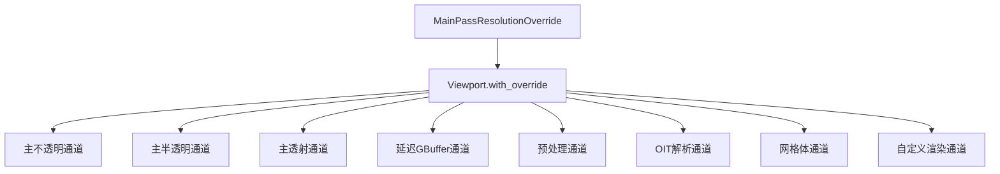

+++
title = "#19817 Resolution override"
date = "2025-06-27T00:00:00"
draft = false
template = "pull_request_page.html"
in_search_index = false

[extra]
current_language = "zh-cn"
available_languages = {"en" = { name = "English", url = "/pull_request/bevy/2025-06/pr-19817-en-20250627" }, "zh-cn" = { name = "中文", url = "/pull_request/bevy/2025-06/pr-19817-zh-cn-20250627" }}
+++

# 分辨率覆盖功能分析报告

## 基本信息
- **标题**: Resolution override
- **PR链接**: https://github.com/bevyengine/bevy/pull/19817
- **作者**: tychedelia
- **状态**: 已合并
- **标签**: C-Bug, A-Rendering, S-Ready-For-Final-Review
- **创建时间**: 2025-06-26T00:55:00Z
- **合并时间**: 2025-06-27T16:50:47Z
- **合并者**: alice-i-cecile

## 描述翻译
该PR引入了一个`MainPassResolutionOverride`组件，允许在渲染主通道时覆盖分辨率。这对于在分辨率低于最终输出时渲染主通道非常有用，例如在动态分辨率或升采样技术中。

使用说明：
- 在3D相机实体上添加`MainPassResolutionOverride`组件
- 覆盖分辨率必须小于相机的视口尺寸
- 分辨率以物理像素为单位指定

```rust
commands.spawn((
    Camera3dBundle::default(),
    MainPassResolutionOverride(UVec2::new(320, 240)),
));
```

## PR分析

### 问题背景
在Bevy渲染系统中，相机视口(Viewport)定义了渲染目标区域，但缺乏在渲染主通道时动态覆盖分辨率的机制。这限制了实现动态分辨率调整、升采样等优化技术的能力。具体表现为：
- 所有渲染通道直接使用相机的原始视口尺寸
- 无法在保持最终输出分辨率的同时降低主通道渲染分辨率
- 相关优化技术难以集成到现有渲染管线中

### 解决方案
核心方案是引入`MainPassResolutionOverride`组件和对应的视口调整机制：
1. 创建新组件存储分辨率覆盖值
2. 扩展`Viewport`结构体，添加`with_override()`方法
3. 修改所有主渲染节点，查询分辨率覆盖组件
4. 在设置渲染通道视口时应用分辨率覆盖

#### 关键技术实现
在`camera.rs`中定义新组件和视口方法：
```rust
#[derive(Component, Reflect, Deref)]
#[reflect(Component)]
pub struct MainPassResolutionOverride(pub UVec2);

impl Viewport {
    pub fn with_override(
        &self,
        main_pass_resolution_override: Option<&MainPassResolutionOverride>,
    ) -> Self {
        let mut viewport = self.clone();
        if let Some(override_size) = main_pass_resolution_override {
            viewport.physical_size = **override_size;
        }
        viewport
    }
}
```

#### 渲染节点改造
所有主渲染节点更新为：
1. 在视图查询中添加`Option<&'static MainPassResolutionOverride>`
2. 设置视口时调用`with_override()`

以主不透明通道节点为例：
```rust
// 修改前
if let Some(viewport) = camera.viewport.as_ref() {
    render_pass.set_camera_viewport(viewport);
}

// 修改后
if let Some(viewport) = camera.viewport.as_ref() {
    render_pass.set_camera_viewport(&viewport.with_override(resolution_override));
}
```

### 实现细节
修改涉及多个渲染管线模块：
- **核心3D管线**：主不透明/半透明/透射通道
- **延迟渲染**：GBuffer预处理节点
- **预处理器**：后期预处理节点
- **PBR网格体**：材质着色相关节点
- **自定义渲染阶段**：示例更新

所有修改遵循相同模式：
1. 添加分辨率覆盖组件查询
2. 在视口设置时应用覆盖
3. 保持原始视口位置和逻辑尺寸不变

### 技术考量
1. **可选组件设计**：使用`Option`查询确保向后兼容
2. **最小化克隆开销**：仅在存在覆盖时克隆Viewport
3. **尺寸验证**：依赖开发者确保覆盖尺寸小于视口
4. **作用域限定**：仅影响主通道分辨率，不影响后处理

### 影响与价值
1. **性能优化**：支持主通道降分辨率渲染
2. **功能扩展**：为动态分辨率/升采样提供基础设施
3. **API一致性**：统一处理所有主渲染通道
4. **错误修复**：解决分辨率覆盖缺失问题(C-Bug标签)

## 可视化关系


## 关键文件变更

### `crates/bevy_render/src/camera/camera.rs`
添加分辨率覆盖组件和视口调整方法
```rust
// 新增组件
#[derive(Component, Reflect, Deref)]
#[reflect(Component)]
pub struct MainPassResolutionOverride(pub UVec2);

// Viewport新增方法
pub fn with_override(
    &self,
    main_pass_resolution_override: Option<&MainPassResolutionOverride>,
) -> Self {
    let mut viewport = self.clone();
    if let Some(override_size) = main_pass_resolution_override {
        viewport.physical_size = **override_size;
    }
    viewport
}
```

### `crates/bevy_core_pipeline/src/core_3d/main_opaque_pass_3d_node.rs`
更新主不透明通道节点
```rust
// 查询添加分辨率覆盖
(
    &'static ExtractedCamera,
    ...,
    Option<&'static MainPassResolutionOverride>,
)

// 视口设置应用覆盖
if let Some(viewport) = camera.viewport.as_ref() {
    render_pass.set_camera_viewport(&viewport.with_override(resolution_override));
}
```

### `crates/bevy_pbr/src/meshlet/material_shade_nodes.rs`
更新网格体着色节点
```rust
// 在MeshletMainOpaquePass3dNode查询中添加
Option<&'static MainPassResolutionOverride>,

// 应用分辨率覆盖
if let Some(viewport) = camera.viewport.as_ref() {
    render_pass.set_camera_viewport(&viewport.with_override(resolution_override));
}
```

### `examples/shader/custom_render_phase.rs`
更新自定义渲染示例
```rust
// 查询添加分辨率覆盖
(
    &'static ExtractedCamera,
    &'static ExtractedView,
    &'static ViewTarget,
    Option<&'static MainPassResolutionOverride>,
)

// 应用分辨率覆盖
if let Some(viewport) = camera.viewport.as_ref() {
    render_pass.set_camera_viewport(&viewport.with_override(resolution_override));
}
```

## 延伸阅读
1. [Bevy渲染管线架构](https://bevyengine.org/learn/book/next/render/architecture)
2. [动态分辨率技术解析](https://developer.nvidia.com/dynamic-resolution-rendering)
3. [视口管理最佳实践](https://registry.khronos.org/vulkan/specs/1.3-extensions/html/vkspec.html#viewport-state)
4. [Bevy组件系统文档](https://bevyengine.org/learn/book/next/programming/ecs)