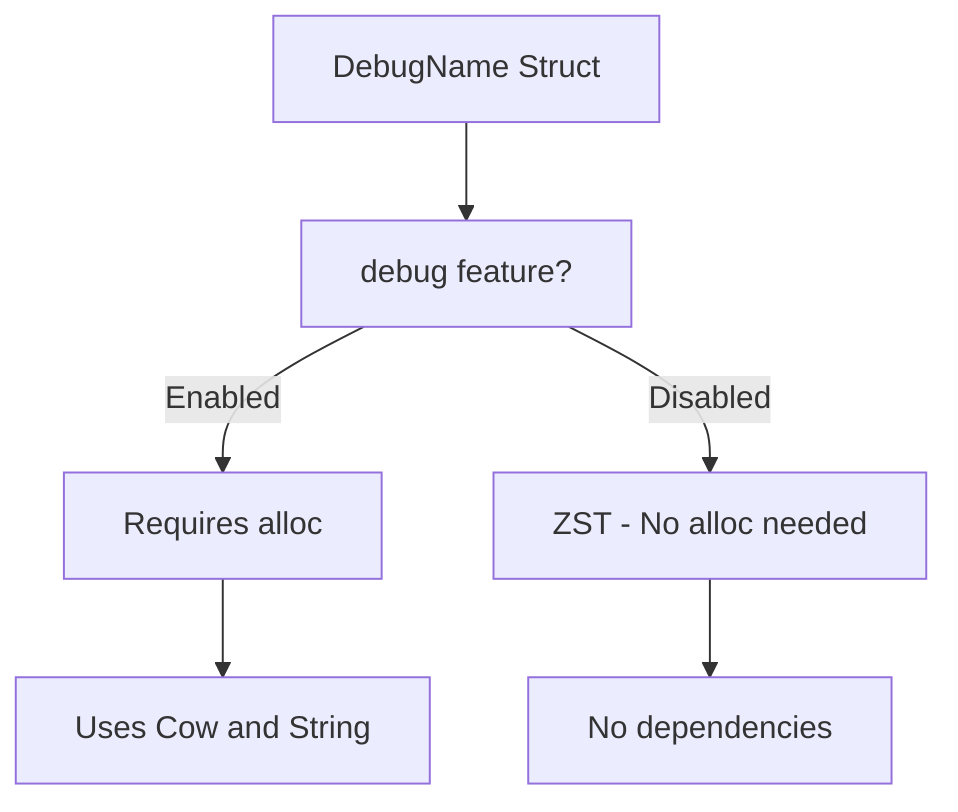

+++
title = "#19824 Make `DebugName` work when building with no default features"
date = "2025-06-29T00:00:00"
draft = false
template = "pull_request_page.html"
in_search_index = true

[taxonomies]
list_display = ["show"]

[extra]
current_language = "en"
available_languages = {"en" = { name = "English", url = "/pull_request/bevy/2025-06/pr-19824-en-20250629" }, "zh-cn" = { name = "中文", url = "/pull_request/bevy/2025-06/pr-19824-zh-cn-20250629" }}
labels = ["C-Code-Quality", "A-Utils"]
+++

# Technical Analysis of PR #19824: Make `DebugName` work when building with no default features

## Basic Information
- **Title**: Make `DebugName` work when building with no default features
- **PR Link**: https://github.com/bevyengine/bevy/pull/19824
- **Author**: chescock
- **Status**: MERGED
- **Labels**: C-Code-Quality, S-Ready-For-Final-Review, A-Utils
- **Created**: 2025-06-26T17:52:56Z
- **Merged**: 2025-06-29T03:05:05Z
- **Merged By**: alice-i-cecile

## Description Translation
# Objective

Let `bevy_utils` build with no default features.  

`cargo build -p bevy_utils --no-default-features` currently fails with 

```
error[E0433]: failed to resolve: use of unresolved module or unlinked crate `alloc`
 --> crates\bevy_utils\src\debug_info.rs:1:5
  |
1 | use alloc::{borrow::Cow, fmt, string::String};
  |     ^^^^^ use of unresolved module or unlinked crate `alloc`
  |
  = help: add `extern crate alloc` to use the `alloc` crate

error[E0432]: unresolved import `alloc`
 --> crates\bevy_utils\src\debug_info.rs:1:5
  |
1 | use alloc::{borrow::Cow, fmt, string::String};
  |     ^^^^^ help: a similar path exists: `core::alloc`
```

I would have expected CI to catch this earlier, but I have not investigated why it did not.  

## Solution

Wrap the parts of `DebugName` that use `Cow` and `String` in `cfg::alloc!`.  

If the `debug` feature is enabled, then `DebugName` itself stores a `Cow`, so make the `debug` feature require `bevy_platform/alloc`.  

That is, you can use `DebugName` in no-std contexts when it's just a ZST!  (I bet it's even possible to support no-std `debug` by storing `&'static str` instead of `Cow<'static, str>`, but that seemed like too much complexity for now.)

## The Story of This Pull Request

The problem surfaced when attempting to build `bevy_utils` with no default features. The build failed because `debug_info.rs` unconditionally imported `alloc` types like `Cow` and `String`, even when building without the `alloc` feature. This violated the crate's ability to function in no_std environments without allocation support.

The core issue was that `DebugName` methods and traits required `alloc` even when the `debug` feature was disabled. This was problematic because:
1. `DebugName` is designed to be a zero-sized type (ZST) when `debug` is disabled
2. The current implementation leaked allocator dependencies even in this ZST mode
3. The CI pipeline didn't catch this because it likely didn't test the no-default-features configuration

The solution approach focused on:
1. Making `debug` feature explicitly require allocator support
2. Conditionally compiling alloc-dependent code only when alloc is available
3. Maintaining ZST behavior for `DebugName` when `debug` is disabled

The implementation used Bevy's existing `cfg::alloc!` macro to wrap alloc-dependent code. The key changes were:

**Cargo.toml changes**:
```toml
# Before:
debug = []

# After:
debug = ["bevy_platform/alloc"]
```
This ensures that enabling the `debug` feature automatically enables allocator support.

**debug_info.rs changes**:
```rust
// Before:
use alloc::{borrow::Cow, fmt, string::String};

// After:
use crate::cfg;
cfg::alloc! {
    use alloc::{borrow::Cow, fmt, string::String};
}
```
This restricts alloc imports to only when alloc is available.

The `Display` implementation was moved inside the alloc guard:
```rust
// Before:
impl fmt::Display for DebugName {
    fn fmt(&self, f: &mut core::fmt::Formatter<'_>) -> core::fmt::Result {
        #[cfg(feature = "debug")]
        f.write_str(self.name.as_ref())?;
        #[cfg(not(feature = "debug"))]
        f.write_str(FEATURE_DISABLED)?;

        Ok(())
    }
}

// After:
cfg::alloc! {
    impl fmt::Display for DebugName {
        // Implementation remains the same but now conditionally compiled
    }
}
```

Similarly, the `owned()` method and `From` implementations were wrapped:
```rust
cfg::alloc! {
    /// Create a new `DebugName` from a `String`
    #[cfg_attr(not(feature = "debug"), expect(unused_variables))]
    pub fn owned(value: String) -> Self {
        // Implementation
    }
    
    impl From<Cow<'static, str>> for DebugName { ... }
    impl From<String> for DebugName { ... }
}
```

These changes ensure that:
- When `debug` is enabled, `alloc` is required (via Cargo.toml)
- When `debug` is disabled, `DebugName` remains a ZST with no alloc dependencies
- The crate can now build with no default features

The trade-offs considered:
1. The PR explicitly decided against supporting `debug` in no-std environments using `&'static str` due to complexity
2. The solution maintains existing functionality while fixing the build issue
3. Conditional compilation adds some complexity but keeps the no_std path clean

The impact is straightforward: `bevy_utils` can now be built with `--no-default-features` without compilation errors. This improves the crate's flexibility for embedded and resource-constrained environments where allocators might not be available.

## Visual Representation



## Key Files Changed

### crates/bevy_utils/Cargo.toml
**Changes**: Added alloc dependency to debug feature  
**Why**: Ensures allocator is available when debug feature is enabled  
**Diff**:
```diff
- debug = []
+ debug = ["bevy_platform/alloc"]
```

### crates/bevy_utils/src/debug_info.rs
**Changes**: Conditionally compiled alloc-dependent code  
**Why**: Prevents build failures when alloc is unavailable  
**Key modifications**:

1. Conditional imports:
```diff
- use alloc::{borrow::Cow, fmt, string::String};
+ use crate::cfg;
+ cfg::alloc! {
+     use alloc::{borrow::Cow, fmt, string::String};
+ }
```

2. Conditional Display implementation:
```diff
- impl fmt::Display for DebugName {
-     // ...
- }
+ cfg::alloc! {
+     impl fmt::Display for DebugName {
+         // ...
+     }
+ }
```

3. Conditional methods and trait implementations:
```diff
- pub fn owned(value: String) -> Self { ... }
- impl From<Cow<'static, str>> for DebugName { ... }
- impl From<String> for DebugName { ... }

+ cfg::alloc! {
+     pub fn owned(value: String) -> Self { ... }
+     impl From<Cow<'static, str>> for DebugName { ... }
+     impl From<String> for DebugName { ... }
+ }
```

## Further Reading
1. [Rust Conditional Compilation](https://doc.rust-lang.org/reference/conditional-compilation.html)
2. [Bevy's Platform Abstraction](https://github.com/bevyengine/bevy/tree/main/crates/bevy_platform)
3. [No-std Programming in Rust](https://rust-embedded.github.io/book/intro/no-std.html)
4. [Understanding Zero-Sized Types](https://doc.rust-lang.org/nomicon/exotic-sizes.html#zero-sized-types-zsts)