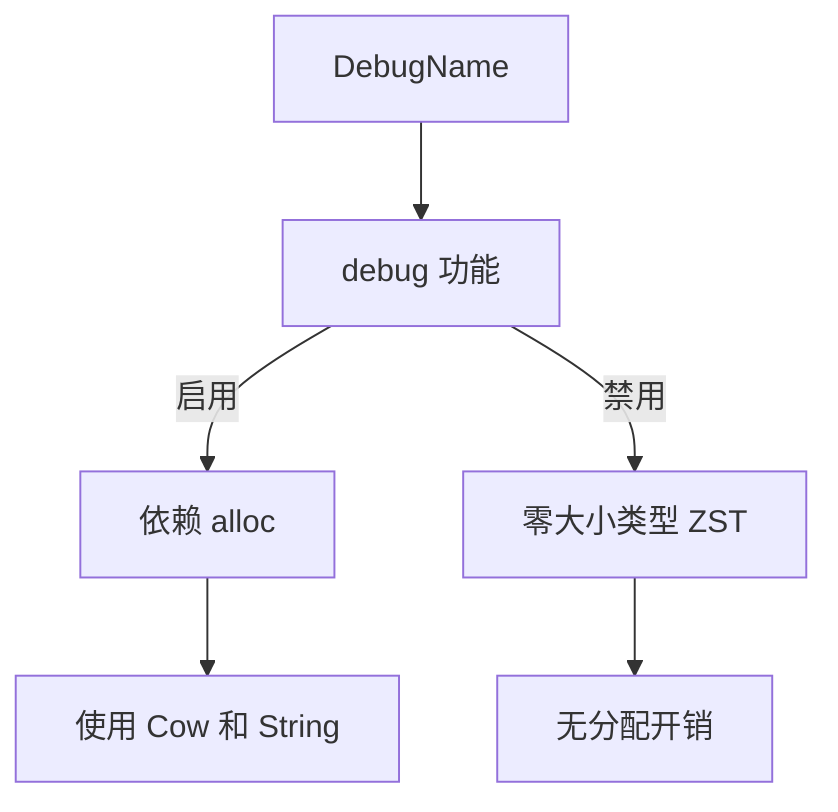

+++
title = "#19824 Make `DebugName` work when building with no default features"
date = "2025-06-29T00:00:00"
draft = false
template = "pull_request_page.html"
in_search_index = false

[extra]
current_language = "zh-cn"
available_languages = {"en" = { name = "English", url = "/pull_request/bevy/2025-06/pr-19824-en-20250629" }, "zh-cn" = { name = "中文", url = "/pull_request/bevy/2025-06/pr-19824-zh-cn-20250629" }}
+++

## 标题  
**Make `DebugName` work when building with no default features**  

### 基本信息  
- **标题**: Make `DebugName` work when building with no default features  
- **PR链接**: https://github.com/bevyengine/bevy/pull/19824  
- **作者**: chescock  
- **状态**: 已合并 (MERGED)  
- **标签**: C-Code-Quality, S-Ready-For-Final-Review, A-Utils  
- **创建时间**: 2025-06-26T17:52:56Z  
- **合并时间**: 2025-06-29T03:05:05Z  
- **合并者**: alice-i-cecile  

### 描述翻译  
**目标**  
使 `bevy_utils` 能在无默认功能 (no default features) 的情况下构建。  

`cargo build -p bevy_utils --no-default-features` 当前会失败并报错：  

```  
error[E0433]: failed to resolve: use of unresolved module or unlinked crate `alloc`  
 --> crates\bevy_utils\src\debug_info.rs:1:5  
  |  
1 | use alloc::{borrow::Cow, fmt, string::String};  
  |     ^^^^^ use of unresolved module or unlinked crate `alloc`  
  |  
  = help: add `extern crate alloc` to use the `alloc` crate  

error[E0432]: unresolved import `alloc`  
 --> crates\bevy_utils\src\debug_info.rs:1:5  
  |  
1 | use alloc::{borrow::Cow, fmt, string::String};  
  |     ^^^^^ help: a similar path exists: `core::alloc`  
```  

本应通过 CI 更早捕获此问题，但未调查具体原因。  

**解决方案**  
将 `DebugName` 中使用 `Cow` 和 `String` 的部分用 `cfg::alloc!` 宏包裹。  

若启用 `debug` 功能，则 `DebugName` 自身会存储一个 `Cow`，因此需让 `debug` 功能依赖 `bevy_platform/alloc`。  

这意味着在无 `alloc` 的上下文（如 no-std 环境）中，当 `DebugName` 仅作为零大小类型（ZST）时仍可使用！（理论上可通过改用 `&'static str` 替代 `Cow<'static, str>` 支持 no-std 下的 `debug`，但当前暂不引入此复杂度。）  

---

### 问题背景  
此 PR 解决了一个具体的技术问题：当用户以 `--no-default-features` 标志构建 `bevy_utils` 时，编译会因 `alloc` 依赖缺失而失败。错误源于 `debug_info.rs` 中无条件导入了 `alloc` 模块，而该模块在无默认功能（如 `std`）的 no-std 环境中不可用。这导致 `DebugName` 类型无法在无分配器（allocator）的环境中使用，限制了框架的灵活性。  

### 解决方案设计  
核心思路是通过条件编译隔离 `alloc` 依赖：  
1. **功能依赖调整**：将 `debug` 功能与 `bevy_platform/alloc` 显式绑定，确保启用 `debug` 时分配器可用。  
2. **条件编译隔离**：用 `cfg::alloc!` 宏包裹所有依赖 `alloc` 的代码路径（如 `Cow` 和 `String` 操作），使这些代码仅在分配器存在时编译。  
3. **保留零开销抽象**：未启用 `debug` 时，`DebugName` 退化为零大小类型（ZST），避免无谓开销。  

权衡考虑：  
- **未采用方案**：在 no-std 下用 `&'static str` 替代 `Cow` 虽可行，但会增加类型复杂度，与当前目标（快速修复）不符。  
- **关键决策**：保持 `DebugName` 的轻量化特性，确保其在资源受限环境中仍可用。  

### 实现细节  
#### 1. 功能依赖调整 (`Cargo.toml`)  
```toml
# 修改前
debug = []

# 修改后
debug = ["bevy_platform/alloc"]
```  
此变更确保启用 `debug` 时必然启用分配器，避免 `alloc` 解析失败。  

#### 2. 条件编译隔离 (`debug_info.rs`)  
**关键变更1**: 隔离 `alloc` 导入  
```rust
// 修改前
use alloc::{borrow::Cow, fmt, string::String};

// 修改后
use crate::cfg;
cfg::alloc! {
    use alloc::{borrow::Cow, fmt, string::String};
}
```  

**关键变更2**: 为 `Display` trait 实现添加条件编译  
```rust
// 修改前
impl fmt::Display for DebugName {
    fn fmt(&self, f: &mut core::fmt::Formatter<'_>) -> core::fmt::Result {
        #[cfg(feature = "debug")]
        f.write_str(self.name.as_ref())?;
        #[cfg(not(feature = "debug"))]
        f.write_str(FEATURE_DISABLED)?;
        Ok(())
    }
}

// 修改后
cfg::alloc! {
    impl fmt::Display for DebugName {
        // 实现体不变，但仅在 alloc 存在时编译
    }
}
```  

**关键变更3**: 隔离依赖 `String` 的方法  
```rust
// 修改前
pub fn owned(value: String) -> Self { ... }

// 修改后
cfg::alloc! {
    pub fn owned(value: String) -> Self { ... }
}
```  

**关键变更4**: 隔离 `From` trait 实现  
```rust
// 修改前
impl From<Cow<'static, str>> for DebugName { ... }
impl From<String> for DebugName { ... }

// 修改后
cfg::alloc! {
    impl From<Cow<'static, str>> for DebugName { ... }
    impl From<String> for DebugName { ... }
}
```  

### 技术洞察  
1. **条件编译策略**：  
   - 使用 `cfg::alloc!`（Bevy 内部宏）而非原生 `#[cfg(feature = "alloc")]`，统一处理 `alloc` 可用性逻辑。  
   - 宏展开后，内部代码仅在 `alloc` 存在时编译，否则整块代码被移除。  

2. **零开销设计**：  
   - 未启用 `debug` 时，`DebugName` 不包含实际数据（仅作为 ZST），无运行时开销。  
   - 启用 `debug` 但无 `alloc` 的场景被显式禁止（通过功能依赖），避免未定义行为。  

3. **API 兼容性**：  
   - 公有方法（如 `owned`）仅在 `alloc` 存在时暴露，避免用户在不支持环境调用无效接口。  
   - `#[cfg_attr(not(feature = "debug"), expect(unused_variables))]` 抑制无关编译警告，保持输出清洁。  

### 影响总结  
1. **构建兼容性**：  
   - `cargo build -p bevy_utils --no-default-features` 现在可通过编译，支持无分配器环境。  
2. **功能无损**：  
   - 启用 `debug` 时行为不变，仍完整支持动态字符串。  
3. **维护性提升**：  
   - 显式功能依赖消除隐式假设，降低后续维护风险。  

### 视觉关系  


### 关键文件变更  
#### `crates/bevy_utils/src/debug_info.rs`  
```rust
// 修改前：无条件使用 alloc
use alloc::{borrow::Cow, fmt, string::String};

// 修改后：条件编译
use crate::cfg;
cfg::alloc! {
    use alloc::{borrow::Cow, fmt, string::String};
}
```
```rust
// 修改前：Display 实现始终存在
impl fmt::Display for DebugName { ... }

// 修改后：仅在 alloc 存在时编译
cfg::alloc! {
    impl fmt::Display for DebugName { ... }
}
```

#### `crates/bevy_utils/Cargo.toml`  
```toml
# 修改前：debug 功能无依赖
debug = []

# 修改后：debug 显式依赖 alloc
debug = ["bevy_platform/alloc"]
```

### 延伸阅读  
1. [Rust 条件编译](https://doc.rust-lang.org/reference/conditional-compilation.html)  
2. [Bevy 功能标志设计](https://github.com/bevyengine/bevy/blob/main/docs/plugins_guidelines.md#feature-flags)  
3. [零大小类型 (ZST) 应用](https://doc.rust-lang.org/nomicon/exotic-sizes.html#zero-sized-types-zsts)