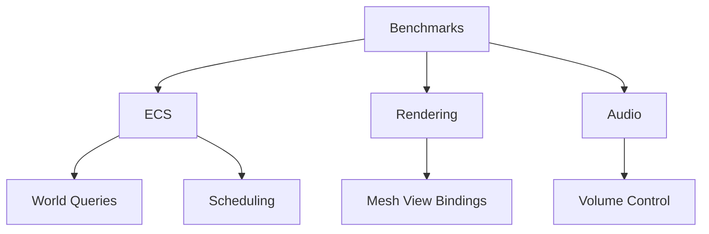

+++
title = "#19825 Upgrade to Rust 1.88"
date = "2025-06-26T00:00:00"
draft = false
template = "pull_request_page.html"
in_search_index = true

[taxonomies]
list_display = ["show"]

[extra]
current_language = "en"
available_languages = {"en" = { name = "English", url = "/pull_request/bevy/2025-06/pr-19825-en-20250626" }, "zh-cn" = { name = "中文", url = "/pull_request/bevy/2025-06/pr-19825-zh-cn-20250626" }}
labels = ["D-Trivial", "C-Code-Quality", "P-Critical", "A-Cross-Cutting"]
+++

# Technical Analysis: Upgrade to Rust 1.88

## Basic Information
- **Title**: Upgrade to Rust 1.88
- **PR Link**: https://github.com/bevyengine/bevy/pull/19825
- **Author**: tychedelia
- **Status**: MERGED
- **Labels**: D-Trivial, C-Code-Quality, S-Ready-For-Final-Review, P-Critical, A-Cross-Cutting
- **Created**: 2025-06-26T19:04:47Z
- **Merged**: 2025-06-26T19:55:46Z
- **Merged By**: alice-i-cecile

## Description Translation
Upgrade to Rust 1.88

## The Story of This Pull Request

The primary objective of this PR was to update the Bevy engine to use Rust 1.88, taking advantage of new language features and syntax improvements. The most significant change introduced in Rust 1.88 is the stabilization of `format_args_capture`, which allows direct variable interpolation in format strings. This eliminates the need for explicit variable naming in format strings, reducing boilerplate and improving code readability.

The implementation approach was straightforward but widespread: systematically replace explicit variable formatting with the new inline capture syntax. This required modifying format strings throughout the codebase, particularly in benchmarking code, diagnostic messages, and UI text formatting. The changes were mechanical but touched multiple areas of the codebase, including the ECS, rendering, audio, and UI systems.

Key technical insights from this upgrade:
1. The new format syntax (`format!("{variable}")` instead of `format!("{}", variable)`) provides more concise and readable string formatting
2. Reduced visual clutter in complex format strings with multiple variables
3. Eliminated potential mismatches between format placeholders and arguments
4. Maintained full backward compatibility with existing formatting behavior

The changes were implemented by:
1. Identifying all instances of `format!` macros with explicit variable references
2. Converting them to use direct variable capture syntax
3. Preserving all existing functionality while reducing code verbosity
4. Adding specific lint expectations where necessary to handle false positives

For example, in benchmarking code:
```rust
// Before:
group.bench_function(format!("size_4_events_{}", count), |b| { ... });

// After:
group.bench_function(format!("size_4_events_{count}"), |b| { ... });
```

The impact of these changes is primarily improved code quality and maintainability. The new syntax is more resistant to errors from argument misalignment and reduces cognitive load when reading complex format strings. Additionally, several clippy lints were addressed where the new Rust version introduced warnings, such as `clippy::mut_from_ref` and `clippy::neg_multiply`, with explicit expectations added to handle false positives.

## Visual Representation



## Key Files Changed

### `benches/benches/bevy_ecs/world/world_get.rs`
Changes: Updated benchmark naming to use direct variable capture
```rust
// Before:
group.bench_function(format!("{}_entities_table", entity_count), ...);

// After:
group.bench_function(format!("{entity_count}_entities_table"), ...);
```
Reason: Improves readability and reduces formatting boilerplate

### `crates/bevy_pbr/src/render/mesh_view_bindings.rs`
Changes: Replaced complex ternary formatting with explicit conditionals
```rust
// Before:
format!(
    "mesh_view_layout{}{}{}{}{}{}",
    self.contains(Key::MULTISAMPLED).then_some("_multisampled").unwrap_or_default(),
    ...
)

// After:
format!(
    "mesh_view_layout{}{}{}{}{}{}",
    if self.contains(Key::MULTISAMPLED) { "_multisampled" } else { "" },
    ...
)
```
Reason: Avoids potential `unwrap` issues and improves maintainability

### `crates/bevy_audio/src/volume.rs`
Changes: Simplified error message formatting
```rust
// Before:
assert!(db_delta.abs() < 1e-2, "Expected ~{}dB, got {}dB (delta {})", ...);

// After:
assert!(db_delta.abs() < 1e-2, "Expected ~{db}dB, got {db_test}dB (delta {db_delta})");
```
Reason: More concise error messages with direct variable inclusion

### `examples/stress_tests/many_components.rs`
Changes: Updated panic messages to use new formatting
```rust
// Before:
panic!("Component{}", i);

// After:
panic!("Component{i}");
```
Reason: Consistent adoption of new formatting style

### `benches/benches/bevy_ecs/scheduling/running_systems.rs`
Changes: Combined entity/system count formatting
```rust
// Before:
format!("{:02}x_entities_{:02}_systems", ...);

// After:
format!("{entity_bunches:02}x_entities_{system_amount:02}_systems")
```
Reason: Improved formatting consistency and reduced visual complexity

## Further Reading
- [Rust 1.88 Release Notes](https://blog.rust-lang.org/2025/06/26/Rust-1.88.0.html)
- [RFC 2795: Format Args Capture](https://rust-lang.github.io/rfcs/2795-format-args-implicit-identifiers.html)
- [Bevy's Rust Version Policy](https://github.com/bevyengine/bevy/blob/main/docs/plugins_guidelines.md#rust-version-compatibility)