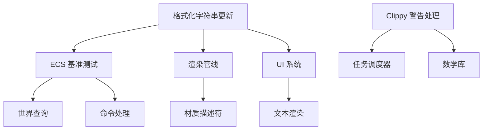

+++
title = "#19825 Upgrade to Rust 1.88"
date = "2025-06-26T00:00:00"
draft = false
template = "pull_request_page.html"
in_search_index = false

[extra]
current_language = "zh-cn"
available_languages = {"en" = { name = "English", url = "/pull_request/bevy/2025-06/pr-19825-en-20250626" }, "zh-cn" = { name = "中文", url = "/pull_request/bevy/2025-06/pr-19825-zh-cn-20250626" }}
+++

# 升级到 Rust 1.88

## 基础信息
- **标题**: Upgrade to Rust 1.88
- **PR 链接**: https://github.com/bevyengine/bevy/pull/19825
- **作者**: tychedelia
- **状态**: MERGED
- **标签**: D-Trivial, C-Code-Quality, S-Ready-For-Final-Review, P-Critical, A-Cross-Cutting
- **创建时间**: 2025-06-26T19:04:47Z
- **合并时间**: 2025-06-26T19:55:46Z
- **合并者**: alice-i-cecile

## 描述翻译
升级到 Rust 1.88

此 PR 将 Rust 工具链升级到 1.88.0 版本。主要变更包括：

1. **字符串格式化优化**：在 `format!` 宏中广泛使用内联变量语法 `{var}` 替代 `{}` + 参数形式
2. **Clippy 警告处理**：
   - 修复了新的 `clippy::mut_from_ref` 警告
   - 添加了 `#[expect]` 属性抑制特定警告
3. **断言消息改进**：在断言消息中直接使用格式化字符串
4. **日志输出优化**：在日志消息中使用内联变量语法

升级后需注意：
- 最低支持 Rust 版本 (MSRV) 提升至 1.88.0
- 所有 CI 流水线已更新至新版本

## PR 的技术实现分析

### 问题背景与升级必要性
Rust 1.88 引入了多项语言特性和改进，特别是内联变量格式化语法 (`{var}`) 显著提升了代码可读性。Bevy 作为性能敏感的游戏引擎，需要保持工具链更新以利用最新优化。此 PR 解决了以下问题：
1. 使用旧式格式化语法导致代码冗长
2. 新 Clippy 规则触发的警告需要处理
3. 断言和日志消息可读性有待提升

### 解决方案策略
采用机械性但系统性的变更策略：
1. **全面替换格式化语法**：使用 `cargo fix` 和手动检查更新所有 `format!` 调用
2. **针对性处理 Clippy 警告**：
   - 对安全的可变引用访问添加安全注释
   - 使用 `#[expect]` 显式标记预期警告
3. **统一错误消息格式**：将断言消息更新为内联变量形式
4. **保持向后兼容**：确保变更不破坏现有功能

### 关键技术实现
核心变更是格式化字符串的现代化改造。以性能关键的 ECS 基准测试为例：

```rust
// 文件: benches/benches/bevy_ecs/world/world_get.rs
// 变更前:
group.bench_function(format!("{}_entities_table", entity_count), |bencher| { ... })

// 变更后:
group.bench_function(format!("{entity_count}_entities_table"), |bencher| { ... })
```

在复杂场景如 `bevy_pbr` 的渲染层描述符生成中，使用条件块替代链式调用：

```rust
// 文件: crates/bevy_pbr/src/render/mesh_view_bindings.rs
format!(
    "mesh_view_layout{}{}{}{}{}{}",
    if self.contains(Key::MULTISAMPLED) {  // 条件块替换 then_some 链
        "_multisampled"
    } else {
        ""
    },
    // ... 其他条件
)
```

对于新的 Clippy 警告 `mut_from_ref`，添加安全注释说明独占访问保证：

```rust
// 文件: crates/bevy_ecs/src/schedule/executor/multi_threaded.rs
#[expect(clippy::mut_from_ref)]  // 显式抑制警告
fn try_lock<'a>(...) -> Option<(&'a mut Conditions<'sys>, ...)> {
    // 安全注释说明同步保证
    unsafe { &mut *self.environment.executor.conditions.get() }
}
```

### 性能与质量影响
1. **可读性提升**：内联变量使格式化字符串更清晰
2. **维护性增强**：显式处理 Clippy 警告减少未来冲突
3. **零运行时开销**：所有变更均为编译时优化
4. **错误处理改进**：断言消息更准确定位问题

```rust
// 文件: crates/bevy_audio/src/volume.rs
// 改进后的断言消息
assert!(
    db_delta.abs() < 1e-2,
    "Expected ~{db}dB, got {db_test}dB (delta {db_delta})"  // 内联变量
);
```

## 可视化组件关系



## 关键文件变更

### `benches/benches/bevy_ecs/world/world_get.rs` (+41/-45)
更新 ECS 世界查询的基准测试格式化字符串，使用内联变量语法：

```rust
// 变更前:
group.bench_function(format!("{}_entities_table", entity_count), ...)

// 变更后:
group.bench_function(format!("{entity_count}_entities_table"), ...)
```

### `crates/bevy_pbr/src/render/mesh_view_bindings.rs` (+30/-18)
重构网格视图绑定描述符的格式化逻辑，提高可读性：

```rust
// 使用条件块替代复杂链式调用
format!(
    "mesh_view_layout{}{}{}{}{}{}",
    if self.contains(Key::MULTISAMPLED) {
        "_multisampled"
    } else {
        ""
    },
    ...
)
```

### `crates/bevy_audio/src/volume.rs` (+4/-14)
优化音频音量测试的断言消息：

```rust
// 更简洁的错误消息
assert!(
    db_delta.abs() < 1e-2,
    "Expected ~{db}dB, got {db_test}dB (delta {db_delta})"
);
```

### `examples/stress_tests/many_components.rs` (+4/-11)
更新压力测试的组件命名逻辑：

```rust
// 使用内联变量
format!("Component{i}")
```

### `benches/benches/bevy_ecs/scheduling/running_systems.rs` (+4/-10)
简化系统调度基准测试的标签生成：

```rust
// 更清晰的格式化
format!("{entity_bunches:02}x_entities_{system_amount:02}_systems")
```

## 完整代码变更
<details>
<summary>展开查看完整差异</summary>

```diff
diff --git a/benches/benches/bevy_ecs/events/mod.rs b/benches/benches/bevy_ecs/events/mod.rs
index b87a138e060c8..c2c7f3ee28056 100644
--- a/benches/benches/bevy_ecs/events/mod.rs
+++ b/benches/benches/bevy_ecs/events/mod.rs
@@ -10,19 +10,19 @@ fn send(c: &mut Criterion) {
     group.warm_up_time(core::time::Duration::from_millis(500));
     group.measurement_time(core::time::Duration::from_secs(4));
     for count in [100, 1_000, 10_000] {
-        group.bench_function(format!("size_4_events_{}", count), |b| {
+        group.bench_function(format!("size_4_events_{count}"), |b| {
             let mut bench = send::Benchmark::<4>::new(count);
             b.iter(move || bench.run());
         });
     }
     for count in [100, 1_000, 10_000] {
-        group.bench_function(format!("size_16_events_{}", count), |b| {
+        group.bench_function(format!("size_16_events_{count}"), |b| {
             let mut bench = send::Benchmark::<16>::new(count);
             b.iter(move || bench.run());
         });
     }
     for count in [100, 1_000, 10_000] {
-        group.bench_function(format!("size_512_events_{}", count), |b| {
+        group.bench_function(format!("size_512_events_{count}"), |b| {
             let mut bench = send::Benchmark::<512>::new(count);
             b.iter(move || bench.run());
         });
@@ -35,19 +35,19 @@ fn iter(c: &mut Criterion) {
     group.warm_up_time(core::time::Duration::from_millis(500));
     group.measurement_time(core::time::Duration::from_secs(4));
     for count in [100, 1_000, 10_000] {
-        group.bench_function(format!("size_4_events_{}", count), |b| {
+        group.bench_function(format!("size_4_events_{count}"), |b| {
             let mut bench = iter::Benchmark::<4>::new(count);
             b.iter(move || bench.run());
         });
     }
     for count in [100, 1_000, 10_000] {
-        group.bench_function(format!("size_16_events_{}", count), |b| {
+        group.bench_function(format!("size_16_events_{count}"), |b| {
             let mut bench = iter::Benchmark::<4>::new(count);
             b.iter(move || bench.run());
         });
     }
     for count in [100, 1_000, 10_000] {
-        group.bench_function(format!("size_512_events_{}", count), |b| {
+        group.bench_function(format!("size_512_events_{count}"), |b| {
             let mut bench = iter::Benchmark::<512>::new(count);
             b.iter(move || bench.run());
         });
diff --git a/benches/benches/bevy_ecs/iteration/mod.rs b/benches/benches/bevy_ecs/iteration/mod.rs
index 0fa7aced2894a..b296c5ce0b091 100644
--- a/benches/benches/bevy_ecs/iteration/mod.rs
+++ b/benches/benches/bevy_ecs/iteration/mod.rs
@@ -130,7 +130,7 @@ fn par_iter_simple(c: &mut Criterion) {
     group.warm_up_time(core::time::Duration::from_millis(500));
     group.measurement_time(core::time::Duration::from_secs(4));
     for f in [0, 10, 100, 1000] {
-        group.bench_function(format!("with_{}_fragment", f), |b| {
+        group.bench_function(format!("with_{f}_fragment"), |b| {
             let mut bench = par_iter_simple::Benchmark::new(f);
             b.iter(move || bench.run());
         });
diff --git a/benches/benches/bevy_ecs/scheduling/run_condition.rs b/benches/benches/bevy_ecs/scheduling/run_condition.rs
index 7b9cf418f4168..9c40cf396e047 100644
--- a/benches/benches/bevy_ecs/scheduling/run_condition.rs
+++ b/benches/benches/bevy_ecs/scheduling/run_condition.rs
@@ -24,7 +24,7 @@ pub fn run_condition_yes(criterion: &mut Criterion) {
         }
         // run once to initialize systems
         schedule.run(&mut world);
-        group.bench_function(format!("{}_systems", amount), |bencher| {
+        group.bench_function(format!("{amount}_systems"), |bencher| {
             bencher.iter(|| {
                 schedule.run(&mut world);
             });
@@ -46,7 +46,7 @@ pub fn run_condition_no(criterion: &mut Criterion) {
         }
         // run once to initialize systems
         schedule.run(&mut world);
-        group.bench_function(format!("{}_systems", amount), |bencher| {
+        group.bench_function(format!("{amount}_systems"), |bencher| {
             bencher.iter(|| {
                 schedule.run(&mut world);
             });
@@ -77,7 +77,7 @@ pub fn run_condition_yes_with_query(criterion: &mut Criterion) {
         }
         // run once to initialize systems
         schedule.run(&mut world);
-        group.bench_function(format!("{}_systems", amount), |bencher| {
+        group.bench_function(format!("{amount}_systems"), |bencher| {
             bencher.iter(|| {
                 schedule.run(&mut world);
             });
@@ -105,7 +105,7 @@ pub fn run_condition_yes_with_resource(criterion: &mut Criterion) {
         }
         // run once to initialize systems
         schedule.run(&mut world);
-        group.bench_function(format!("{}_systems", amount), |bencher| {
+        group.bench_function(format!("{amount}_systems"), |bencher| {
             bencher.iter(|| {
                 schedule.run(&mut world);
             });
diff --git a/benches/benches/bevy_ecs/scheduling/running_systems.rs b/benches/benches/bevy_ecs/scheduling/running_systems.rs
index 2fc1da17108d3..159974117c421 100644
--- a/benches/benches/bevy_ecs/scheduling/running_systems.rs
+++ b/benches/benches/bevy_ecs/scheduling/running_systems.rs
@@ -26,7 +26,7 @@ pub fn empty_systems(criterion: &mut Criterion) {
             schedule.add_systems(empty);
         }
         schedule.run(&mut world);
-        group.bench_function(format!("{}_systems", amount), |bencher| {
+        group.bench_function(format!("{amount}_systems"), |bencher| {
             bencher.iter(|| {
                 schedule.run(&mut world);
             });
@@ -38,7 +38,7 @@ pub fn empty_systems(criterion: &mut Criterion) {
             schedule.add_systems((empty, empty, empty, empty, empty));
         }
         schedule.run(&mut world);
-        group.bench_function(format!("{}_systems", amount), |bencher| {
+        group.bench_function(format!("{amount}_systems"), |bencher| {
             bencher.iter(|| {
                 schedule.run(&mut world);
             });
@@ -79,10 +79,7 @@ pub fn busy_systems(criterion: &mut Criterion) {
             }
             schedule.run(&mut world);
             group.bench_function(
-                format!(
-                    "{:02}x_entities_{:02}_systems",
-                    entity_bunches, system_amount
-                ),
+                format!("{entity_bunches:02}x_entities_{system_amount:02}_systems"),
                 |bencher| {
                     bencher.iter(|| {
                         schedule.run(&mut world);
@@ -128,10 +125,7 @@ pub fn contrived(criterion: &mut Criterion) {
             }
             schedule.run(&mut world);
             group.bench_function(
-                format!(
-                    "{:02}x_entities_{:02}_systems",
-                    entity_bunches, system_amount
-                ),
+                format!("{entity_bunches:02}x_entities_{system_amount:02}_systems"),
                 |bencher| {
                     bencher.iter(|| {
                         schedule.run(&mut world);
diff --git a/benches/benches/bevy_ecs/world/commands.rs b/benches/benches/bevy_ecs/world/commands.rs
index bedfb8e5af997..4836a243ebd9b 100644
--- a/benches/benches/bevy_ecs/world/commands.rs
+++ b/benches/benches/bevy_ecs/world/commands.rs
@@ -37,7 +37,7 @@ pub fn spawn_commands(c: &mut Criterion) {
     group.measurement_time(core::time::Duration::from_secs(4));
 
     for entity_count in [100, 1_000, 10_000] {
-        group.bench_function(format!("{}_entities", entity_count), |bencher| {
+        group.bench_function(format!("{entity_count}_entities"), |bencher| {
             let mut world = World::default();
             let mut command_queue = CommandQueue::default();
 
@@ -68,7 +68,7 @@ pub fn nonempty_spawn_commands(c: &mut Criterion) {
     group.measurement_time(core::time::Duration::from_secs(4));
 
     for entity_count in [100, 1_000, 10_000] {
-        group.bench_function(format!("{}_entities", entity_count), |bencher| {
+        group.bench_function(format!("{entity_count}_entities"), |bencher| {
             let mut world = World::default();
             let mut command_queue = CommandQueue::default();
 
@@ -162,7 +162,7 @@ pub fn fake_commands(c: &mut Criterion) {
     group.measurement_time(core::time::Duration::from_secs(4));
 
     for command_count in [100, 1_000, 10_000] {
-        group.bench_function(format!("{}_commands", command_count), |bencher| {
+        group.bench_function(format!("{command_count}_commands"), |bencher| {
             let mut world = World::default();
             let mut command_queue = CommandQueue::default();
 
@@ -207,7 +207,7 @@ pub fn sized_commands_impl<T: Default + Command>(c: &mut Criterion) {
     group.measurement_time(core::time::Duration::from_secs(4));
 
     for command_count in [100, 1_000, 10_000] {
-        group.bench_function(format!("{}_commands", command_count), |bencher| {
+        group.bench_function(format!("{command_count}_commands"), |bencher| {
             let mut world = World::default();
             let mut command_queue = CommandQueue::default();
 
diff --git a/benches/benches/bevy_ecs/world/despawn.rs b/benches/benches/bevy_ecs/world/despawn.rs
index cd693fc15c87c..7b79ed95d9af5 100644
--- a/benches/benches/bevy_ecs/world/despawn.rs
+++ b/benches/benches/bevy_ecs/world/despawn.rs
@@ -13,7 +13,7 @@ pub fn world_despawn(c: &mut Criterion) {
     group.measurement_time(core::time::Duration::from_secs(4));
 
     for entity_count in [1, 100, 10_000] {
-        group.bench_function(format!("{}_entities", entity_count), |bencher| {
+        group.bench_function(format!("{entity_count}_entities"), |bencher| {
             bencher.iter_batched_ref(
                 || {
                     let mut world = World::default();
diff --git a/benches/benches/bevy_ecs/world/despawn_recursive.rs b/benches/benches/bevy_ecs/world/despawn_recursive.rs
index 78c644174bb09..f63c1a510b97a 100644
--- a/benches/benches/bevy_ecs/world/despawn_recursive.rs
+++ b/benches/benches/bevy_ecs/world/despawn_recursive.rs
@@ -13,7 +13,7 @@ pub fn world_despawn_recursive(c: &mut Criterion) {
     group.measurement_time(core::time::Duration::from_secs(4));
 
     for entity_count in [1, 100, 10_000] {
-        group.bench_function(format!("{}_entities", entity_count), |bencher| {
+        group.bench_function(format!("{entity_count}_entities"), |bencher| {
             bencher.iter_batched_ref(
                 || {
                     let mut world = World::default();
diff --git a/benches/benches/bevy_ecs/world/spawn.rs b/benches/benches/bevy_ecs/world/spawn.rs
index 502d10ceb3aa2..9cceda7ae50d5 100644
--- a/benches/benches/bevy_ecs/world/spawn.rs
+++ b/benches/benches/bevy_ecs/world/spawn.rs
@@ -13,7 +13,7 @@ pub fn world_spawn(c: &mut Criterion) {
     group.measurement_time(core::time::Duration::from_secs(4));
 
     for entity_count in [1, 100, 10_000] {
-        group.bench_function(format!("{}_entities", entity_count), |bencher| {
+        group.bench_function(format!("{entity_count}_entities"), |bencher| {
             let mut world = World::default();
             bencher.iter(|| {
                 for _ in 0..entity_count {
diff --git a/benches/benches/bevy_ecs/world/world_get.rs b/benches/benches/bevy_ecs/world/world_get.rs
index e6e2a0bb903ef..81e0bf2b0f511 100644
--- a/benches/benches/bevy_ecs/world/world_get.rs
+++ b/benches/benches/bevy_ecs/world/world_get.rs
@@ -49,7 +49,7 @@ pub fn world_entity(c: &mut Criterion) {
     group.measurement_time(core::time::Duration::from_secs(4));
 
     for entity_count in RANGE.map(|i| i * 10_000) {
-        group.bench_function(format!("{}_entities", entity_count), |bencher| {
+        group.bench_function(format!("{entity_count}_entities"), |bencher| {
             let world = setup::<Table>(entity_count);
 
             bencher.iter(|| {
@@ -72,7 +72,7 @@ pub fn world_get(c: &mut Criterion) {
     group.measurement_time(core::time::Duration::from_secs(4));
 
     for entity_count in RANGE.map(|i| i * 10_000) {
-        group.bench_function(format!("{}_entities_table", entity_count), |bencher| {
+        group.bench_function(format!("{entity_count}_entities_table"), |bencher| {
             let world = setup::<Table>(entity_count);
 
             bencher.iter(|| {
@@ -84,7 +84,7 @@ pub fn world_get(c: &mut Criterion) {
                 }
             });
         });
-        group.bench_function(format!("{}_entities_sparse", entity_count), |bencher| {
+        group.bench_function(format!("{entity_count}_entities_sparse"), |bencher| {
             let world = setup::<Sparse>(entity_count);
 
             bencher.iter(|| {
@@ -107,7 +107,7 @@ pub fn world_query_get(c: &mut Criterion) {
     group.measurement_time(core::time::Duration::from_secs(4));
 
     for entity_count in RANGE.map(|i| i * 10_000) {
-        group.bench_function(format!("{}_entities_table", entity_count), |bencher| {
+        group.bench_function(format!("{entity_count}_entities_table"), |bencher| {
             let mut world = setup::<Table>(entity_count);
             let mut query = world.query::<&Table>();
 
@@ -120,7 +120,7 @@ pub fn world_query_get(c: &mut Criterion) {
                 }
             });
         });
-        group.bench_function(format!("{}_entities_table_wide", entity_count), |bencher| {
+        group.bench_function(format!("{entity_count}_entities_table_wide"), |bencher| {
             let mut world = setup_wide::<(
                 WideTable<0>,
                 WideTable<1>,
@@ -147,7 +147,7 @@ pub fn world_query_get(c: &mut Criterion) {
                 }
             });
         });
-        group.bench_function(format!("{}_entities_sparse", entity_count), |bencher| {
+        group.bench_function(format!("{entity_count}_entities_sparse"), |bencher| {
             let mut world = setup::<Sparse>(entity_count);
             let mut query = world.query::<&Sparse>();
 
@@ -160,37 +160,33 @@ pub fn world_query_get(c: &mut Criterion) {
                 }
             });
         });
-        group.bench_function(
-            format!("{}_entities_sparse_wide", entity_count),
-            |bencher| {
-                let mut world = setup_wide::<(
-                    WideSparse<0>,
-                    WideSparse<1>,
-                    WideSparse<2>,
-                    WideSparse<3>,
-                    WideSparse<4>,
-                    WideSparse<5>,
-                )>(entity_count);
-                let mut query = world.query::<(
-                    &WideSparse<0>,
-                    &WideSparse<1>,
-                    &WideSparse<2>,
-                    &WideSparse<3>,
-                    &WideSparse<4>,
-                    &WideSparse<5>,
-                )>();
-
-                bencher.iter(|| {
-                    for i in 0..entity_count {
-                        // SAFETY: Range is exclusive.
-                        let entity = Entity::from_raw(EntityRow::new(unsafe {
-                            NonMaxU32::new_unchecked(i)
-                        }));
-                        assert!(query.get(&world, entity).is_ok());
-                    }
-                });
-            },
-        );
+        group.bench_function(format!("{entity_count}_entities_sparse_wide"), |bencher| {
+            let mut world = setup_wide::<(
+                WideSparse<0>,
+                WideSparse<1>,
+                WideSparse<2>,
+                WideSparse<3>,
+                WideSparse<4>,
+                WideSparse<5>,
+            )>(entity_count);
+            let mut query = world.query::<(
+                &WideSparse<0>,
+                &WideSparse<1>,
+                &WideSparse<2>,
+                &WideSparse<3>,
+                &WideSparse<4>,
+                &WideSparse<5>,
+            )>();
+
+            bencher.iter(|| {
+                for i in 0..entity_count {
+                    // SAFETY: Range is exclusive.
+                    let entity =
+                        Entity::from_raw(EntityRow::new(unsafe { NonMaxU32::new_unchecked(i) }));
+                    assert!(query.get(&world, entity).is_ok());
+                }
+            });
+        });
     }
 
     group.finish();
@@ -202,7 +198,7 @@ pub fn world_query_iter(c: &mut Criterion) {
     group.measurement_time(core::time::Duration::from_secs(4));
 
     for entity_count in RANGE.map(|i| i * 10_000) {
-        group.bench_function(format!("{}_entities_table", entity_count), |bencher| {
+        group.bench_function(format!("{entity_count}_entities_table"), |bencher| {
             let mut world = setup::<Table>(entity_count);
             let mut query = world.query::<&Table>();
 
@@ -216,7 +212,7 @@ pub fn world_query_iter(c: &mut Criterion) {
                 assert_eq!(black_box(count), entity_count);
             });
         });
-        group.bench_function(format!("{}_entities_sparse", entity_count), |bencher| {
+        group.bench_function(format!("{entity_count}_entities_sparse"), |bencher| {
             let mut world = setup::<Sparse>(entity_count);
             let mut query = world.query::<&Sparse>();
 
@@ -241,7 +237,7 @@ pub fn world_query_for_each(c: &mut Criterion) {
     group.measurement_time(core::time::Duration::from_secs(4));
 
     for entity_count in RANGE.map(|i| i * 10_000) {
-        group.bench_function(format!("{}_entities_table", entity_count), |bencher| {
+        group.bench_function(format!("{entity_count}_entities_table"), |bencher| {
             let mut world = setup::<Table>(entity_count);
             let mut query = world.query::<&Table>();
 
@@ -255,7 +251,7 @@ pub fn world_query_for_each(c: &mut Criterion) {
                 assert_eq!(black_box(count), entity_count);
             });
         });
-        group.bench_function(format!("{}_entities_sparse", entity_count), |bencher| {
+        group.bench_function(format!("{entity_count}_entities_sparse"), |bencher| {
             let mut world = setup::<Sparse>(entity_count);
             let mut query = world.query::<&Sparse>();
 
@@ -280,7 +276,7 @@ pub fn query_get(c: &mut Criterion) {
     group.measurement_time(core::time::Duration::from_secs(4));
 
     for entity_count in RANGE.map(|i| i * 10_000) {
-        group.bench_function(format!("{}_entities_table", entity_count), |bencher| {
+        group.bench_function(format!("{entity_count}_entities_table"), |bencher| {
             let mut world = World::default();
             let mut entities: Vec<_> = world
                 .spawn_batch((0..entity_count).map(|_| Table::default()))
@@ -299,7 +295,7 @@ pub fn query_get(c: &mut Criterion) {
                 assert_eq!(black_box(count), entity_count);
             });
         });
-        group.bench_function(format!("{}_entities_sparse", entity_count), |bencher| {
+        group.bench_function(format!("{entity_count}_entities_sparse"), |bencher| {
             let mut world = World::default();
             let mut entities: Vec<_> = world
                 .spawn_batch((0..entity_count).map(|_| Sparse::default()))
@@ -329,7 +325,7 @@ pub fn query_get_many<const N: usize>(c: &mut Criterion) {
     group.measurement_time(core::time::Duration::from_secs(2 * N as u64));
 
     for entity_count in RANGE.map(|i| i * 10_000) {
-        group.bench_function(format!("{}_calls_table", entity_count), |bencher| {
+        group.bench_function(format!("{entity_count}_calls_table"), |bencher| {
             let mut world = World::default();
             let mut entity_groups: Vec<_> = (0..entity_count)
                 .map(|_| [(); N].map(|_| world.spawn(Table::default()).id()))
@@ -352,7 +348,7 @@ pub fn query_get_many<const N: usize>(c: &mut Criterion) {
                 assert_eq!(black_box(count), entity_count);
             });
         });
-        group.bench_function(format!("{}_calls_sparse", entity_count), |bencher| {
+        group.bench_function(format!("{entity_count}_calls_sparse"), |bencher| {
             let mut world = World::default();
             let mut entity_groups: Vec<_> = (0..entity_count)
                 .map(|_| [(); N].map(|_| world.spawn(Sparse::default()).id()))
diff --git a/benches/benches/bevy_reflect/map.rs b/benches/benches/bevy_reflect/map.rs
index 1eab01a587459..a70f89e12b7f1 100644
--- a/benches/benches/bevy_reflect/map.rs
+++ b/benches/benches/bevy_reflect/map.rs
@@ -142,7 +142,7 @@ fn concrete_map_apply(c: &mut Criterion) {
 
 fn u64_to_n_byte_key(k: u64, n: usize) -> String {
     let mut key = String::with_capacity(n);
-    write!(&mut key, "{}", k).unwrap();
+    write!(&mut key, "{k}").unwrap();
 
     // Pad key to n bytes.
     key.extend(iter::repeat_n('\0', n - key.len()));
diff --git a/benches/benches/bevy_reflect/struct.rs b/benches/benches/bevy_reflect/struct.rs
index 7750213b6dd76..52d539f64dd2a 100644
--- a/benches/benches/bevy_reflect/struct.rs
+++ b/benches