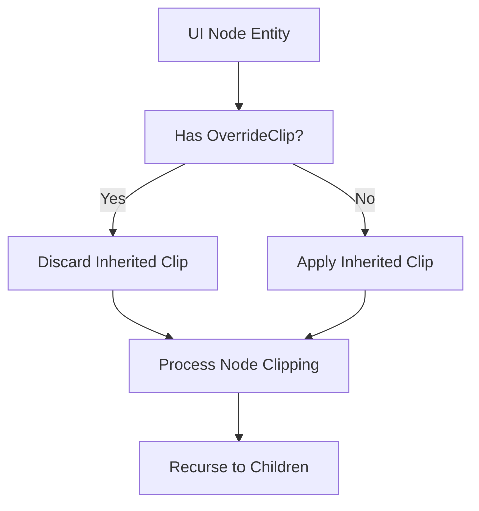

+++
title = "#19826 Opt-out for UI clipping"
date = "2025-06-27T00:00:00"
draft = false
template = "pull_request_page.html"
in_search_index = true

[taxonomies]
list_display = ["show"]

[extra]
current_language = "en"
available_languages = {"en" = { name = "English", url = "/pull_request/bevy/2025-06/pr-19826-en-20250627" }, "zh-cn" = { name = "中文", url = "/pull_request/bevy/2025-06/pr-19826-zh-cn-20250627" }}
labels = ["C-Feature", "A-Rendering", "A-UI", "D-Straightforward"]
+++

# PR Analysis: Opt-out for UI clipping

## Basic Information
- **Title**: Opt-out for UI clipping
- **PR Link**: https://github.com/bevyengine/bevy/pull/19826
- **Author**: ickshonpe
- **Status**: MERGED
- **Labels**: C-Feature, A-Rendering, A-UI, S-Ready-For-Final-Review, D-Straightforward
- **Created**: 2025-06-26T19:16:27Z
- **Merged**: 2025-06-27T17:36:47Z
- **Merged By**: alice-i-cecile

## Description Translation
# Objective

Opt-out for UI clipping, for motivation see issue #19821

## Solution

New zst component `OverrideClip`. A UI node entity with this component will ignore any inherited clipping rect, so it will never get clipped regardless of the `Overflow` settings of its ancestors.

#### Why use a marker component and not add a new variant to `Overflow` instead? 
A separate marker component allows users to set both `Overflow` and `OverrideClip` on the same node. 

## Testing

Run the `overflow` example with the `OverrideClip` component added to the `ImagNode`s and you will see that clipping is disabled.

## The Story of This Pull Request

### The Problem and Context
In Bevy's UI system, clipping behavior is inherited through the node hierarchy. When a parent node sets `Overflow` to clip its content, all child nodes are automatically clipped to the parent's bounds. While this is generally desirable, there are cases where developers need specific UI elements to escape this clipping constraint. Issue #19821 documented scenarios where UI elements like tooltips, dropdown menus, or contextual overlays need to render outside their parent containers. The existing system provided no straightforward way to opt out of inherited clipping, forcing workarounds that complicated the node hierarchy or required manual positioning adjustments.

### The Solution Approach
The solution introduces a new zero-sized marker component `OverrideClip` that allows UI nodes to ignore inherited clipping constraints. This approach was chosen over alternatives like adding a new variant to the `Overflow` enum because:
1. It maintains backward compatibility with existing UI setups
2. It allows independent control of a node's own overflow behavior (`Overflow`) and its relationship to ancestor clipping (`OverrideClip`)
3. It avoids expanding the `Overflow` enum which already handles multiple axes
4. It provides a clear, self-documenting API through the component name

The implementation required modifying the clipping update system to check for this new component during clip inheritance calculations.

### The Implementation
The implementation consists of two main changes:

1. **New component definition** in `ui_node.rs`:
```rust
/// UI node entities with this component will ignore any clipping rect they inherit,
/// the node will not be clipped regardless of its ancestors' `Overflow` setting.
#[derive(Component)]
pub struct OverrideClip;
```

2. **Clipping system modification** in `update.rs`:
```rust
fn update_clipping(
    // ...
) {
    let Ok((node, computed_node, transform, maybe_calculated_clip, has_override_clip)) =
        node_query.get_mut(entity)
    else {
        return;
    };

    // If the UI node entity has an `OverrideClip` component, discard any inherited clip rect
    if has_override_clip {
        maybe_inherited_clip = None;
    }
    
    // ... existing clipping logic continues ...
}
```
The key change is adding a `Has<OverrideClip>` to the node query and inserting a conditional check that clears any inherited clipping rectangle when the component is present. This occurs early in the clipping calculation process, before any node-specific clipping logic is applied.

### Technical Insights
The implementation demonstrates several sound engineering practices:
- **Minimal API surface**: The solution adds just 17 lines of code while solving a significant use case
- **Zero-cost abstraction**: The marker component has no runtime cost beyond the presence check
- **Orthogonal concerns**: Separating clipping override from overflow behavior keeps responsibilities clear
- **Backward compatibility**: Existing UI systems continue working without modification
- **Recursive system integration**: The clipping system already processes nodes hierarchically, making this a natural extension point

The solution maintains existing performance characteristics since the additional check is a simple boolean test on a component that's already being queried.

### The Impact
This change enables new UI patterns that were previously difficult or impossible to implement:
- Tooltips that extend beyond their container boundaries
- Dropdown menus that overflow their parent elements
- Contextual overlays that render on top of other UI
- Special effects that need to break out of scrollable areas

Developers can now selectively disable clipping where needed without restructuring their entire UI hierarchy. The implementation avoids common pitfalls like:
- Creating special-case code paths for specific UI elements
- Introducing global configuration options that affect all nodes
- Breaking existing clipping behavior for nodes without the component

The solution demonstrates how marker components can effectively modify system behavior while maintaining API clarity and backward compatibility.

## Visual Representation



## Key Files Changed

### `crates/bevy_ui/src/ui_node.rs`
Added the new marker component definition:

```rust
// ... existing code ...
pub struct CalculatedClip {
    pub clip: Rect,
}

/// UI node entities with this component will ignore any clipping rect they inherit,
/// the node will not be clipped regardless of its ancestors' `Overflow` setting.
#[derive(Component)]
pub struct OverrideClip;

/// Indicates that this [`Node`] entity's front-to-back ordering is not controlled solely
// ... existing code ...
```

### `crates/bevy_ui/src/update.rs`
Modified the clipping system to respect the new component:

```rust
// Before:
pub fn update_clipping_system(
    // ...
    node_query: Query<(
        &Node,
        &ComputedNode,
        &UiGlobalTransform,
        Option<&mut CalculatedClip>,
    )>,
    // ...
) { /* ... */ }

// After:
pub fn update_clipping_system(
    // ...
    node_query: Query<(
        &Node,
        &ComputedNode,
        &UiGlobalTransform,
        Option<&mut CalculatedClip>,
        Has<OverrideClip>,  // Added component check
    )>,
    // ...
) { /* ... */ }

// Inside update_clipping function:
// Before:
let Ok((node, computed_node, transform, maybe_calculated_clip)) = node_query.get_mut(entity)

// After:
let Ok((node, computed_node, transform, maybe_calculated_clip, has_override_clip)) = 
    node_query.get_mut(entity)

// New logic added:
if has_override_clip {
    maybe_inherited_clip = None;
}
```

## Further Reading
1. Original issue motivating this change: [#19821](https://github.com/bevyengine/bevy/issues/19821)
2. Bevy UI clipping documentation: [Bevy UI Book - Clipping](https://bevyengine.org/learn/book/features/ui/clipping)
3. Marker component pattern: [Rust API Guidelines - C-FEATURE](https://rust-lang.github.io/api-guidelines/about.html)
4. Bevy component system: [Bevy Components](https://bevyengine.org/learn/book/ecs/components)