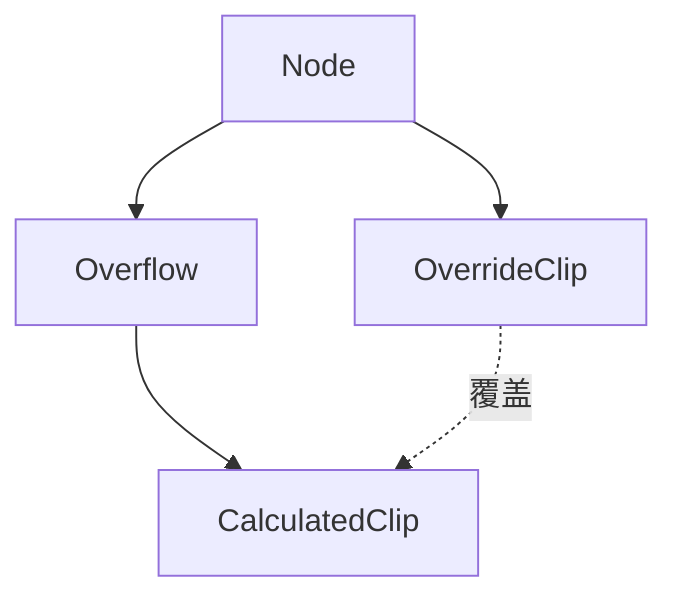

+++
title = "#19826 Opt-out for UI clipping"
date = "2025-06-27T00:00:00"
draft = false
template = "pull_request_page.html"
in_search_index = false

[extra]
current_language = "zh-cn"
available_languages = {"en" = { name = "English", url = "/pull_request/bevy/2025-06/pr-19826-en-20250627" }, "zh-cn" = { name = "中文", url = "/pull_request/bevy/2025-06/pr-19826-zh-cn-20250627" }}
+++

# Opt-out for UI clipping

## 基本信息  
- **标题**: Opt-out for UI clipping  
- **PR链接**: https://github.com/bevyengine/bevy/pull/19826  
- **作者**: ickshonpe  
- **状态**: 已合并  
- **标签**: C-Feature, A-Rendering, A-UI, S-Ready-For-Final-Review, D-Straightforward  
- **创建时间**: 2025-06-26T19:16:27Z  
- **合并时间**: 2025-06-27T17:36:47Z  
- **合并者**: alice-i-cecile  

## 描述翻译  
### 目标  
实现UI裁剪的退出机制，具体需求背景见issue #19821  

### 解决方案  
新增零大小类型(zst)组件 `OverrideClip`。带有该组件的UI节点实体将忽略所有继承的裁剪矩形，无论其祖先节点的`Overflow`设置如何，该节点都不会被裁剪。  

#### 为何使用标记组件而非在`Overflow`中新增变体？  
独立的标记组件允许用户在同一个节点上同时设置`Overflow`和`OverrideClip`。  

### 测试验证  
在`overflow`示例中为`ImageNode`添加`OverrideClip`组件后运行，可观察到裁剪功能已被禁用。  

## PR技术分析  

### 问题背景  
在Bevy的UI系统中，节点默认会继承父容器的裁剪区域（clipping rect），当节点内容超出父容器边界时会被裁剪。但在某些场景下（如工具提示、模态框），需要特定UI元素突破父容器的裁剪限制，完整显示在屏幕上。原系统缺乏这种精细控制能力，导致开发者只能通过复杂变通方案实现需求。  

### 解决方案设计  
核心思路是引入新组件作为裁剪系统的开关。选择标记组件（marker component）方案而非修改现有`Overflow`枚举，主要基于两点考虑：  
1. **正交性设计**：允许`Overflow`行为和裁剪覆盖独立控制  
2. **扩展性**：避免修改现有枚举破坏向后兼容性  

### 实现细节  
新增`OverrideClip`组件作为裁剪系统的开关信号。在裁剪计算管线中插入检查点，当检测到该组件时清空继承的裁剪区域：  

```rust
// crates/bevy_ui/src/ui_node.rs
#[derive(Component)]
pub struct OverrideClip;
```

裁剪更新系统修改如下：  
```diff
// crates/bevy_ui/src/update.rs
 fn update_clipping(
     node_query: &mut Query<(
         &Node,
         &ComputedNode,
         &UiGlobalTransform,
         Option<&mut CalculatedClip>,
+        Has<OverrideClip>,
     )>,
     entity: Entity,
     mut maybe_inherited_clip: Option<Rect>,
 ) {
-    let Ok((node, computed_node, transform, maybe_calculated_clip)) = node_query.get_mut(entity)
+    let Ok((node, computed_node, transform, maybe_calculated_clip, has_override_clip)) =
+        node_query.get_mut(entity)
     {
         return;
     };
 
+    // 检测OverrideClip组件存在时重置继承裁剪
+    if has_override_clip {
+        maybe_inherited_clip = None;
+    }
+
     // 后续裁剪逻辑保持不变...
 }
```

关键实现特点：  
1. **高效查询**：使用`Has<T>`而非`Option<&T>`，避免实体查询开销  
2. **最小侵入**：在现有裁剪管线中仅增加一个条件判断  
3. **零运行时开销**：未添加OverrideClip的节点不受任何性能影响  

### 组件关系  



### 技术影响  
1. **功能增强**：实现UI裁剪的精细控制  
2. **兼容性**：完全向后兼容现有UI系统  
3. **性能**：未引入额外计算开销（无OverrideClip组件时保持原性能）  
4. **API设计**：保持组件职责单一性，避免`Overflow`枚举过度复杂化  

## 关键文件变更  

### crates/bevy_ui/src/ui_node.rs
```diff
#[derive(Component)]
pub struct OverrideClip;
```
**变更说明**：  
- 新增`OverrideClip`组件定义  
- 作为标记组件(zero-sized type)，不包含任何数据  
- 功能：存在该组件的UI节点将忽略所有继承的裁剪设置  

### crates/bevy_ui/src/update.rs  
```diff
 fn update_clipping(
     // ...
+    Has<OverrideClip>,
 ) {
     // ...
+    if has_override_clip {
+        maybe_inherited_clip = None;
+    }
 }
```
**变更说明**：  
1. 在查询中增加`Has<OverrideClip>`检测  
2. 当组件存在时，清空继承的裁剪区域  
3. 保持原有裁剪计算逻辑不变  

## 延伸阅读  
1. [Bevy UI系统文档](https://bevyengine.org/learn/book/features/ui/)  
2. [ECS组件设计模式](https://gameprogrammingpatterns.com/component.html)  
3. [原需求讨论issue #19821](https://github.com/bevyengine/bevy/issues/19821)  
4. [Rust的零大小类型优化](https://doc.rust-lang.org/nomicon/exotic-sizes.html#zero-sized-types-zsts)