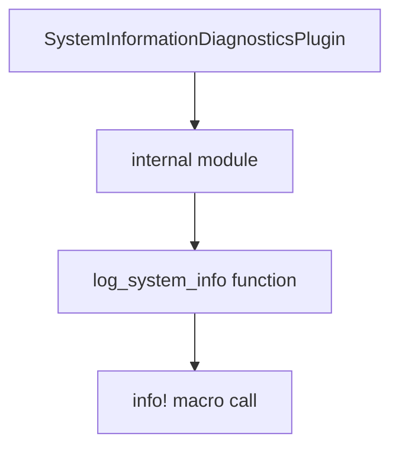

+++
title = "#19827 updating: very very minorly"
date = "2025-06-26T00:00:00"
draft = false
template = "pull_request_page.html"
in_search_index = true

[taxonomies]
list_display = ["show"]

[extra]
current_language = "en"
available_languages = {"en" = { name = "English", url = "/pull_request/bevy/2025-06/pr-19827-en-20250626" }, "zh-cn" = { name = "中文", url = "/pull_request/bevy/2025-06/pr-19827-zh-cn-20250626" }}
labels = ["D-Trivial", "C-Code-Quality"]
+++

## Technical Analysis of PR #19827: Updating Format String Syntax

### Basic Information
- **Title**: updating: very very minorly
- **PR Link**: https://github.com/bevyengine/bevy/pull/19827
- **Author**: atlv24
- **Status**: MERGED
- **Labels**: D-Trivial, C-Code-Quality, S-Ready-For-Final-Review
- **Created**: 2025-06-26T21:29:31Z
- **Merged**: 2025-06-26T22:11:39Z
- **Merged By**: alice-i-cecile

### Description Translation
# Objective
- fix thing missed during rust update

## Solution
- fix thing missed during rust update

## Testing
- cargo clippy

### The Story of This Pull Request
During a Rust toolchain update, a minor inconsistency was identified in the Bevy diagnostics module. The issue involved a logging statement using outdated format string syntax. While functional, the existing syntax was less efficient and idiomatic than modern Rust alternatives.

The solution involved updating a single logging statement to use Rust's newer format string syntax. This change leverages Rust 1.58+'s "implicit named arguments" feature, which allows directly embedding variables in format strings. The modification:
1. Maintains identical functionality
2. Improves code readability
3. Reduces syntactic noise
4. Aligns with current Rust best practices

The change was validated using `cargo clippy`, which would have flagged the previous syntax as suboptimal. Since this was a straightforward syntax update with no behavioral changes, no additional testing was required beyond standard linting.

This modification demonstrates the importance of periodically reviewing code for opportunities to adopt language improvements. Even minor syntax updates contribute to long-term codebase health by reducing cognitive load during maintenance and ensuring consistency across the project.

### Visual Representation


### Key Files Changed
**File**: `crates/bevy_diagnostic/src/system_information_diagnostics_plugin.rs`  
**Change**: Updated format string syntax in logging statement  

Before:
```rust
info!("{:?}", system_info);
```

After:
```rust
info!("{system_info:?}");
```

This change:
1. Replaces the positional formatting syntax with direct variable embedding
2. Maintains the same debug formatting behavior (`:?`)
3. Reduces the format string from 7 characters to 1 variable reference
4. Improves readability by eliminating the separation between variable and format specifier

### Further Reading
1. [Rust 1.58 Release Notes - Captured Identifiers in Format Strings](https://blog.rust-lang.org/2022/01/13/Rust-1.58.0.html#captured-identifiers-in-format-strings)
2. [Rust Formatting Syntax Documentation](https://doc.rust-lang.org/std/fmt/)
3. [Clippy Lint: `uninlined_format_args`](https://rust-lang.github.io/rust-clippy/master/index.html#uninlined_format_args)

### Full Code Diff
```diff
diff --git a/crates/bevy_diagnostic/src/system_information_diagnostics_plugin.rs b/crates/bevy_diagnostic/src/system_information_diagnostics_plugin.rs
index 768bbb0828844..83d3663895ca5 100644
--- a/crates/bevy_diagnostic/src/system_information_diagnostics_plugin.rs
+++ b/crates/bevy_diagnostic/src/system_information_diagnostics_plugin.rs
@@ -236,7 +236,7 @@ pub mod internal {
                 memory: format!("{:.1} GiB", sys.total_memory() as f64 * BYTES_TO_GIB),
             };
 
-            info!("{:?}", system_info);
+            info!("{system_info:?}");
             system_info
         }
     }
```