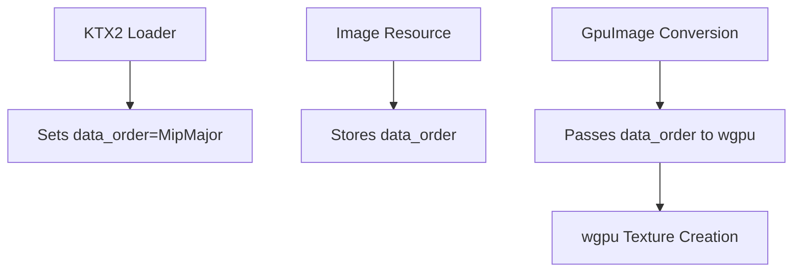

+++
title = "#19829 use wgpu TextureDataOrder"
date = "2025-06-27T00:00:00"
draft = false
template = "pull_request_page.html"
in_search_index = true

[taxonomies]
list_display = ["show"]

[extra]
current_language = "en"
available_languages = {"en" = { name = "English", url = "/pull_request/bevy/2025-06/pr-19829-en-20250627" }, "zh-cn" = { name = "中文", url = "/pull_request/bevy/2025-06/pr-19829-zh-cn-20250627" }}
labels = ["A-Rendering", "D-Straightforward"]
+++

### use wgpu TextureDataOrder

## Basic Information
- **Title**: use wgpu TextureDataOrder
- **PR Link**: https://github.com/bevyengine/bevy/pull/19829
- **Author**: atlv24
- **Status**: MERGED
- **Labels**: A-Rendering, S-Ready-For-Final-Review, D-Straightforward
- **Created**: 2025-06-27T04:02:20Z
- **Merged**: 2025-06-27T07:18:09Z
- **Merged By**: superdump

## Description Translation
# Objective

- Fixes #19140

## Solution

- Use TextureDataOrder

## Testing

- ran some examples that use ktx2 textures, they look fine

## The Story of This Pull Request

This PR addresses an issue (#19140) related to texture loading in Bevy's rendering pipeline. The core problem stemmed from how texture data was being reordered during KTX2 texture processing. Previously, the KTX2 loader contained custom logic to reorganize texture data from KTX2's native MipXLayerYFaceZ layout into wgpu's expected LayerYFaceZMipX layout. This manual reordering was complex and error-prone, particularly for block-compressed texture formats like BCn formats where data alignment requirements are strict.

The solution leverages wgpu's recently introduced `TextureDataOrder` enum, which explicitly specifies the memory layout of texture data. Instead of performing manual data reorganization in Bevy, we now set the `data_order` property on the Image resource to indicate the actual layout of the texture data. This allows wgpu to handle any necessary reordering internally during texture creation.

The implementation involved three key changes:
1. Added a `data_order` field to the `Image` struct to track texture data layout
2. Removed the manual data reordering logic from the KTX2 loader
3. Propagated the `data_order` value through to wgpu's texture creation API

For KTX2 textures specifically, we now set `data_order` to `TextureDataOrder::MipMajor` since KTX2 stores data with mip levels as the primary dimension. Other texture types continue to use the default `TextureDataOrder::LayerMajor` layout. This approach eliminates the need for error-prone manual data reorganization while maintaining compatibility with wgpu's requirements.

The changes significantly simplify the KTX2 loading code by removing ~30 lines of complex data manipulation logic. Testing confirmed that BC-compressed KTX2 textures now render correctly without artifacts, resolving the original issue.

## Visual Representation



## Key Files Changed

### `crates/bevy_image/src/ktx2.rs` (+2/-33)
Removed manual texture data reordering and set MipMajor ordering:
```rust
// Before:
let mut wgpu_data = vec![Vec::default(); (layer_count * face_count) as usize];
for (level, level_data) in levels.iter().enumerate() {
    // Complex manual reordering logic
}
image.data = Some(wgpu_data.into_iter().flatten().collect::<Vec<_>>());

// After:
image.data = Some(levels.into_iter().flatten().collect::<Vec<_>>());
image.data_order = wgpu_types::TextureDataOrder::MipMajor;
```

### `crates/bevy_image/src/image.rs` (+7/-2)
Added data_order field to Image struct:
```rust
pub struct Image {
    pub data: Option<Vec<u8>>,
    pub data_order: TextureDataOrder, // New field
    pub texture_descriptor: TextureDescriptor<...>,
    // ...
}

impl Image {
    pub fn new(
        size: Extent3d,
        dimension: TextureDimension,
        data: Vec<u8>,
        format: TextureFormat,
    ) -> Self {
        Image {
            data: Some(data),
            data_order: TextureDataOrder::default(), // Initialized
            // ...
        }
    }
}
```

### `crates/bevy_render/src/texture/gpu_image.rs` (+1/-2)
Propagated data_order to texture creation:
```rust
// Before:
render_device.create_texture_with_data(
    render_queue,
    &image.texture_descriptor,
    wgpu::util::TextureDataOrder::default(), // Hardcoded
    data,
)

// After:
render_device.create_texture_with_data(
    render_queue,
    &image.texture_descriptor,
    image.data_order, // Uses value from Image
    data,
)
```

### `crates/bevy_core_pipeline/src/tonemapping/mod.rs` (+1/-0)
```rust
Image {
    data: Some(data),
    data_order: TextureDataOrder::default(), // Added initialization
    texture_descriptor: TextureDescriptor {
        // ...
    },
}
```

### `crates/bevy_sprite/src/tilemap_chunk/mod.rs` (+4/-1)
```rust
Image {
    data: Some(
        indices
            .iter()
            .flat_map(|i| u16::to_ne_bytes(i.unwrap_or(u16::MAX)))
            .collect(),
    ),
    data_order: TextureDataOrder::default(), // Added initialization
    texture_descriptor: TextureDescriptor {
        // ...
    },
}
```

## Further Reading
- [wgpu TextureDataOrder documentation](https://docs.rs/wgpu/latest/wgpu/util/enum.TextureDataOrder.html)
- [KTX2 specification](https://github.khronos.org/KTX-Specification/)
- [Block compression formats](https://learn.microsoft.com/en-us/windows/win32/direct3d11/texture-block-compression-in-direct3d-11)