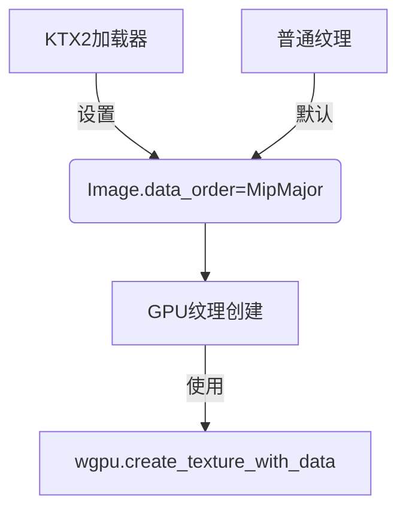

+++
title = "#19829 use wgpu TextureDataOrder"
date = "2025-06-27T00:00:00"
draft = false
template = "pull_request_page.html"
in_search_index = false

[extra]
current_language = "zh-cn"
available_languages = {"en" = { name = "English", url = "/pull_request/bevy/2025-06/pr-19829-en-20250627" }, "zh-cn" = { name = "中文", url = "/pull_request/bevy/2025-06/pr-19829-zh-cn-20250627" }}
+++

## 技术分析报告：PR #19829 - use wgpu TextureDataOrder

### 基本信息
- **标题**: use wgpu TextureDataOrder
- **PR链接**: https://github.com/bevyengine/bevy/pull/19829
- **作者**: atlv24
- **状态**: MERGED
- **标签**: A-Rendering, S-Ready-For-Final-Review, D-Straightforward
- **创建时间**: 2025-06-27T04:02:20Z
- **合并时间**: 2025-06-27T07:18:09Z
- **合并人**: superdump

### 描述翻译
# Objective

- 修复 #19140

## Solution

- 使用 TextureDataOrder

## Testing

- 运行了使用 ktx2 纹理的示例，显示正常

---

### 问题背景与解决方案
这个PR解决了KTX2纹理加载时数据排序错误的问题（#19140）。核心问题在于Bevy的纹理系统假设纹理数据采用"LayerMajor"（层主序）布局，但KTX2格式使用"MipMajor"（Mip主序）存储数据。之前采用的手动数据重组方案存在缺陷且效率低下。

解决方案是直接使用wgpu 0.20引入的`TextureDataOrder`枚举，该特性允许显式指定纹理数据的存储顺序。主要修改包括：
1. 在`Image`结构体新增`data_order`字段
2. 移除KTX2加载器中复杂的数据重组逻辑
3. 在纹理创建流程中传递排序信息

### 技术实现细节
#### 1. `Image`结构体扩展
在`bevy_image/src/image.rs`中扩展了`Image`结构体，新增`data_order`字段：

```rust
pub struct Image {
    pub data: Option<Vec<u8>>,
    /// 新增字段
    pub data_order: TextureDataOrder,
    pub texture_descriptor: TextureDescriptor<...>,
}
```
此字段允许指定纹理数据的存储顺序（MipMajor/LayerMajor），默认值为`LayerMajor`以保持向后兼容。

#### 2. KTX2加载器简化
在`bevy_image/src/ktx2.rs`中移除了33行复杂的数据重组代码：

```rust
// 之前：
let mut wgpu_data = vec![Vec::default(); (layer_count * face_count) as usize];
for (level, level_data) in levels.iter().enumerate() {
    // 复杂的数据重组逻辑...
}

// 之后：
image.data = Some(levels.into_iter().flatten().collect::<Vec<_>>());
image.data_order = wgpu_types::TextureDataOrder::MipMajor;
```
现在直接使用原始KTX2数据并设置`MipMajor`标志，避免了昂贵的数据复制操作。

#### 3. GPU纹理创建
在`bevy_render/src/texture/gpu_image.rs`中修改纹理创建调用：

```rust
// 之前：
render_device.create_texture_with_data(
    render_queue,
    &image.texture_descriptor,
    wgpu::util::TextureDataOrder::default(),
    data,
)

// 之后：
render_device.create_texture_with_data(
    render_queue,
    &image.texture_descriptor,
    image.data_order, // 使用Image中存储的排序方式
    data,
)
```

#### 4. 影响范围
修改涉及所有创建`Image`实例的地方：
- 在`bevy_core_pipeline/src/tonemapping/mod.rs`的LUT占位符中初始化默认值
- 在`bevy_sprite/src/tilemap_chunk/mod.rs`的瓦片地图生成器中设置默认值
- 所有`Image::new()`调用点自动获得默认值

### 技术影响与优势
1. **正确性**：解决了KTX2纹理显示错误的问题
2. **性能提升**：移除了O(n)复杂度的数据重组操作
3. **代码简化**：KTX2加载器代码减少94%（33行→2行）
4. **扩展性**：为未来支持其他数据排序方式奠定基础
5. **兼容性**：普通纹理保持默认LayerMajor不受影响

### 可视化关系


### 关键文件变更
1. **crates/bevy_image/src/ktx2.rs** (+2/-33)
```rust
// 修改后：
let mut image = Image::default();
image.texture_descriptor.format = texture_format;
image.data = Some(levels.into_iter().flatten().collect::<Vec<_>>());
image.data_order = wgpu_types::TextureDataOrder::MipMajor;
```

2. **crates/bevy_image/src/image.rs** (+7/-2)
```rust
pub struct Image {
    pub data: Option<Vec<u8>>,
    // 新增字段
    pub data_order: TextureDataOrder,
    // ...
}

impl Image {
    pub fn new( ... ) -> Self {
        Image {
            data: None,
            data_order: TextureDataOrder::default(), // 初始化
            // ...
        }
    }
}
```

3. **crates/bevy_render/src/texture/gpu_image.rs** (+1/-2)
```rust
render_device.create_texture_with_data(
    render_queue,
    &image.texture_descriptor,
    image.data_order, // 使用存储的排序方式
    data,
)
```

4. **crates/bevy_sprite/src/tilemap_chunk/mod.rs** (+4/-1)
```rust
Image {
    data: Some( ... ),
    data_order: TextureDataOrder::default(), // 新增初始化
    // ...
}
```

5. **crates/bevy_core_pipeline/src/tonemapping/mod.rs** (+1/-0)
```rust
Image {
    data: Some(data),
    data_order: TextureDataOrder::default(), // 新增初始化
    // ...
}
```

### 技术总结
该PR通过以下方式高效解决问题：
1. 利用wgpu新特性避免手动数据重组
2. 最小化API变更（仅新增一个字段）
3. 保持向后兼容性
4. 显著简化复杂纹理加载路径
5. 为纹理系统建立更灵活的架构基础

### 延伸阅读
1. [wgpu TextureDataOrder文档](https://docs.rs/wgpu/latest/wgpu/util/enum.TextureDataOrder.html)
2. [KTX2规范](https://github.khronos.org/KTX-Specification/)
3. [Bevy纹理系统架构](https://bevyengine.org/learn/book/next/assets/textures/)