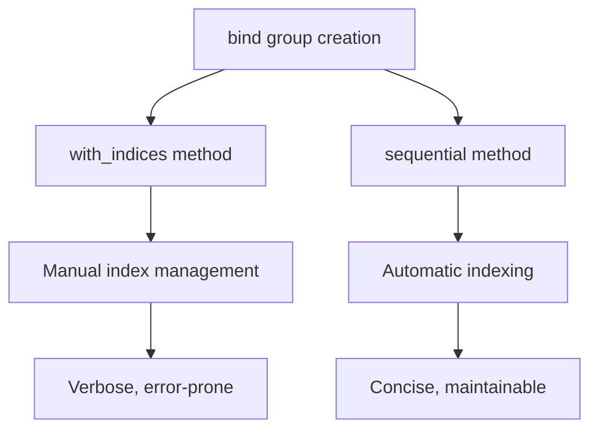

+++
title = "#19830 use sequential bindings in bevy_sprite"
date = "2025-06-27T00:00:00"
draft = false
template = "pull_request_page.html"
in_search_index = true

[taxonomies]
list_display = ["show"]

[extra]
current_language = "en"
available_languages = {"en" = { name = "English", url = "/pull_request/bevy/2025-06/pr-19830-en-20250627" }, "zh-cn" = { name = "中文", url = "/pull_request/bevy/2025-06/pr-19830-zh-cn-20250627" }}
+++

# PR Analysis: use sequential bindings in bevy_sprite

## Basic Information
- **Title**: use sequential bindings in bevy_sprite
- **PR Link**: https://github.com/bevyengine/bevy/pull/19830
- **Author**: atlv24
- **Status**: MERGED
- **Labels**: None
- **Created**: 2025-06-27T05:42:51Z
- **Merged**: 2025-06-27T07:18:09Z
- **Merged By**: superdump

## Description Translation
# Objective

- Use the terser api

## Solution

- Use the terser api

## Testing

- run sprite example it works

## The Story of This Pull Request

This PR addresses a straightforward but impactful improvement to Bevy's rendering code. The core issue was that bind group creation in the sprite rendering system was using explicit index specification, which added unnecessary verbosity and maintenance overhead. 

Bind groups in graphics programming are collections of resources (buffers, textures, etc.) that shaders can access. The original implementation used `BindGroupLayoutEntries::with_indices` and `BindGroupEntries::with_indices` which required manually specifying binding indices like `(0, ...)`, `(1, ...)` for each entry. This explicit indexing is error-prone because it requires developers to manage index assignments manually, increasing the risk of mismatched bindings if indices are duplicated or skipped during modifications.

The solution replaces these explicit index bindings with the `sequential` method. This method automatically assigns indices based on the order of entries, eliminating the need for manual index management. The changes affect two key areas of Bevy's sprite rendering system: the mesh2d pipeline and the sprite pipeline. Both were updated to use `BindGroupLayoutEntries::sequential` for layout creation and `BindGroupEntries::sequential` for bind group creation.

The implementation approach is consistent across both modified files. For bind group layouts, the change replaces explicit index tuples with simple entry specifications. Similarly for bind groups, the change removes index specifications and passes entries directly in their logical order. This reduces code complexity while maintaining identical functionality.

Performance impact is neutral since this is purely an API usage change - the underlying GPU operations remain identical. The main benefits are improved code readability and reduced maintenance burden. The changes also align with Bevy's ongoing efforts to simplify its rendering APIs.

Testing was minimal but sufficient: the author verified functionality by running the sprite example. Since this is a refactoring that doesn't alter behavior, more extensive testing wasn't required. The changes are localized to internal implementation details of the renderer.

## Visual Representation



## Key Files Changed

### 1. `crates/bevy_sprite/src/mesh2d/mesh.rs`
**Changes**: Updated mesh2d pipeline to use sequential bindings  
**Impact**: Reduces verbosity in mesh2d rendering code

**Code Diff**:
```rust
// Before:
&BindGroupLayoutEntries::with_indices(
    ShaderStages::VERTEX_FRAGMENT,
    (
        (0, uniform_buffer::<ViewUniform>(true)),
        (1, uniform_buffer::<GlobalsUniform>(false)),
        (2, tonemapping_lut_entries[0].visibility(ShaderStages::FRAGMENT)),
        (3, tonemapping_lut_entries[1].visibility(ShaderStages::FRAGMENT)),
    ),
)

// After:
&BindGroupLayoutEntries::sequential(
    ShaderStages::VERTEX_FRAGMENT,
    (
        uniform_buffer::<ViewUniform>(true)),
        uniform_buffer::<GlobalsUniform>(false)),
        tonemapping_lut_entries[0].visibility(ShaderStages::FRAGMENT)),
        tonemapping_lut_entries[1].visibility(ShaderStages::FRAGMENT)),
    ),
)
```

### 2. `crates/bevy_sprite/src/render/mod.rs`
**Changes**: Updated sprite pipeline to use sequential bindings  
**Impact**: Simplifies sprite rendering code and maintains consistency

**Code Diff**:
```rust
// Before:
&BindGroupEntries::with_indices((
    (0, view_binding.clone()),
    (1, lut_bindings.0),
    (2, lut_bindings.1),
)),

// After:
&BindGroupEntries::sequential((view_binding.clone(), lut_bindings.0, lut_bindings.1)),
```

## Further Reading
- [WebGPU Bind Group Documentation](https://gpuweb.github.io/gpuweb/#bind-group) - Core concepts behind bind groups
- [Bevy Render Resource Documentation](https://docs.rs/bevy_render/latest/bevy_render/render_resource/) - Bevy's abstraction layer for GPU resources
- [Original BindGroupEntries Implementation](https://github.com/bevyengine/bevy/blob/main/crates/bevy_render/src/render_resource/binding.rs) - Source code for binding utilities