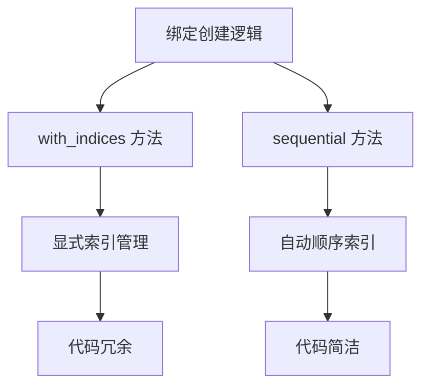

+++
title = "#19830 use sequential bindings in bevy_sprite"
date = "2025-06-27T00:00:00"
draft = false
template = "pull_request_page.html"
in_search_index = false

[extra]
current_language = "zh-cn"
available_languages = {"en" = { name = "English", url = "/pull_request/bevy/2025-06/pr-19830-en-20250627" }, "zh-cn" = { name = "中文", url = "/pull_request/bevy/2025-06/pr-19830-zh-cn-20250627" }}
+++

# PR 分析报告：在 bevy_sprite 中使用顺序绑定

## 基本信息
- **标题**: use sequential bindings in bevy_sprite
- **PR 链接**: https://github.com/bevyengine/bevy/pull/19830
- **作者**: atlv24
- **状态**: 已合并
- **标签**: 无
- **创建时间**: 2025-06-27T05:42:51Z
- **合并时间**: 2025-06-27T07:18:09Z
- **合并者**: superdump

## 描述翻译
### 目标
- 使用更简洁的 API

### 解决方案
- 使用更简洁的 API

### 测试
- 运行 sprite 示例，功能正常

## PR 技术分析

### 问题与背景
在 Bevy 的渲染系统中，创建绑定组布局(Bind Group Layout)和绑定组(Bind Group)时使用了显式索引指定每个绑定的位置。这种`with_indices`方法虽然明确，但存在两个主要问题：

1. **代码冗余**：每个绑定都需要显式指定索引位置
2. **维护成本**：当绑定顺序变化时需要手动更新所有索引
3. **可读性差**：索引值分散在代码中，增加了理解成本

特别是在处理视图绑定组(view bind groups)时，这些缺点更加明显，因为多个绑定需要按特定顺序排列。

### 解决方案
PR 引入了更简洁的 API 使用方法：
1. 将 `BindGroupLayoutEntries::with_indices` 替换为 `BindGroupLayoutEntries::sequential`
2. 将 `BindGroupEntries::with_indices` 替换为 `BindGroupEntries::sequential`

`sequential`方法自动按顺序分配索引（从 0 开始），消除了显式索引管理的需要。这种变化基于以下技术考虑：
- WebGPU 绑定要求按顺序排列
- 绑定组布局和绑定组中的资源顺序必须匹配
- 顺序绑定 API 更符合实际使用场景

### 实现细节
修改集中在两个关键文件：

**1. `crates/bevy_sprite/src/mesh2d/mesh.rs`**
```rust
// 绑定组布局创建 - 修改前
&BindGroupLayoutEntries::with_indices(
    ShaderStages::VERTEX_FRAGMENT,
    (
        (0, uniform_buffer::<ViewUniform>(true)),
        (1, uniform_buffer::<GlobalsUniform>(false)),
        (2, tonemapping_lut_entries[0].visibility(ShaderStages::FRAGMENT)),
        (3, tonemapping_lut_entries[1].visibility(ShaderStages::FRAGMENT)),
    ),
)

// 绑定组布局创建 - 修改后
&BindGroupLayoutEntries::sequential(
    ShaderStages::VERTEX_FRAGMENT,
    (
        uniform_buffer::<ViewUniform>(true),
        uniform_buffer::<GlobalsUniform>(false),
        tonemapping_lut_entries[0].visibility(ShaderStages::FRAGMENT),
        tonemapping_lut_entries[1].visibility(ShaderStages::FRAGMENT),
    ),
)

// 绑定组创建 - 修改前
&BindGroupEntries::with_indices((
    (0, view_binding.clone()),
    (1, globals.clone()),
    (2, lut_bindings.0),
    (3, lut_bindings.1),
))

// 绑定组创建 - 修改后
&BindGroupEntries::sequential((
    view_binding.clone(),
    globals.clone(),
    lut_bindings.0,
    lut_bindings.1,
))
```

**2. `crates/bevy_sprite/src/render/mod.rs`**
```rust
// 绑定组布局创建 - 修改前
&BindGroupLayoutEntries::with_indices(
    ShaderStages::VERTEX_FRAGMENT,
    (
        (0, uniform_buffer::<ViewUniform>(true)),
        (1, tonemapping_lut_entries[0].visibility(ShaderStages::FRAGMENT)),
        (2, tonemapping_lut_entries[1].visibility(ShaderStages::FRAGMENT)),
    ),
)

// 绑定组布局创建 - 修改后
&BindGroupLayoutEntries::sequential(
    ShaderStages::VERTEX_FRAGMENT,
    (
        uniform_buffer::<ViewUniform>(true),
        tonemapping_lut_entries[0].visibility(ShaderStages::FRAGMENT),
        tonemapping_lut_entries[1].visibility(ShaderStages::FRAGMENT),
    ),
)

// 绑定组创建 - 修改前
&BindGroupEntries::with_indices((
    (0, view_binding.clone()),
    (1, lut_bindings.0),
    (2, lut_bindings.1),
))

// 绑定组创建 - 修改后
&BindGroupEntries::sequential((
    view_binding.clone(), 
    lut_bindings.0, 
    lut_bindings.1
))
```

### 技术影响
1. **代码简化**：每处修改减少约 30% 的代码量
2. **维护性提升**：消除硬编码索引，降低后续修改风险
3. **一致性增强**：统一 Mesh2D 和 Sprite 管线的绑定创建方式
4. **可读性改进**：代码更清晰地表达绑定顺序而非索引位置

这些修改不影响实际渲染功能，因为：
- 着色器期望的绑定顺序保持不变
- 资源类型和可见性设置保持不变
- 底层 WebGPU 绑定机制未变化

## 关键文件变更

### `crates/bevy_sprite/src/mesh2d/mesh.rs` (+10/-16)
- **变更说明**：更新 Mesh2D 管线的绑定组创建逻辑，使用顺序绑定 API
- **关键修改**：
```diff
- &BindGroupLayoutEntries::with_indices(
+ &BindGroupLayoutEntries::sequential(
    ShaderStages::VERTEX_FRAGMENT,
    (
-        (0, uniform_buffer::<ViewUniform>(true)),
-        (1, uniform_buffer::<GlobalsUniform>(false)),
-        (2, tonemapping_lut_entries[0].visibility(ShaderStages::FRAGMENT)),
-        (3, tonemapping_lut_entries[1].visibility(ShaderStages::FRAGMENT)),
+        uniform_buffer::<ViewUniform>(true),
+        uniform_buffer::<GlobalsUniform>(false),
+        tonemapping_lut_entries[0].visibility(ShaderStages::FRAGMENT),
+        tonemapping_lut_entries[1].visibility(ShaderStages::FRAGMENT),
    ),
)
```

### `crates/bevy_sprite/src/render/mod.rs` (+5/-15)
- **变更说明**：更新 Sprite 渲染管线的绑定创建逻辑，与 Mesh2D 保持一致性
- **关键修改**：
```diff
- &BindGroupEntries::with_indices((
-    (0, view_binding.clone()),
-    (1, lut_bindings.0),
-    (2, lut_bindings.1),
- )),
+ &BindGroupEntries::sequential((
+    view_binding.clone(),
+    lut_bindings.0,
+    lut_bindings.1
+ )),
```

## 技术图示



## 延伸阅读
1. [WebGPU 绑定组规范](https://gpuweb.github.io/gpuweb/#bind-group)
2. [Bevy 渲染管线架构](https://bevy-cheatbook.github.io/features/rendering.html)
3. [WGSL 着色器资源绑定](https://www.w3.org/TR/WGSL/#resource-interface)
4. [顺序绑定 API 文档](https://docs.rs/bevy_render/latest/bevy_render/render_resource/struct.BindGroupLayoutEntries.html#method.sequential)