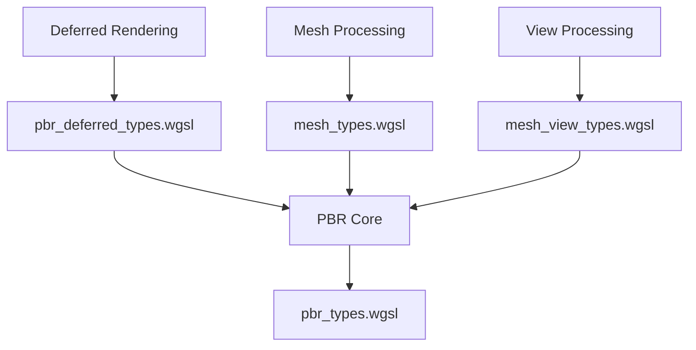

+++
title = "#19831 cleanup constants"
date = "2025-06-27T00:00:00"
draft = false
template = "pull_request_page.html"
in_search_index = true

[taxonomies]
list_display = ["show"]

[extra]
current_language = "en"
available_languages = {"en" = { name = "English", url = "/pull_request/bevy/2025-06/pr-19831-en-20250627" }, "zh-cn" = { name = "中文", url = "/pull_request/bevy/2025-06/pr-19831-zh-cn-20250627" }}
+++

### PR Analysis: Cleanup Constants (#19831)

## Basic Information
- **Title**: cleanup constants
- **PR Link**: https://github.com/bevyengine/bevy/pull/19831
- **Author**: atlv24
- **Status**: MERGED
- **Labels**: None
- **Created**: 2025-06-27T06:15:11Z
- **Merged**: 2025-06-27T07:21:16Z
- **Merged By**: superdump

## Description Translation
# Objective

- I think const expressions weren't supported in Naga when these were written, and we've just stuck with that since then. They're supported now so let's use them

## Solution

- Do that thang

## Testing

- transparency_3d, transmission, ssr, 3d_scene, couple others. They all look fine

## The Story of This Pull Request

**The Problem and Context**  
The Bevy engine's PBR rendering pipeline uses bitmask flags extensively in its WGSL shaders to represent material properties and rendering states. Originally, these flags were defined as raw numeric literals (like `1073741824u`) because Naga (Bevy's shader translation layer) didn't support constant expressions when the code was first written. Over time, this approach became problematic:  

1. Raw numbers are opaque and require manual bit position calculations  
2. Maintenance is error-prone when adding new flags  
3. The code is harder to read and verify  
4. Naga added support for const expressions, making the old approach obsolete  

**The Solution Approach**  
The developer identified that all affected constants could be rewritten using bit-shift expressions (`1u << n`) for clearer intent and better maintainability. This approach:  

1. Explicitly shows which bit position each flag occupies  
2. Eliminates manual calculation of large numeric literals  
3. Uses standard bit manipulation patterns familiar to graphics programmers  
4. Requires no functional changes to the rendering logic  

No alternatives were considered since the solution directly addresses the root issue. The changes are localized to constant definitions and don't affect shader logic.

**The Implementation**  
The changes update four WGSL files containing flag definitions. Each modification replaces numeric literals with equivalent shift operations:  

```wgsl
// Before
const MESH_FLAGS_NO_FRUSTUM_CULLING_BIT: u32 = 268435456u;

// After
const MESH_FLAGS_NO_FRUSTUM_CULLING_BIT: u32 = 1u << 28u;
```

The most significant update occurs in `pbr_types.wgsl`, where all 24 material flag constants were converted. Complex bitmask definitions like visibility range indices were also improved:  

```wgsl
// Before
const MESH_FLAGS_VISIBILITY_RANGE_INDEX_BITS: u32 = 65535u;

// After (clearer intent)
const MESH_FLAGS_VISIBILITY_RANGE_INDEX_BITS: u32 = (1u << 16u) - 1u;
```

Alpha mode flags were updated to use consistent shift patterns:  
```wgsl
// Before
const STANDARD_MATERIAL_FLAGS_ALPHA_MODE_MASK: u32 = 536870912u;

// After (explicit bit position)
const STANDARD_MATERIAL_FLAGS_ALPHA_MODE_MASK: u32 = 1u << 29u;
```

**Technical Insights**  
The changes demonstrate several good practices:  
1. **Bitmask Hygiene**: Using `1u << n` prevents accidental overlap and makes bit positions explicit  
2. **Compiler Compatibility**: Leveraging newer WGSL features when toolchain support matures  
3. **Technical Debt Reduction**: Proactively updating patterns when dependencies evolve  
4. **Validation**: Maintaining existing bitmask values ensures backward compatibility  

**The Impact**  
These changes provide immediate benefits:  
1. **Readability**: Bit positions are now explicit rather than implied  
2. **Maintainability**: Adding new flags requires less manual calculation  
3. **Debugging**: Easier to verify bitmask logic during shader development  
4. **Consistency**: Standardizes bitflag patterns across the codebase  

Testing confirmed no visual regressions in key rendering features like transparency, SSR, and 3D scenes.

## Visual Representation



## Key Files Changed

### `crates/bevy_pbr/src/render/pbr_types.wgsl` (+28/-30)
**Purpose**: Update material flag constants to use bit-shift expressions  
**Key Changes**:
```wgsl
// Before:
const STANDARD_MATERIAL_FLAGS_BASE_COLOR_TEXTURE_BIT: u32 = 1u;
const STANDARD_MATERIAL_FLAGS_ALPHA_MODE_MASK: u32 = 536870912u;

// After:
const STANDARD_MATERIAL_FLAGS_BASE_COLOR_TEXTURE_BIT: u32 = 1u << 0u;
const STANDARD_MATERIAL_FLAGS_ALPHA_MODE_MASK: u32 = 1u << 29u;
```

### `crates/bevy_pbr/src/render/mesh_types.wgsl` (+6/-9)
**Purpose**: Improve mesh flag constant definitions  
**Key Changes**:
```wgsl
// Before:
const MESH_FLAGS_NO_FRUSTUM_CULLING_BIT: u32 = 268435456u;

// After:
const MESH_FLAGS_NO_FRUSTUM_CULLING_BIT: u32 = 1u << 28u;
```

### `crates/bevy_pbr/src/render/mesh_view_types.wgsl` (+7/-7)
**Purpose**: Update light flag constants  
**Key Changes**:
```wgsl
// Before:
const POINT_LIGHT_FLAGS_SHADOWS_ENABLED_BIT: u32 = 1u;

// After:
const POINT_LIGHT_FLAGS_SHADOWS_ENABLED_BIT: u32 = 1u << 0u;
```

### `crates/bevy_pbr/src/deferred/pbr_deferred_types.wgsl` (+3/-3)
**Purpose**: Standardize deferred rendering flags  
**Key Changes**:
```wgsl
// Before:
const DEFERRED_FLAGS_UNLIT_BIT: u32 = 1u;

// After:
const DEFERRED_FLAGS_UNLIT_BIT: u32 = 1u << 0u;
```

## Further Reading
1. [WGSL Bitwise Operations](https://www.w3.org/TR/WGSL/#bit-expr)  
2. [Bevy PBR Rendering Architecture](https://bevyengine.org/learn/book/next/pbr/)  
3. [Naga Shader Translation](https://github.com/gfx-rs/naga)  
4. [Bitmask Patterns in Graphics Programming](https://graphicsprogrammingpatterns.com/pattern/bitmask-flags/)