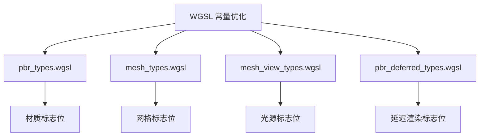

+++
title = "#19831 cleanup constants"
date = "2025-06-27T00:00:00"
draft = false
template = "pull_request_page.html"
in_search_index = false

[extra]
current_language = "zh-cn"
available_languages = {"en" = { name = "English", url = "/pull_request/bevy/2025-06/pr-19831-en-20250627" }, "zh-cn" = { name = "中文", url = "/pull_request/bevy/2025-06/pr-19831-zh-cn-20250627" }}
+++

# cleanup constants

## Basic Information
- **Title**: cleanup constants
- **PR Link**: https://github.com/bevyengine/bevy/pull/19831
- **Author**: atlv24
- **Status**: MERGED
- **Labels**: None
- **Created**: 2025-06-27T06:15:11Z
- **Merged**: 2025-06-27T07:21:16Z
- **Merged By**: superdump

## Description Translation
### 目标

- 我认为在编写这些常量时，naga 还不支持常量表达式（const exprs），之后我们一直沿用这种方式。现在支持了，所以我们应该使用它

### 解决方案

- 执行该操作

### 测试

- 测试了 transparency_3d、transmission、ssr、3d_scene 及其他几个场景，效果均正常

## The Story of This Pull Request

### 问题背景
在 Bevy 的 PBR 着色器代码中，存在多个位标志常量（bit-flag constants）使用硬编码整数值而非位移表达式。这种做法源于历史原因：当这些常量最初实现时，Naga（Bevy 使用的着色器翻译器）尚不支持 WGSL 的常量表达式。虽然这些硬编码值在功能上正确，但存在两个主要问题：

1. **可读性差**：开发者需要手动计算或验证位移结果（如 `536870912u` 对应 `1 << 29`）
2. **维护成本高**：修改位标志时需要重新计算整数值，易出错
3. **一致性缺失**：部分常量已使用位移表达式，但多数仍用硬编码值

### 技术解决方案
随着 Naga 对 WGSL 常量表达式支持的完善，PR 将硬编码的位标志常量统一重构为位移表达式：
1. 使用 `1u << N` 替代魔数（magic numbers）
2. 位掩码使用 `(1u << N) - 1u` 表达式
3. 多位移位操作统一为 `X << Y` 格式

重构原则：
- **功能等价**：确保新表达式计算结果与原值严格一致
- **最小改动**：仅修改常量定义，不影响使用这些常量的逻辑
- **范围控制**：仅修改 WGSL 文件，不涉及 Rust 代码

### 实现验证
作者通过以下方式验证修改：
1. 运行多个关键场景测试：
   - `transparency_3d`
   - `transmission`
   - `ssr`
   - `3d_scene`
2. 视觉对比：确认渲染结果与原实现无差异
3. 编译验证：确保所有修改的着色器通过 Naga 编译

### 技术影响
1. **可读性提升**：
   - 位移表达式明确展示位操作意图（例：`1u << 29u` 比 `536870912u` 更清晰）
   - 减少代码中的魔数
2. **维护性增强**：
   - 调整位标志时只需修改位移位数，无需重新计算整数值
   - 降低因手动计算错误导致 bug 的风险
3. **一致性改进**：统一项目中位标志的定义风格
4. **零性能开销**：所有修改均为编译时常量替换，不影响运行时性能

### 工程经验
1. **技术债务偿还**：及时利用新语言特性替换临时解决方案
2. **渐进式改进**：在保持功能不变前提下提升代码质量
3. **测试覆盖**：修改底层常量后需验证关键场景功能

## Visual Representation



## Key Files Changed

### 1. `crates/bevy_pbr/src/render/pbr_types.wgsl`
**变更说明**：重构材质系统标志位常量，使用位移表达式替代硬编码值

```wgsl
// Before:
const STANDARD_MATERIAL_FLAGS_BASE_COLOR_TEXTURE_BIT: u32         = 1u;
const STANDARD_MATERIAL_FLAGS_ALPHA_MODE_RESERVED_BITS: u32       = 3758096384u;
const STANDARD_MATERIAL_FLAGS_ALPHA_MODE_MASK: u32                = 536870912u;

// After:
const STANDARD_MATERIAL_FLAGS_BASE_COLOR_TEXTURE_BIT: u32         = 1u << 0u;
const STANDARD_MATERIAL_FLAGS_ALPHA_MODE_RESERVED_BITS: u32       = 7u << 29u;
const STANDARD_MATERIAL_FLAGS_ALPHA_MODE_MASK: u32                = 1u << 29u;
```

### 2. `crates/bevy_pbr/src/render/mesh_types.wgsl`
**变更说明**：优化网格标志位常量定义，使用位移表达式和掩码表达式

```wgsl
// Before:
const MESH_FLAGS_VISIBILITY_RANGE_INDEX_BITS: u32 = 65535u;
const MESH_FLAGS_NO_FRUSTUM_CULLING_BIT: u32 = 268435456u;

// After:
const MESH_FLAGS_VISIBILITY_RANGE_INDEX_BITS: u32     = (1u << 16u) - 1u;
const MESH_FLAGS_NO_FRUSTUM_CULLING_BIT: u32          = 1u << 28u;
```

### 3. `crates/bevy_pbr/src/render/mesh_view_types.wgsl`
**变更说明**：统一光源系统标志位常量的定义风格

```wgsl
// Before:
const POINT_LIGHT_FLAGS_SHADOWS_ENABLED_BIT: u32 = 1u;
const DIRECTIONAL_LIGHT_FLAGS_SHADOWS_ENABLED_BIT: u32 = 1u;

// After:
const POINT_LIGHT_FLAGS_SHADOWS_ENABLED_BIT: u32 = 1u << 0u;
const DIRECTIONAL_LIGHT_FLAGS_SHADOWS_ENABLED_BIT: u32 = 1u << 0u;
```

### 4. `crates/bevy_pbr/src/deferred/pbr_deferred_types.wgsl`
**变更说明**：更新延迟渲染路径的标志位常量

```wgsl
// Before:
const DEFERRED_FLAGS_UNLIT_BIT: u32 = 1u;

// After:
const DEFERRED_FLAGS_UNLIT_BIT: u32 = 1u << 0u;
```

## Further Reading
1. [WGSL 常量表达式规范](https://www.w3.org/TR/WGSL/#constant-expressions)
2. [位标志设计模式](https://en.wikipedia.org/wiki/Bit_field)
3. [Naga 着色器翻译器](https://github.com/gfx-rs/naga)
4. [Bevy PBR 材质系统文档](https://bevyengine.org/learn/book/next/pbr/)