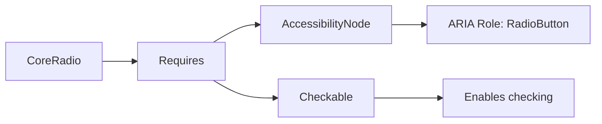

+++
title = "#19836 CoreRadio should require Checkable, not Checked."
date = "2025-06-27T00:00:00"
draft = false
template = "pull_request_page.html"
in_search_index = true

[taxonomies]
list_display = ["show"]

[extra]
current_language = "en"
available_languages = {"en" = { name = "English", url = "/pull_request/bevy/2025-06/pr-19836-en-20250627" }, "zh-cn" = { name = "中文", url = "/pull_request/bevy/2025-06/pr-19836-zh-cn-20250627" }}
labels = ["C-Bug", "D-Trivial", "A-UI"]
+++

## CoreRadio should require Checkable, not Checked.

### Basic Information
- **Title**: CoreRadio should require Checkable, not Checked.
- **PR Link**: https://github.com/bevyengine/bevy/pull/19836
- **Author**: viridia
- **Status**: MERGED
- **Labels**: C-Bug, D-Trivial, A-UI, S-Ready-For-Final-Review
- **Created**: 2025-06-27T13:58:30Z
- **Merged**: 2025-06-27T18:43:52Z
- **Merged By**: alice-i-cecile

### Description Translation
This was a mistake in my original PR #19778: a holdover from when Checked was not a marker component.

### The Story of This Pull Request

The PR addresses a component requirement issue in Bevy's UI system. In the original implementation of the `CoreRadio` widget (introduced in PR #19778), the component incorrectly required the `Checked` marker component instead of `Checkable`. This was an oversight from when `Checked` wasn't implemented as a marker component.

The problem surfaced because `CoreRadio` widgets need to be checkable regardless of their current state. Requiring `Checked` meant that only pre-checked radio buttons would satisfy the component requirement. This violated the fundamental behavior of radio buttons, which should be checkable even in their unchecked state. The issue would manifest as broken accessibility features and inconsistent UI behavior since non-checked radio buttons wouldn't have the necessary `Checkable` component.

The solution was straightforward: update the component requirement to use `Checkable` instead of `Checked`. This aligns with Bevy's UI component design where:
1. `Checkable` marks an entity as capable of being checked/unchecked
2. `Checked` is a state marker indicating the current checked status
3. Radio buttons must be checkable regardless of initial state

The implementation required only two changes:
1. Updating the `require` attribute on `CoreRadio`
2. Adjusting the import statement to include `Checkable`

These changes ensure that all `CoreRadio` entities automatically receive the `Checkable` component, enabling consistent check/uncheck behavior regardless of initial state. The fix maintains compatibility with existing systems that interact with radio buttons while correcting the component dependency graph.

The impact is significant for accessibility and UI consistency. Screen readers and input systems rely on the presence of `Checkable` to properly identify interactive elements. By fixing this requirement:
- All radio buttons now properly expose their checkable nature to accessibility APIs
- Input handling works consistently for both checked and unchecked states
- The component system accurately reflects the actual dependencies

This correction demonstrates the importance of precise component semantics in ECS architectures. Marker components should accurately represent capabilities (`Checkable`) rather than states (`Checked`), as capabilities persist through state changes.

### Visual Representation



### Key Files Changed

**File**: `crates/bevy_core_widgets/src/core_radio.rs`

**Changes**: 
1. Updated component requirement from `Checked` to `Checkable`
2. Added `Checkable` to imports

**Code Comparison**:
```rust
// Before:
use bevy_ui::{Checked, InteractionDisabled};

#[require(AccessibilityNode(accesskit::Node::new(Role::RadioButton)), Checked)]
pub struct CoreRadio;

// After:
use bevy_ui::{Checkable, Checked, InteractionDisabled};

#[require(AccessibilityNode(accesskit::Node::new(Role::RadioButton)), Checkable)]
pub struct CoreRadio;
```

### Further Reading
1. [Bevy UI Components Documentation](https://docs.rs/bevy_ui/latest/bevy_ui/)
2. [AccessKit ARIA Roles](https://accesskit.dev/api/accesskit/struct.Role.html)
3. [WAI-ARIA Radio Group Pattern](https://www.w3.org/WAI/ARIA/apg/patterns/radio/)