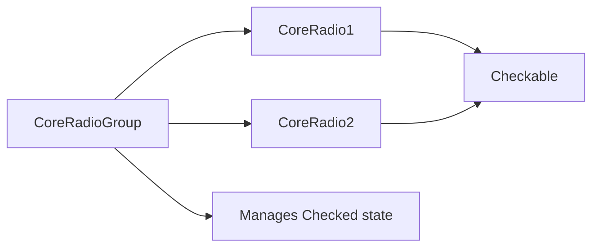

+++
title = "#19836 CoreRadio should require Checkable, not Checked."
date = "2025-06-27T00:00:00"
draft = false
template = "pull_request_page.html"
in_search_index = false

[extra]
current_language = "zh-cn"
available_languages = {"en" = { name = "English", url = "/pull_request/bevy/2025-06/pr-19836-en-20250627" }, "zh-cn" = { name = "中文", url = "/pull_request/bevy/2025-06/pr-19836-zh-cn-20250627" }}
labels = ["C-Bug", "D-Trivial", "A-UI"]
+++

# CoreRadio should require Checkable, not Checked.

## Basic Information
- **Title**: CoreRadio should require Checkable, not Checked.
- **PR Link**: https://github.com/bevyengine/bevy/pull/19836
- **Author**: viridia
- **Status**: MERGED
- **Labels**: C-Bug, D-Trivial, A-UI, S-Ready-For-Final-Review
- **Created**: 2025-06-27T13:58:30Z
- **Merged**: 2025-06-27T18:43:52Z
- **Merged By**: alice-i-cecile

## Description Translation
这是我原始PR #19778中的一个错误：它是Checked还不是标记组件时遗留下来的问题。

## The Story of This Pull Request

### 问题背景
在之前的PR #19778中，我们重构了Bevy的UI组件系统，引入了`Checkable`和`Checked`组件来管理可选中元素的状态。`CoreRadio`组件（用于实现单选按钮）被错误地标记为需要`Checked`组件，而不是`Checkable`组件。这违背了单选按钮组的设计原则：在单选组中，只有一个按钮应该处于`Checked`状态，其他按钮应是可选中但未选中的状态。

问题源于历史遗留问题：在早期实现中，`Checked`还没有作为标记组件存在。当#19778引入`Checkable`组件后，`CoreRadio`的错误依赖关系被保留下来。

### 解决方案实现
解决方案直接明了：修改`CoreRadio`组件的依赖关系，从要求`Checked`改为要求`Checkable`。这个改动虽然微小（仅修改2行代码），但修复了组件系统的类型安全保证。

在Bevy的组件系统中，`#[require]`属性确保当某个组件存在时，其依赖的组件也必须存在。这个机制帮助开发者避免无效的组件组合状态。对于`CoreRadio`，正确的依赖关系应该是：
1. 每个单选按钮必须是可选中元素（`Checkable`）
2. 单选按钮组（`CoreRadioGroup`）负责管理哪个按钮处于选中状态（`Checked`）

### 技术影响
这个修复：
1. 恢复了类型系统的正确性：`CoreRadio`不再要求矛盾的状态（所有单选按钮都被标记为选中）
2. 保持了ARIA可访问性规范的正确实现（所有单选按钮都声明为`Role::RadioButton`）
3. 使单选按钮组的行为符合预期：只有组内一个按钮可以是`Checked`状态
4. 防止了未来可能出现的逻辑错误和无效状态

## Visual Representation



## Key Files Changed

### `crates/bevy_core_widgets/src/core_radio.rs`
**修改原因**：修正`CoreRadio`组件的依赖关系，从要求`Checked`改为要求`Checkable`

代码修改：
```diff
 use bevy_input::ButtonState;
 use bevy_input_focus::FocusedInput;
 use bevy_picking::events::{Click, Pointer};
-use bevy_ui::{Checked, InteractionDisabled};
+use bevy_ui::{Checkable, Checked, InteractionDisabled};
 
 /// Headless widget implementation for a "radio button group". This component is used to group
 /// multiple [`CoreRadio`] components together, allowing them to behave as a single unit. It
@@ -46,7 +46,7 @@ pub struct CoreRadioGroup {
 /// but rather the enclosing group should be focusable.
 /// See <https://www.w3.org/WAI/ARIA/apg/patterns/radio>/
 #[derive(Component, Debug)]
-#[require(AccessibilityNode(accesskit::Node::new(Role::RadioButton)), Checked)]
+#[require(AccessibilityNode(accesskit::Node::new(Role::RadioButton)), Checkable)]
 pub struct CoreRadio;
 
 fn radio_group_on_key_input(
```

**关键点**：
1. 添加了`Checkable`的导入
2. 将`#[require]`属性中的`Checked`替换为`Checkable`
3. 保留了可访问性节点要求（`AccessibilityNode`）
4. 组件角色（`Role::RadioButton`）保持不变

## Further Reading
1. [ARIA Radio Group Pattern](https://www.w3.org/WAI/ARIA/apg/patterns/radio/) - 单选按钮组的官方可访问性规范
2. [Bevy UI Components](https://bevyengine.org/learn/book/features/ui/) - Bevy官方UI组件文档
3. [Marker Components in ECS](https://bevy-cheatbook.github.io/programming/marker-components.html) - ECS中标记组件的使用模式

# Full Code Diff
```diff
diff --git a/crates/bevy_core_widgets/src/core_radio.rs b/crates/bevy_core_widgets/src/core_radio.rs
index d5dd18fb1a839..a0857575c425c 100644
--- a/crates/bevy_core_widgets/src/core_radio.rs
+++ b/crates/bevy_core_widgets/src/core_radio.rs
@@ -15,7 +15,7 @@ use bevy_input::keyboard::{KeyCode, KeyboardInput};
 use bevy_input::ButtonState;
 use bevy_input_focus::FocusedInput;
 use bevy_picking::events::{Click, Pointer};
-use bevy_ui::{Checked, InteractionDisabled};
+use bevy_ui::{Checkable, Checked, InteractionDisabled};
 
 /// Headless widget implementation for a "radio button group". This component is used to group
 /// multiple [`CoreRadio`] components together, allowing them to behave as a single unit. It
@@ -46,7 +46,7 @@ pub struct CoreRadioGroup {
 /// but rather the enclosing group should be focusable.
 /// See <https://www.w3.org/WAI/ARIA/apg/patterns/radio>/
 #[derive(Component, Debug)]
-#[require(AccessibilityNode(accesskit::Node::new(Role::RadioButton)), Checked)]
+#[require(AccessibilityNode(accesskit::Node::new(Role::RadioButton)), Checkable)]
 pub struct CoreRadio;
 
 fn radio_group_on_key_input(
```