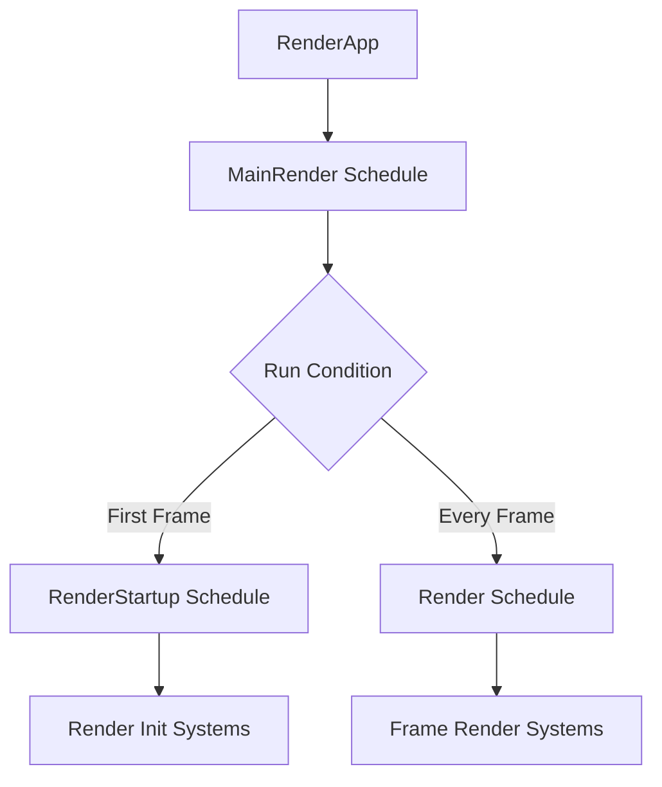

+++
title = "#19841"
date = "2025-06-29T00:00:00"
draft = false
template = "pull_request_page.html"
in_search_index = true

[taxonomies]
list_display = ["show"]

[extra]
current_language = "en"
available_languages = {"en" = { name = "English", url = "/pull_request/bevy/2025-06/pr-19841-en-20250629" }, "zh-cn" = { name = "中文", url = "/pull_request/bevy/2025-06/pr-19841-zh-cn-20250629" }}
+++

## The Story of This Pull Request

### The Problem and Context
In Bevy's rendering architecture, the `RenderApp` (a separate ECS world for rendering logic) lacked an equivalent to the main App's `Startup` schedule. This created friction when initializing render-specific resources or entities that should only exist in the rendering context. Currently, such initialization had to be placed in plugin build/finish methods, which is less flexible and doesn't align with Bevy's ECS scheduling paradigm. This limitation forced workarounds where rendering setup code couldn't naturally leverage ECS systems and schedules.

### The Solution Approach
The solution introduces a new `RenderStartup` schedule specifically for the `RenderApp`. To execute this schedule correctly, we also need to modify the render application's main execution flow. Inspired by how the main App handles startup logic, we create a new top-level schedule `MainRender` that:
1. Runs `RenderStartup` exactly once on first execution
2. Runs the main `Render` schedule on every frame

This approach mirrors the pattern used in `bevy_app::Main` while maintaining clear separation between startup and frame execution logic. The implementation required careful coordination between the new schedules and the existing render pipeline initialization.

### The Implementation
The core changes are in `crates/bevy_render/src/lib.rs`:

1. **Added `MainRender` schedule** - A new top-level schedule that orchestrates render app execution:
```rust
#[derive(ScheduleLabel, Clone, Debug, PartialEq, Eq, Hash, Default)]
pub struct MainRender;
impl MainRender {
    pub fn run(world: &mut World, mut run_at_least_once: Local<bool>) {
        if !*run_at_least_once {
            let _ = world.try_run_schedule(RenderStartup);
            *run_at_least_once = true;
        }

        let _ = world.try_run_schedule(Render);
    }
}
```
The `Local<bool>` ensures `RenderStartup` runs exactly once, while `Render` executes every frame.

2. **Added `RenderStartup` schedule** - The new startup schedule for render initialization:
```rust
#[derive(ScheduleLabel, Debug, Hash, PartialEq, Eq, Clone, Default)]
pub struct RenderStartup;
```

3. **Updated render app initialization** - Modified the `RenderApp` to use `MainRender` as its update schedule:
```rust
unsafe fn initialize_render_app(app: &mut App) {
    // ...
    let mut render_app = SubApp::new();
    render_app.update_schedule = Some(MainRender.intern());  // Changed from Render
    
    // ...
    render_app
        // ...
        .add_systems(MainRender, MainRender::run)  // Added system executor
        // ...
}
```
This change replaces the direct use of `Render` schedule with the new orchestrator `MainRender`.

### Technical Insights
The implementation demonstrates several important ECS patterns:
1. **Schedule composition**: `MainRender` composes multiple schedules (`RenderStartup` and `Render`) into a coherent execution flow
2. **Run-once pattern**: The `Local<bool>` tracks state across executions without storing it in the main world
3. **Schedule labeling**: Using `ScheduleLabel` derives enables type-safe schedule references
4. **Mirroring patterns**: The solution intentionally mirrors `bevy_app::Main` for consistency

The `try_run_schedule` calls provide resilience against missing schedules, though in practice both schedules should always exist.

### The Impact
These changes enable cleaner render initialization patterns:
```rust
app.sub_app_mut(RenderApp)
    .add_systems(RenderStartup, setup_render_resources);
```
Instead of placing initialization in plugin methods, developers can now use dedicated startup systems. This:
- Aligns render initialization with Bevy's ECS paradigms
- Enables system ordering constraints within render startup
- Allows startup systems to benefit from Bevy's system features (e.g., system parameters)
- Maintains clear separation between app and render initialization

## Visual Representation



## Key Files Changed

### `crates/bevy_render/src/lib.rs`
**Why changed**: To add render startup capability and reorganize render schedule execution  
**Key modifications**:

1. Added `MainRender` schedule definition and executor:
```rust
// Before: No equivalent exists
// After:
#[derive(ScheduleLabel, Clone, Debug, PartialEq, Eq, Hash, Default)]
pub struct MainRender;
impl MainRender {
    pub fn run(world: &mut World, mut run_at_least_once: Local<bool>) {
        if !*run_at_least_once {
            let _ = world.try_run_schedule(RenderStartup);
            *run_at_least_once = true;
        }
        let _ = world.try_run_schedule(Render);
    }
}
```

2. Added `RenderStartup` schedule label:
```rust
// Before: No render startup schedule
// After:
#[derive(ScheduleLabel, Debug, Hash, PartialEq, Eq, Clone, Default)]
pub struct RenderStartup;
```

3. Updated render app initialization:
```rust
// Before:
render_app.update_schedule = Some(Render.intern());

// After:
render_app.update_schedule = Some(MainRender.intern());
// ...
render_app.add_systems(MainRender, MainRender::run)
```

## Further Reading
1. [Bevy Schedules Documentation](https://bevyengine.org/learn/book/getting-started/schedules/)
2. [Bevy Render Architecture Overview](https://bevyengine.org/learn/book/getting-started/rendering/)
3. [ECS System Ordering Guide](https://bevyengine.org/learn/book/getting-started/system-order/)
4. [SubApps in Bevy](https://github.com/bevyengine/bevy/blob/main/crates/bevy_app/src/sub_app.rs)