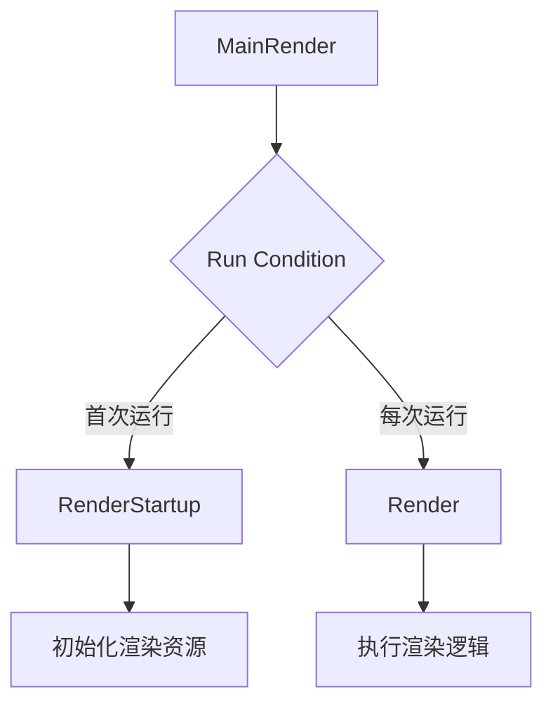

+++
title = "#19841 Add RenderStartup schedule to the RenderApp"
date = "2025-06-29T00:00:00"
draft = false
template = "pull_request_page.html"
in_search_index = false

[extra]
current_language = "zh-cn"
available_languages = {"en" = { name = "English", url = "/pull_request/bevy/2025-06/pr-19841-en-20250629" }, "zh-cn" = { name = "中文", url = "/pull_request/bevy/2025-06/pr-19841-zh-cn-20250629" }}
+++

## 标题
添加 RenderStartup 调度到 RenderApp

## 基本信息
- **标题**: Add RenderStartup schedule to the RenderApp
- **PR 链接**: https://github.com/bevyengine/bevy/pull/19841
- **作者**: IceSentry
- **状态**: 已合并
- **标签**: A-Rendering, A-ECS, S-Ready-For-Final-Review, A-App
- **创建时间**: 2025-06-27T21:47:18Z
- **合并时间**: 2025-06-29T18:33:33Z
- **合并者**: alice-i-cecile

## 描述翻译
# 目标 (Objective)

- 我们有时需要在启动时生成仅存在于 RenderApp 中的内容，但目前 RenderApp 中没有与 Startup schedule 等效的功能，因此必须在插件构建/完成代码中处理所有相关逻辑

## 解决方案 (Solution)

- 添加 RenderStartup schedule，在插件初始化后在 RenderApp 上运行

## 测试 (Testing)

- 已将 custom_post_processing 示例移植为使用此新 schedule，结果符合预期。将在后续 PR 中推送此更改

## 此 PR 的技术分析

### 问题与背景
在 Bevy 的渲染架构中，RenderApp 作为主 App 的独立子应用处理渲染逻辑。开发者经常需要在渲染应用启动时初始化特定资源或实体，但 RenderApp 缺乏与主应用 Startup schedule 对等的机制。这导致必须在插件构建阶段（plugin build/finish code）执行这些初始化操作，带来两个主要问题：
1. 初始化逻辑与插件注册代码耦合，降低代码可读性和可维护性
2. 无法利用 Bevy 的 ECS 调度系统管理启动顺序

### 解决方案设计
PR 引入新的调度阶段 RenderStartup，专门处理 RenderApp 的初始化逻辑。核心设计借鉴主应用的调度模式：
1. 创建 RenderStartup schedule 作为专用启动调度
2. 引入 MainRender schedule 作为渲染主循环
3. 通过 Local<bool> 状态确保 RenderStartup 只执行一次

此方案保持与 Bevy 现有调度架构的一致性，避免引入新范式。技术决策考虑点包括：
- 复用现有 ScheduleLabel 派生宏确保兼容性
- 采用与 bevy_app::Main 相同的"运行一次"模式
- 保持 Render schedule 的原始职责不变

### 实现细节
核心实现在 `crates/bevy_render/src/lib.rs` 中完成。首先定义新的调度标识：

```rust
#[derive(ScheduleLabel, Debug, Hash, PartialEq, Eq, Clone, Default)]
pub struct RenderStartup;

#[derive(ScheduleLabel, Clone, Debug, PartialEq, Eq, Hash, Default)]
pub struct MainRender;
```

MainRender 实现关键运行逻辑，使用 `Local<bool>` 确保 RenderStartup 仅执行一次：

```rust
impl MainRender {
    pub fn run(world: &mut World, mut run_at_least_once: Local<bool>) {
        if !*run_at_least_once {
            let _ = world.try_run_schedule(RenderStartup);
            *run_at_least_once = true;
        }
        let _ = world.try_run_schedule(Render);
    }
}
```

在 RenderApp 初始化流程中，更新调度设置：
1. 将主更新调度改为 MainRender
2. 注册 MainRender::run 系统

```rust
unsafe fn initialize_render_app(app: &mut App) {
    // ...
    let mut render_app = SubApp::new();
    render_app.update_schedule = Some(MainRender.intern()); // 替换原来的 Render
    
    render_app
        // ...
        .add_systems(MainRender, MainRender::run) // 添加主循环系统
        // ...
}
```

### 技术影响
1. **架构清晰化**：启动逻辑与插件代码解耦，符合单一职责原则
2. **扩展性增强**：开发者可通过标准方式添加渲染初始化系统
```rust
app.sub_app_mut(RenderApp)
    .add_systems(RenderStartup, setup_render_resources);
```
3. **行为可预测**：明确的调度阶段替代隐式的插件初始化
4. **性能零开销**：Local<bool> 检查是廉价操作，不影响主渲染循环

### 潜在改进方向
1. 未来可考虑与主应用 Startup schedule 的协同机制
2. 可能添加 RenderPostStartup 等细化阶段
3. 文档补充说明各渲染调度阶段的执行顺序

## 调度关系图示



## 关键文件变更

### crates/bevy_render/src/lib.rs
**变更说明**：
1. 新增 RenderStartup 调度标识
2. 引入 MainRender 调度及运行逻辑
3. 更新 RenderApp 初始化流程

**代码变更**：
```rust
// 新增 MainRender 和 RenderStartup 定义
#[derive(ScheduleLabel, Clone, Debug, PartialEq, Eq, Hash, Default)]
pub struct MainRender;
impl MainRender {
    pub fn run(world: &mut World, mut run_at_least_once: Local<bool>) {
        if !*run_at_least_once {
            let _ = world.try_run_schedule(RenderStartup);
            *run_at_least_once = true;
        }
        let _ = world.try_run_schedule(Render);
    }
}

#[derive(ScheduleLabel, Debug, Hash, PartialEq, Eq, Clone, Default)]
pub struct RenderStartup;

// 在初始化函数中更新调度设置
unsafe fn initialize_render_app(app: &mut App) {
    // ...
    let mut render_app = SubApp::new();
    // 变更前: render_app.update_schedule = Some(Render.intern());
    render_app.update_schedule = Some(MainRender.intern());
    
    render_app
        // ...
        // 新增 MainRender 系统注册
        .add_systems(MainRender, MainRender::run)
        // ...
}
```

## 扩展阅读
1. [Bevy 调度系统文档](https://bevyengine.org/learn/book/getting-started/schedules/)
2. [ECS 模式在游戏引擎中的应用](https://github.com/SanderMertens/ecs-faq)
3. [SubApp 架构设计讨论](https://github.com/bevyengine/bevy/discussions/89)

## 完整代码变更
```diff
diff --git a/crates/bevy_render/src/lib.rs b/crates/bevy_render/src/lib.rs
index 8bf7f41195c53..526d75dccdd39 100644
--- a/crates/bevy_render/src/lib.rs
+++ b/crates/bevy_render/src/lib.rs
@@ -217,10 +217,30 @@ pub enum RenderSystems {
     PostCleanup,
 }
 
+/// The schedule that contains the app logic that is evaluated each tick
+///
+/// This is highly inspired by [`bevy_app::Main`]
+#[derive(ScheduleLabel, Clone, Debug, PartialEq, Eq, Hash, Default)]
+pub struct MainRender;
+impl MainRender {
+    pub fn run(world: &mut World, mut run_at_least_once: Local<bool>) {
+        if !*run_at_least_once {
+            let _ = world.try_run_schedule(RenderStartup);
+            *run_at_least_once = true;
+        }
+
+        let _ = world.try_run_schedule(Render);
+    }
+}
+
 /// Deprecated alias for [`RenderSystems`].
 #[deprecated(since = "0.17.0", note = "Renamed to `RenderSystems`.")]
 pub type RenderSet = RenderSystems;
 
+/// The startup schedule of the [`RenderApp`]
+#[derive(ScheduleLabel, Debug, Hash, PartialEq, Eq, Clone, Default)]
+pub struct RenderStartup;
+
 /// The main render schedule.
 #[derive(ScheduleLabel, Debug, Hash, PartialEq, Eq, Clone, Default)]
 pub struct Render;
@@ -531,7 +551,7 @@ unsafe fn initialize_render_app(app: &mut App) {
     app.init_resource::<ScratchMainWorld>();
 
     let mut render_app = SubApp::new();
-    render_app.update_schedule = Some(Render.intern());
+    render_app.update_schedule = Some(MainRender.intern());
 
     let mut extract_schedule = Schedule::new(ExtractSchedule);
     // We skip applying any commands during the ExtractSchedule
@@ -546,6 +566,7 @@ unsafe fn initialize_render_app(app: &mut App) {
         .add_schedule(extract_schedule)
         .add_schedule(Render::base_schedule())
         .init_resource::<render_graph::RenderGraph>()
+        .add_systems(MainRender, MainRender::run)
         .insert_resource(app.world().resource::<AssetServer>().clone())
         .add_systems(ExtractSchedule, PipelineCache::extract_shaders)
         .add_systems(
```