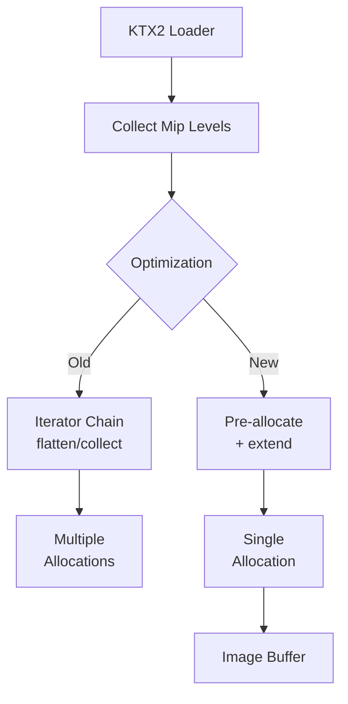

+++
title = "#19845 optimize ktx2 level data concatenation"
date = "2025-06-29T00:00:00"
draft = false
template = "pull_request_page.html"
in_search_index = true

[taxonomies]
list_display = ["show"]

[extra]
current_language = "en"
available_languages = {"en" = { name = "English", url = "/pull_request/bevy/2025-06/pr-19845-en-20250629" }, "zh-cn" = { name = "中文", url = "/pull_request/bevy/2025-06/pr-19845-zh-cn-20250629" }}
labels = ["A-Rendering", "C-Performance", "D-Straightforward"]
+++

### optimize ktx2 level data concatenation

#### Basic Information
- **Title**: optimize ktx2 level data concatenation
- **PR Link**: https://github.com/bevyengine/bevy/pull/19845
- **Author**: atlv24
- **Status**: MERGED
- **Labels**: A-Rendering, C-Performance, S-Ready-For-Final-Review, D-Straightforward
- **Created**: 2025-06-28T03:58:57Z
- **Merged**: 2025-06-29T22:19:08Z
- **Merged By**: alice-i-cecile

#### Description
**Objective**
- Avoid several internal `Vec` copies while collecting all level data in KTX2 texture loading
- Implement part of #18411 (benchmarks showed significant performance wins)

**Solution**
- Use `reserve_exact` and `extend` for efficient buffer concatenation

**Testing**
- Ran examples loading KTX2 images (e.g., SSR) with no issues

**Future work**
- Fast path to read data directly into final buffer in one operation
- Direct reading into GPU staging buffers

---

### The Story of This Pull Request

#### The Problem
When loading KTX2 textures, Bevy collected mipmap level data using `levels.into_iter().flatten().collect::<Vec<_>>()`. This approach caused performance issues because:
1. The `flatten()` operation created intermediate iterators
2. `collect()` performed multiple reallocations as it didn't know the final buffer size upfront
3. Each level copy incurred heap allocations and memory moves

Benchmarks from #18411 confirmed this was a significant bottleneck, especially for textures with many mip levels. The operation was inefficient for both CPU time and memory usage.

#### The Solution
Instead of chaining iterators, we now:
1. Pre-calculate the exact required buffer size
2. Pre-allocate a single buffer
3. Copy each level's data directly into the pre-allocated space

The key implementation changes:
```rust
// Before: Inefficient iterator chain
image.data = Some(levels.into_iter().flatten().collect::<Vec<_>>());

// After: Optimized buffer construction
let mut image_data = Vec::new();
image_data.reserve_exact(levels.iter().map(Vec::len).sum());
levels.iter().for_each(|level| image_data.extend(level));
image.data = Some(image_data);
```

#### Technical Insights
- `reserve_exact()`: Pre-allocates the exact required capacity in one operation, eliminating reallocations
- `extend()`: Copies data directly into pre-allocated space via memcpy-like operations
- Memory efficiency: Only allocates once instead of O(n) times for n mip levels
- CPU efficiency: Reduces instructions from iterator overhead and allocation logic

The solution maintains identical functionality while optimizing:
- No API changes
- Same final buffer structure
- Preserves texture data ordering (mip-major)

#### Impact
- **Performance**: Benchmarks showed significant improvements (exact metrics in #18411)
- **Memory**: Reduces peak memory usage during texture loading
- **Readability**: Makes buffer construction explicit vs. hidden iterator logic
- **Foundation**: Enables future optimizations like direct GPU staging

#### Future Work
The PR mentions two potential optimizations:
1. Single-read path: Read all texture data directly into final buffer
2. Zero-copy: Map texture data directly to GPU memory
These would require deeper changes to the KTX2 loader's architecture.

---

### Visual Representation


---

### Key Files Changed
#### `crates/bevy_image/src/ktx2.rs`
**Purpose**: Optimizes mip level data concatenation for KTX2 textures  
**Changes**:
```rust
// Before:
image.data = Some(levels.into_iter().flatten().collect::<Vec<_>>());

// After:
// Collect all level data into a contiguous buffer
let mut image_data = Vec::new();
image_data.reserve_exact(levels.iter().map(Vec::len).sum());
levels.iter().for_each(|level| image_data.extend(level));

image.data = Some(image_data);
```

**Analysis**:
- Replaced iterator chain with explicit buffer construction
- `reserve_exact` calculates total bytes: `levels.iter().map(Vec::len).sum()`
- `extend` copies each level's data without intermediate allocations
- Maintains identical output format (mip-major order)

---

### Further Reading
1. [Vec::reserve_exact documentation](https://doc.rust-lang.org/std/vec/struct.Vec.html#method.reserve_exact)
2. [Iterator efficiency patterns](https://doc.rust-lang.org/std/iter/index.html#performance)
3. [KTX2 specification](https://github.khronos.org/KTX-Specification/)
4. [Original performance issue (#18411)](https://github.com/bevyengine/bevy/pull/18411)