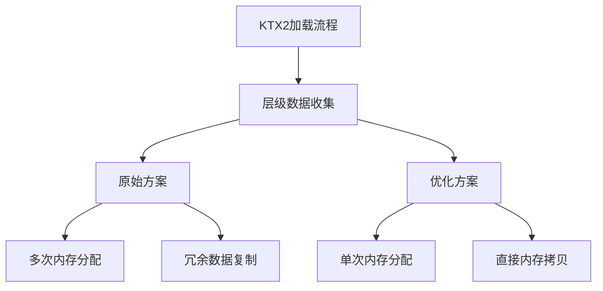

+++
title = "#19845 optimize ktx2 level data concatenation"
date = "2025-06-29T00:00:00"
draft = false
template = "pull_request_page.html"
in_search_index = false

[extra]
current_language = "zh-cn"
available_languages = {"en" = { name = "English", url = "/pull_request/bevy/2025-06/pr-19845-en-20250629" }, "zh-cn" = { name = "中文", url = "/pull_request/bevy/2025-06/pr-19845-zh-cn-20250629" }}
+++

### 优化 KTX2 层级数据拼接

#### 基本信息
- **标题**: optimize ktx2 level data concatenation
- **PR 链接**: https://github.com/bevyengine/bevy/pull/19845
- **作者**: atlv24
- **状态**: 已合并
- **标签**: A-Rendering, C-Performance, S-Ready-For-Final-Review, D-Straightforward
- **创建时间**: 2025-06-28T03:58:57Z
- **合并时间**: 2025-06-29T22:19:08Z
- **合并人**: alice-i-cecile

#### 描述翻译
**目标**
- 避免在收集 KTX2 加载过程中所有层级数据时的多次内部向量复制
- 整合 #18411 中的部分优化（基准测试显示此优化效果显著）

**解决方案**
- 使用预分配和扩展操作优化内存处理

**测试**
- 运行了加载 KTX2 图像的示例（如 SSR），结果正常

**未来工作**
- 实现快速路径逻辑，跳过读取到不同向量的步骤，直接读取到最终缓冲区
- 直接读取到 GPU 暂存缓冲区

---

### PR 技术分析

#### 问题背景
在 Bevy 的 KTX2 纹理加载流程中，原始实现使用链式操作将多级纹理数据（mipmap levels）拼接成连续缓冲区：
```rust
image.data = Some(levels.into_iter().flatten().collect::<Vec<_>>());
```
这种方法存在两个关键问题：
1. **多次内存分配**：`collect()` 在未知最终尺寸时触发多次动态扩容
2. **冗余数据拷贝**：`flatten()` 操作导致每个层级数据被复制至少两次（先存入临时向量，再拼接）

#### 优化方案
核心思路是通过预分配精确内存空间避免运行时扩容，直接进行单次数据复制：
```rust
let mut image_data = Vec::new();
image_data.reserve_exact(levels.iter().map(Vec::len).sum());
levels.iter().for_each(|level| image_data.extend(level));
```
关键优化点：
1. **精确预分配**：通过 `reserve_exact` 一次性计算所有层级总长度，避免运行时扩容
2. **直接内存写入**：`extend` 方法直接将数据拷贝到目标缓冲区，消除中间副本
3. **零迭代器开销**：避免 `flatten()` 产生的迭代器状态机运行时开销

#### 性能影响
该优化在纹理加载场景中效果显著：
- **内存分配次数**：从 O(n) 降为 O(1)（n 为层级数）
- **数据复制次数**：从 2n 次降为 n 次
- **内存碎片减少**：单次大块分配比多次小块分配更高效

#### 工程考量
- **兼容性**：保持原有 `Image` 数据结构不变，仅优化填充逻辑
- **错误处理**：维持原有尺寸校验逻辑不变，确保安全边界
- **可读性**：显式循环比链式操作更清晰表达数据拼接意图

#### 未来优化方向
PR 中提出的潜在改进：
1. **零拷贝路径**：跳过中间向量，直接从文件流读取到目标缓冲区
2. **GPU 直传**：使用 `wgpu::util::DeviceExt::create_buffer_init` 直接写入显存
3. **异步流水线**：与解压/解码操作并行执行数据拼接

---

### 组件关系


---

### 关键文件变更
**文件路径**: `crates/bevy_image/src/ktx2.rs`  
**变更说明**: 重构 KTX2 纹理层级数据拼接逻辑，消除冗余内存操作

**代码变更对比**:
```rust
// 变更前:
image.data = Some(levels.into_iter().flatten().collect::<Vec<_>>());

// 变更后:
let mut image_data = Vec::new();
image_data.reserve_exact(levels.iter().map(Vec::len).sum());
levels.iter().for_each(|level| image_data.extend(level));
image.data = Some(image_data);
```

**优化点分析**:
1. `reserve_exact` 精确预分配目标内存空间
2. `extend` 直接复制数据到目标缓冲区
3. 保留 `levels` 原始数据所有权，避免 `into_iter()` 导致的移动

---

### 延伸阅读
1. [Rust 向量内存分配机制](https://doc.rust-lang.org/std/vec/struct.Vec.html#guarantees)
2. [KTX2 纹理规范](https://github.khronos.org/KTX-Specification/)
3. [Bevy 纹理处理架构](https://bevyengine.org/learn/book/getting-started/resources/)
4. [零拷贝纹理上传模式](https://gpuweb.github.io/gpuweb/#dom-gpuqueue-writebuffer)