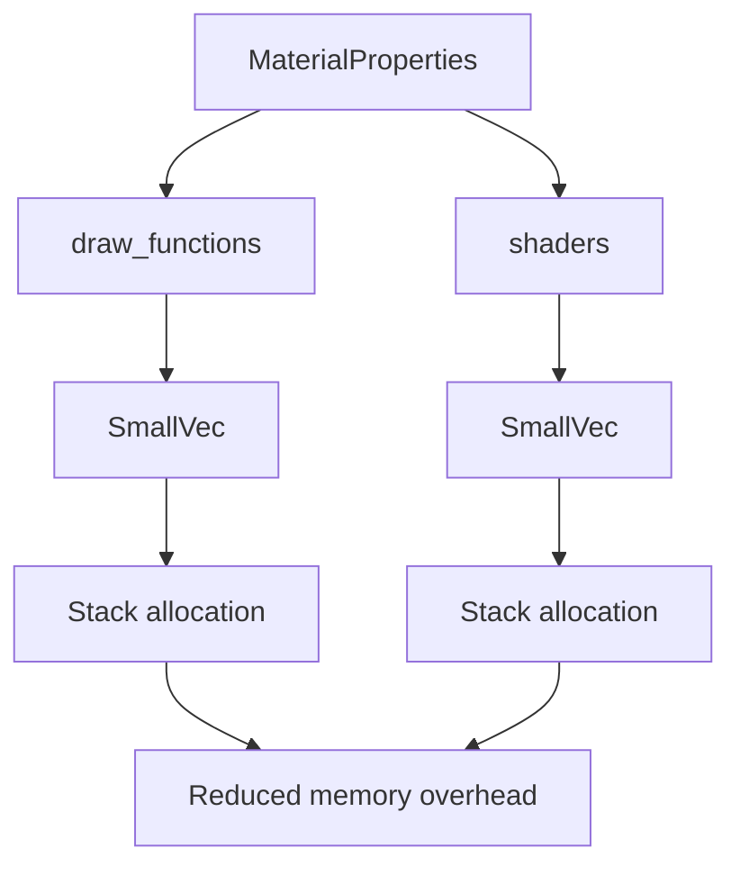

+++
title = "#19846 Use SmallVec instead of HashMap in MaterialProperties"
date = "2025-06-28T00:00:00"
draft = false
template = "pull_request_page.html"
in_search_index = true

[taxonomies]
list_display = ["show"]

[extra]
current_language = "en"
available_languages = {"en" = { name = "English", url = "/pull_request/bevy/2025-06/pr-19846-en-20250628" }, "zh-cn" = { name = "中文", url = "/pull_request/bevy/2025-06/pr-19846-zh-cn-20250628" }}
labels = ["A-Rendering", "C-Performance", "S-Needs-Benchmarking"]
+++

## Use SmallVec instead of HashMap in MaterialProperties

### Basic Information
- **Title**: Use SmallVec instead of HashMap in MaterialProperties
- **PR Link**: https://github.com/bevyengine/bevy/pull/19846
- **Author**: IceSentry
- **Status**: MERGED
- **Labels**: A-Rendering, C-Performance, S-Needs-Benchmarking, S-Needs-Review
- **Created**: 2025-06-28T06:14:02Z
- **Merged**: 2025-06-28T19:03:20Z
- **Merged By**: superdump

### Description Translation
**Objective**
- MaterialProperties uses HashMap for some data that is generally going to be really small. This is likely using more memory than necessary

**Solution**
- Use a SmallVec instead
- I used the size a StandardMaterial would need for all the backing arrays

**Testing**
- Tested the 3d_scene to confirm it still works

**Notes**
I'm not sure if it made a measurable difference since I'm not sure how to measure this. It's a bit hard to create an artificial workflow where this would be the main bottleneck. This is very in the realm of microoptimization.

### The Story of This Pull Request

The `MaterialProperties` struct in Bevy's rendering system contained two HashMap fields for storing draw functions and shaders. HashMaps provide O(1) lookups but carry significant memory overhead due to their internal structure (buckets, hashing state, and load factor management). For typical use cases like `StandardMaterial`, these collections contain only 3-4 entries yet incur HashMap's fixed overhead per instance.

The author identified this as a potential memory optimization opportunity. Since materials are created frequently (each material instance gets its own `MaterialProperties`), reducing per-instance overhead could yield meaningful memory savings across large scenes. The solution replaces the HashMaps with `SmallVec` - a stack-allocated vector that avoids heap allocations for small collections. The backing arrays were sized to accommodate `StandardMaterial`'s typical needs: 4 entries for draw functions and 3 for shaders.

Implementation required updating all access patterns:
1. Lookup methods (`get_shader`, `get_draw_function`) were converted from HashMap's `get` to linear searches through the SmallVec
2. Insertion methods (`add_shader`, `add_draw_function`) were simplified to `push` operations
3. Initialization code was updated to build the collections via `push` instead of `insert`

The prepass module was also updated to use the new `get_shader` method rather than directly accessing the collection. Testing confirmed functionality remained intact in the 3d_scene example.

This optimization targets memory efficiency rather than computational performance. The trade-off involves replacing O(1) HashMap lookups with O(n) linear scans, but given the small collection sizes (n ≤ 4), the practical difference is negligible. The memory savings per material instance come from:
- Eliminating HashMap's internal bucket structure
- Removing hashing overhead
- Avoiding pointer indirection for small collections

### Visual Representation



### Key Files Changed

**1. crates/bevy_pbr/src/material.rs**
- Replaced HashMap with SmallVec in MaterialProperties
- Updated access methods to use linear search
- Modified initialization code to use push operations

```rust
// Before:
pub draw_functions: HashMap<InternedDrawFunctionLabel, DrawFunctionId>,
pub shaders: HashMap<InternedShaderLabel, Handle<Shader>>,

// After:
pub draw_functions: SmallVec<[(InternedDrawFunctionLabel, DrawFunctionId); 4]>,
pub shaders: SmallVec<[(InternedShaderLabel, Handle<Shader>); 3]>,
```

```rust
// Lookup method before:
pub fn get_shader(&self, label: impl ShaderLabel) -> Option<Handle<Shader>> {
    self.shaders.get(&label.intern()).cloned()
}

// Lookup method after:
pub fn get_shader(&self, label: impl ShaderLabel) -> Option<Handle<Shader>> {
    self.shaders
        .iter()
        .find(|(inner_label, _)| inner_label == &label.intern())
        .map(|(_, shader)| shader)
        .cloned()
}
```

**2. crates/bevy_pbr/src/prepass/mod.rs**
- Updated shader access to use get_shader() method

```rust
// Before:
material_properties
    .shaders
    .get(&PrepassFragmentShader.intern())

// After:
material_properties.get_shader(PrepassFragmentShader)
```

### Further Reading
- [SmallVec Documentation](https://docs.rs/smallvec/latest/smallvec/)
- [Rust HashMap Internals](https://nnethercote.github.io/perf-book/collections.html#hash-maps)
- [Bevy Material System](https://bevyengine.org/learn/book/features/pbr/)