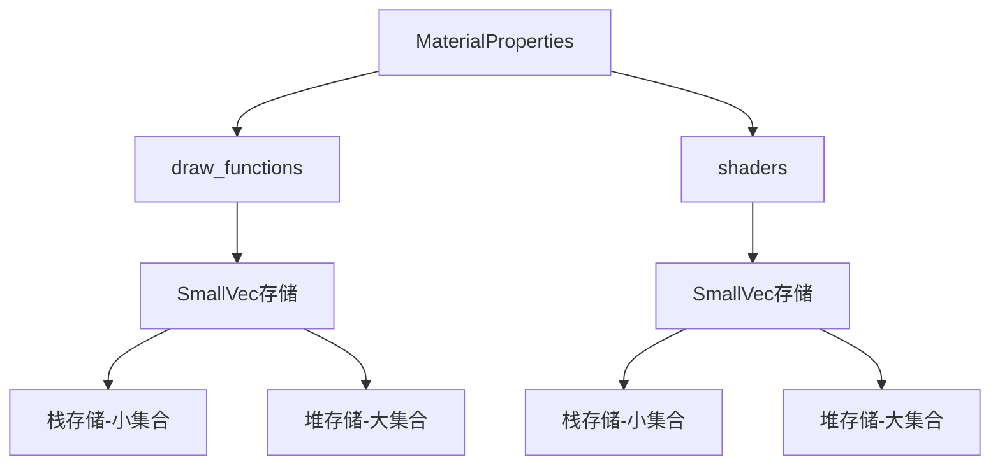

+++
title = "#19846 Use SmallVec instead of HashMap in MaterialProperties"
date = "2025-06-28T00:00:00"
draft = false
template = "pull_request_page.html"
in_search_index = false

[extra]
current_language = "zh-cn"
available_languages = {"en" = { name = "English", url = "/pull_request/bevy/2025-06/pr-19846-en-20250628" }, "zh-cn" = { name = "中文", url = "/pull_request/bevy/2025-06/pr-19846-zh-cn-20250628" }}
+++

# 使用 SmallVec 替代 HashMap 优化 MaterialProperties

## 基本信息
- **标题**: Use SmallVec instead of HashMap in MaterialProperties
- **PR链接**: https://github.com/bevyengine/bevy/pull/19846
- **作者**: IceSentry
- **状态**: 已合并
- **标签**: A-Rendering, C-Performance, S-Needs-Benchmarking, S-Needs-Review
- **创建时间**: 2025-06-28T06:14:02Z
- **合并时间**: 2025-06-28T19:03:20Z
- **合并者**: superdump

## 描述翻译

### 目标
- MaterialProperties 使用 HashMap 存储一些通常非常小的数据。这可能导致使用比必要更多的内存

### 解决方案
- 改用 SmallVec
- 我使用了 StandardMaterial 所需的所有支持数组的大小作为初始容量

### 测试
- 测试了 3d_scene 以确认它仍然正常工作

### 备注
我不确定这是否带来了可测量的差异，因为我不知道如何测量。很难创建一个人工工作流来让这个成为主要瓶颈。这属于微优化的范畴。

## 这个Pull Request的故事

### 问题与优化契机
在Bevy的渲染系统中，`MaterialProperties`结构体负责存储材质相关的关键数据，包括绘制函数(draw functions)和着色器(shaders)。原实现使用`HashMap`存储这些数据：

```rust
pub draw_functions: HashMap<InternedDrawFunctionLabel, DrawFunctionId>,
pub shaders: HashMap<InternedShaderLabel, Handle<Shader>>,
```

但实际使用场景中，这些集合通常非常小。以StandardMaterial为例：
- 绘制函数通常不超过4个
- 着色器通常不超过3个（主片段、预处理片段、延迟片段）

使用`HashMap`存储少量元素存在内存浪费问题：
1. HashMap需要维护桶数组(bucket array)
2. 每个元素需要额外存储哈希值
3. 小集合时内存碎片化更严重

在大量材质实例的场景中，这些额外开销会累积成显著的内存浪费。

### 解决方案选择
SmallVec成为理想的替代方案：
1. 在栈上预分配固定容量（避免小集合时的堆分配）
2. 元素数量不超过容量时零堆分配
3. 保持向量接口的简单性

容量选择基于实际使用场景：
```rust
// 绘制函数初始容量为4（StandardMaterial需求）
pub draw_functions: SmallVec<[(InternedDrawFunctionLabel, DrawFunctionId); 4]>,

// 着色器初始容量为3（StandardMaterial需求）
pub shaders: SmallVec<[(InternedShaderLabel, Handle<Shader>); 3]>,
```

### 实现调整
访问方法需要适配新数据结构。原HashMap的`.get()`方法被替换为线性查找：

```rust
pub fn get_shader(&self, label: impl ShaderLabel) -> Option<Handle<Shader>> {
    self.shaders
        .iter()
        .find(|(inner_label, _)| inner_label == &label.intern())
        .map(|(_, shader)| shader)
        .cloned()
}
```

添加方法简化为直接push操作，不再返回旧值：
```rust
pub fn add_shader(&mut self, label: impl ShaderLabel, shader: Handle<Shader>) {
    self.shaders.push((label.intern(), shader));
}
```

构建MaterialProperties的代码相应调整：
```rust
let mut draw_functions = SmallVec::new();
draw_functions.push((MaterialDrawFunction.intern(), draw_function_id));

let mut shaders = SmallVec::new();
shaders.push((label, shader));
```

### 兼容性处理
预处理模块需要适配新的访问接口：
```rust
// 原实现
material_properties
    .shaders
    .get(&PrepassFragmentShader.intern())
    .is_some()

// 新实现
material_properties
    .get_shader(PrepassFragmentShader)
    .is_some()
```

### 性能权衡
虽然查找时间复杂度从O(1)变为O(n)，但实际影响有限：
1. 集合大小极小（通常≤4）
2. 线性遍历连续内存的局部性好
3. 避免哈希计算的开销

内存收益更显著：
1. 消除HashMap的桶数组开销
2. 小集合时完全避免堆分配
3. 更紧凑的内存布局

### 验证与影响
改动后：
1. 基础渲染功能通过3D场景测试验证
2. 内存敏感场景可能获得收益
3. API保持兼容（修改仅限于内部实现）

由于是微优化，实际性能提升需要具体场景验证，但内存占用减少在理论上是确定的。

## 视觉表示



## 关键文件更改

### crates/bevy_pbr/src/material.rs
将HashMap替换为SmallVec，优化小集合内存使用

```rust
// 修改前:
pub draw_functions: HashMap<InternedDrawFunctionLabel, DrawFunctionId>,
pub shaders: HashMap<InternedShaderLabel, Handle<Shader>>,

// 修改后:
pub draw_functions: SmallVec<[(InternedDrawFunctionLabel, DrawFunctionId); 4]>,
pub shaders: SmallVec<[(InternedShaderLabel, Handle<Shader>); 3]>,
```

```rust
// 方法适配示例:
// 修改前:
pub fn add_shader(&mut self, label: impl ShaderLabel, shader: Handle<Shader>) -> Option<Handle<Shader>> {
    self.shaders.insert(label.intern(), shader)
}

// 修改后:
pub fn add_shader(&mut self, label: impl ShaderLabel, shader: Handle<Shader>) {
    self.shaders.push((label.intern(), shader));
}
```

### crates/bevy_pbr/src/prepass/mod.rs
适配新的shader访问接口

```rust
// 修改前:
material_properties
    .shaders
    .get(&PrepassFragmentShader.intern())
    .is_some()

// 修改后:
material_properties
    .get_shader(PrepassFragmentShader)
    .is_some()
```

## 进一步阅读
1. [SmallVec文档](https://docs.rs/smallvec/latest/smallvec/) - 了解SmallVec实现细节
2. [Rust集合选择指南](https://doc.rust-lang.org/std/collections/index.html#when-to-use-which-collection) - 如何选择合适的数据结构
3. [Bevy材质系统](https://bevyengine.org/learn/book/getting-started/materials/) - 理解材质属性使用场景