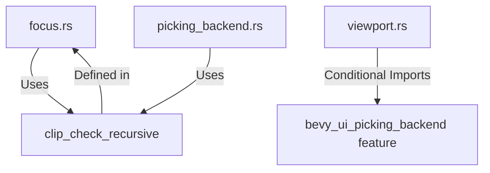

+++
title = "#19858 bevy_ui compilation"
date = "2025-06-29T00:00:00"
draft = false
template = "pull_request_page.html"
in_search_index = true

[taxonomies]
list_display = ["show"]

[extra]
current_language = "en"
available_languages = {"en" = { name = "English", url = "/pull_request/bevy/2025-06/pr-19858-en-20250629" }, "zh-cn" = { name = "中文", url = "/pull_request/bevy/2025-06/pr-19858-zh-cn-20250629" }}
labels = ["C-Code-Quality"]
+++

## bevy_ui compilation

### Basic Information
- **Title**: bevy_ui compilation
- **PR Link**: https://github.com/bevyengine/bevy/pull/19858
- **Author**: mockersf
- **Status**: MERGED
- **Labels**: C-Code-Quality, S-Ready-For-Final-Review
- **Created**: 2025-06-29T10:15:51Z
- **Merged**: 2025-06-29T17:31:29Z
- **Merged By**: alice-i-cecile

### Description Translation
# Objective

- `bevy_ui` has errors and warnings when building independently

## Solution

- properly use the `bevy_ui_picking_backend` feature

## Testing

`cargo build -p bevy_ui`

### The Story of This Pull Request

This PR addresses compilation issues in the `bevy_ui` crate when building without certain features enabled. The core problem was conditional compilation directives not being properly applied across the codebase, causing errors and warnings during standalone builds.

The issue stemmed from two main areas. First, the `clip_check_recursive` function was defined in `picking_backend.rs` but used in `focus.rs`. Since `picking_backend.rs` is conditionally compiled only when the `bevy_ui_picking_backend` feature is enabled, this caused compilation failures when the feature was disabled. Second, `viewport.rs` contained unconditional imports for types only used with the picking backend, leading to unused import warnings.

The solution involved relocating the `clip_check_recursive` function to `focus.rs`, making it available regardless of feature flags. This is valid because the function is essential for focus handling even without picking. The implementation was moved verbatim:

```rust
/// Walk up the tree child-to-parent checking that `point` is not clipped...
pub fn clip_check_recursive(
    point: Vec2,
    entity: Entity,
    clipping_query: &Query<'_, '_, (&ComputedNode, &UiGlobalTransform, &Node)>,
    child_of_query: &Query<&ChildOf>,
) -> bool {
    // Implementation unchanged
}
```

In `picking_backend.rs`, we removed the duplicate function definition and added an import pointing to the new location in `focus.rs`:

```rust
use crate::{clip_check_recursive, prelude::*, ui_transform::UiGlobalTransform, UiStack};
```

For `viewport.rs`, we added conditional compilation attributes to several imports, ensuring they're only included when needed. This eliminated unused import warnings during builds without the picking backend:

```rust
#[cfg(feature = "bevy_ui_picking_backend")]
use bevy_ecs::{
    event::EventReader,
    system::{Commands, Res},
};
```

These changes maintain identical functionality while making the codebase more resilient to different build configurations. The solution demonstrates proper use of Rust's conditional compilation system, particularly important in game engines where feature flags control substantial parts of functionality.

### Visual Representation



### Key Files Changed

1. **crates/bevy_ui/src/focus.rs** (+25/-4)  
   Added `clip_check_recursive` implementation to ensure availability without feature flags.

```rust
// Before: (in picking_backend.rs)
pub fn clip_check_recursive(...) -> bool { ... }

// After: (in focus.rs)
pub fn clip_check_recursive(...) -> bool {
    // Function implementation
}
```

2. **crates/bevy_ui/src/picking_backend.rs** (+1/-25)  
   Removed duplicate function and imported from new location.

```rust
// Before:
// Function definition here

// After:
use crate::clip_check_recursive;  // Import from focus.rs
```

3. **crates/bevy_ui/src/widget/viewport.rs** (+14/-4)  
   Added conditional compilation to picking-specific imports.

```rust
// Before:
use bevy_ecs::event::EventReader;
use bevy_render::camera::NormalizedRenderTarget;

// After:
#[cfg(feature = "bevy_ui_picking_backend")]
use bevy_ecs::event::EventReader;
#[cfg(feature = "bevy_ui_picking_backend")]
use bevy_render::camera::NormalizedRenderTarget;
```

### Further Reading
1. [Rust Conditional Compilation](https://doc.rust-lang.org/reference/conditional-compilation.html) - Official documentation for `#[cfg]` attributes  
2. [Bevy Feature Flags](https://github.com/bevyengine/bevy/blob/main/docs/cargo_features.md) - How Bevy manages feature gating  
3. [Rust Module System](https://doc.rust-lang.org/book/ch07-02-defining-modules-to-control-scope-and-privacy.html) - Structuring code across files