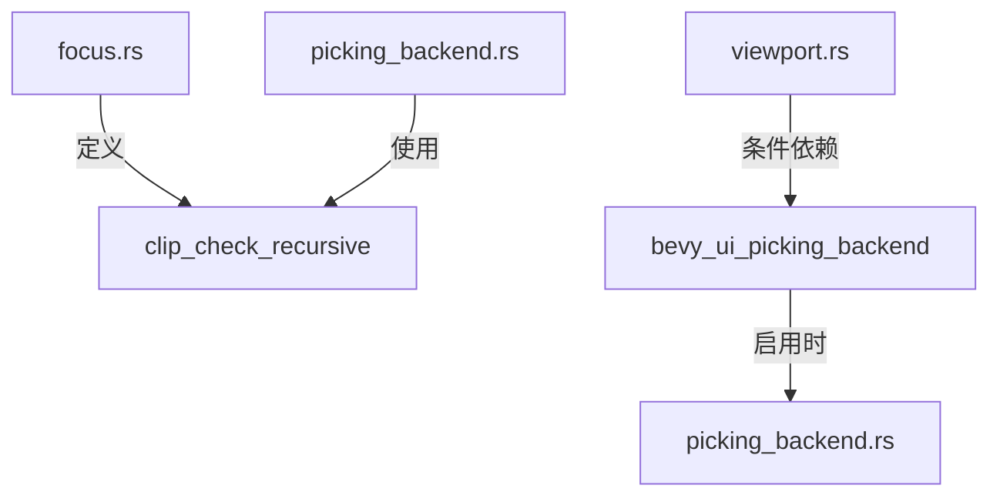

+++
title = "#19858 bevy_ui compilation"
date = "2025-06-29T00:00:00"
draft = false
template = "pull_request_page.html"
in_search_index = false

[extra]
current_language = "zh-cn"
available_languages = {"en" = { name = "English", url = "/pull_request/bevy/2025-06/pr-19858-en-20250629" }, "zh-cn" = { name = "中文", url = "/pull_request/bevy/2025-06/pr-19858-zh-cn-20250629" }}
labels = ["C-Code-Quality"]
+++

# 分析报告：bevy_ui 编译问题修复

## Basic Information
- **Title**: bevy_ui compilation
- **PR Link**: https://github.com/bevyengine/bevy/pull/19858
- **Author**: mockersf
- **Status**: MERGED
- **Labels**: C-Code-Quality, S-Ready-For-Final-Review
- **Created**: 2025-06-29T10:15:51Z
- **Merged**: 2025-06-29T17:31:29Z
- **Merged By**: alice-i-cecile

## Description Translation
### 目标
- 独立构建 `bevy_ui` 时出现错误和警告

### 解决方案
- 正确使用 `bevy_ui_picking_backend` 特性

### 测试
- `cargo build -p bevy_ui`

## The Story of This Pull Request

### 问题和上下文
在独立编译 `bevy_ui` crate 时（使用 `cargo build -p bevy_ui`），出现了编译错误和警告。问题核心在于条件编译特性的使用不严谨：`bevy_ui_picking_backend` 特性相关的代码没有正确隔离。具体表现为：
1. `viewport.rs` 中引用了仅在启用 `bevy_ui_picking_backend` 时才存在的类型
2. `picking_backend.rs` 中的 `clip_check_recursive` 函数在未启用特性时未被使用
3. 函数位置导致不必要的跨模块依赖

这些问题导致在没有启用 `bevy_ui_picking_backend` 特性时，编译器会遇到未解析的符号和未使用的函数警告，违反了 Rust 的编译检查规则。

### 解决方案
作者采取了两个关键措施：
1. **重构函数位置**：
   - 将 `clip_check_recursive` 函数从 `picking_backend.rs` 移动到 `focus.rs`
   - 在 `picking_backend.rs` 中改为导入而非重新定义该函数
   
2. **严格条件编译**：
   - 在 `viewport.rs` 中为所有 `bevy_ui_picking_backend` 相关代码添加 `#[cfg(feature = "bevy_ui_picking_backend")]` 属性
   - 将相关导入语句移到特性保护块内

### 实现细节
**函数移动的合理性**：
`clip_check_recursive` 是处理 UI 焦点和选取的底层工具函数。将其移至 `focus.rs` 更符合逻辑，因为：
- 焦点系统是 UI 的核心功能，始终启用
- 选取系统是可选扩展功能
- 这避免了 `picking_backend.rs` 在未启用特性时包含未使用代码

**条件编译的精确处理**：
在 `viewport.rs` 中，作者系统性地检查了所有依赖 `bevy_ui_picking_backend` 的代码段：
```rust
// 修改前：无条件导入
use bevy_ecs::event::EventReader;

// 修改后：特性保护导入
#[cfg(feature = "bevy_ui_picking_backend")]
use bevy_ecs::event::EventReader;
```
这种修改确保编译器在未启用特性时不会看到相关导入和类型引用。

### 技术影响
1. **编译可靠性**：
   - 修复后，`cargo build -p bevy_ui` 在所有特性组合下都能成功编译
   - 消除了未使用代码的警告（dead code warnings）

2. **代码组织改进**：
   - `clip_check_recursive` 现在位于更合适的模块
   - 减少了模块间耦合
   - 特性边界更加清晰

3. **维护性提升**：
   - 开发者现在可以安全添加/修改选取功能
   - 条件编译块明确标识了特性相关代码

### 经验总结
1. **特性标志的最佳实践**：
   - 特性保护应包含所有依赖项（类型、函数、导入）
   - 通过 `cargo check --no-default-features` 验证独立编译

2. **模块边界设计**：
   - 核心功能应独立于可选扩展
   - 共享工具函数应放在公共区域

3. **编译警告的价值**：
   - 未使用代码警告常指示设计问题
   - 应视为重构机会而非简单抑制

## Visual Representation


## Key Files Changed

### 1. `crates/bevy_ui/src/focus.rs` (+25/-4)
**目的**：接收 `clip_check_recursive` 函数，解决函数位置不当问题  
**关键变更**：
```diff
@@ -1,7 +1,4 @@
-use crate::{
-    picking_backend::clip_check_recursive, ui_transform::UiGlobalTransform, ComputedNode,
-    ComputedNodeTarget, Node, UiStack,
-};
+use crate::{ui_transform::UiGlobalTransform, ComputedNode, ComputedNodeTarget, Node, UiStack};
...
+/// Walk up the tree child-to-parent checking that `point` is not clipped by any ancestor node.
+pub fn clip_check_recursive(
+    point: Vec2,
+    entity: Entity,
+    clipping_query: &Query<'_, '_, (&ComputedNode, &UiGlobalTransform, &Node)>,
+    child_of_query: &Query<&ChildOf>,
+) -> bool {
+    if let Ok(child_of) = child_of_query.get(entity) {
+        let parent = child_of.0;
+        if let Ok((computed_node, transform, node)) = clipping_query.get(parent) {
+            if !computed_node
+                .resolve_clip_rect(node.overflow, node.overflow_clip_margin)
+                .contains(transform.inverse().transform_point2(point))
+            {
+                return false;
+            }
+        }
+        return clip_check_recursive(point, parent, clipping_query, child_of_query);
+    }
+    true
+}
```

### 2. `crates/bevy_ui/src/picking_backend.rs` (+1/-25)
**目的**：移除函数定义，改为导入，解决未使用代码问题  
**关键变更**：
```diff
@@ -24,7 +24,7 @@
 
 #![deny(missing_docs)]
 
-use crate::{prelude::*, ui_transform::UiGlobalTransform, UiStack};
+use crate::{clip_check_recursive, prelude::*, ui_transform::UiGlobalTransform, UiStack};
...
@@ -252,27 +252,3 @@ pub fn ui_picking(
         output.write(PointerHits::new(*pointer, picks, order));
     }
 }
-
-/// Walk up the tree child-to-parent checking that `point` is not clipped by any ancestor node.
-pub fn clip_check_recursive(
-    point: Vec2,
-    entity: Entity,
-    clipping_query: &Query<'_, '_, (&ComputedNode, &UiGlobalTransform, &Node)>,
-    child_of_query: &Query<&ChildOf>,
-) -> bool {
-    if let Ok(child_of) = child_of_query.get(entity) {
-        let parent = child_of.0;
-        if let Ok((computed_node, transform, node)) = clipping_query.get(parent) {
-            if !computed_node
-                .resolve_clip_rect(node.overflow, node.overflow_clip_margin)
-                .contains(transform.inverse().transform_point2(point))
-            {
-                return false;
-            }
-        }
-        return clip_check_recursive(point, parent, clipping_query, child_of_query);
-    }
-    true
-}
```

### 3. `crates/bevy_ui/src/widget/viewport.rs` (+14/-4)
**目的**：严格隔离特性相关代码，解决条件编译问题  
**关键变更**：
```diff
@@ -2,22 +2,32 @@ use bevy_asset::Assets;
 use bevy_ecs::{
     component::Component,
     entity::Entity,
-    event::EventReader,
     query::{Changed, Or},
     reflect::ReflectComponent,
-    system::{Commands, Query, Res, ResMut},
+    system::{Query, ResMut},
+};
+#[cfg(feature = "bevy_ui_picking_backend")]
+use bevy_ecs::{
+    event::EventReader,
+    system::{Commands, Res},
 };
...
-#[cfg(feature = "bevy_ui_picking_backend")]
-use bevy_platform::collections::HashMap;
 use bevy_reflect::Reflect;
-use bevy_render::camera::{Camera, NormalizedRenderTarget};
+use bevy_render::camera::Camera;
+#[cfg(feature = "bevy_ui_picking_backend")]
+use bevy_render::camera::NormalizedRenderTarget;
+#[cfg(feature = "bevy_ui_picking_backend")]
 use bevy_transform::components::GlobalTransform;
```

## Further Reading
1. [Rust 特性标志文档](https://doc.rust-lang.org/cargo/reference/features.html)
2. [Bevy 条件编译最佳实践](https://github.com/bevyengine/bevy/blob/main/docs/plugins_guidelines.md#feature-flags)
3. [模块系统设计原则](https://rust-lang.github.io/api-guidelines/