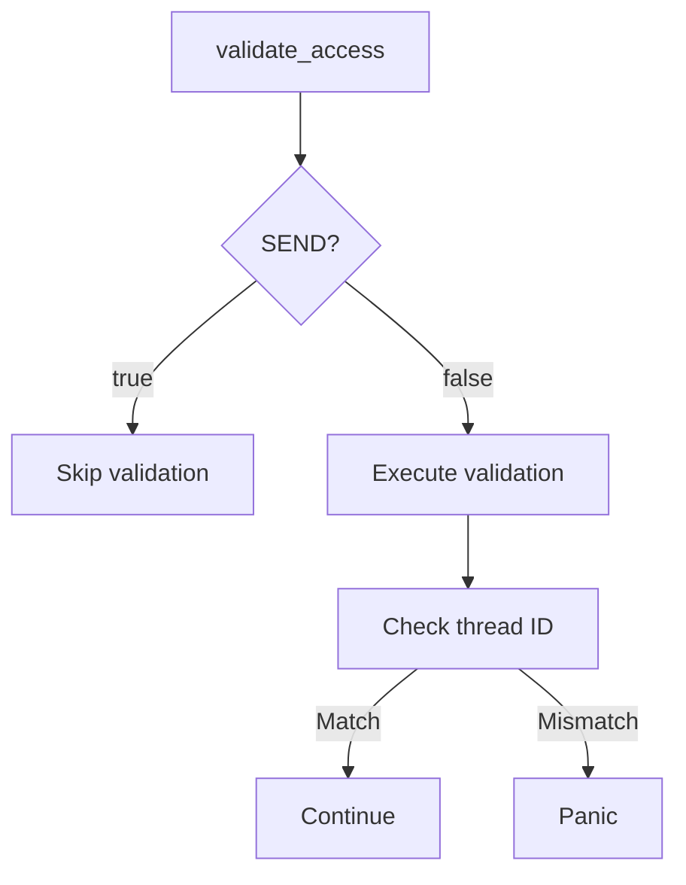

+++
title = "#19859 bevy_ecs: remove use of needless_return"
date = "2025-06-29T00:00:00"
draft = false
template = "pull_request_page.html"
in_search_index = true

[taxonomies]
list_display = ["show"]

[extra]
current_language = "en"
available_languages = {"en" = { name = "English", url = "/pull_request/bevy/2025-06/pr-19859-en-20250629" }, "zh-cn" = { name = "中文", url = "/pull_request/bevy/2025-06/pr-19859-zh-cn-20250629" }}
labels = ["C-Code-Quality"]
+++

# Technical Report: PR #19859 - bevy_ecs: remove use of needless_return

## Basic Information
- **Title**: bevy_ecs: remove use of needless_return
- **PR Link**: https://github.com/bevyengine/bevy/pull/19859
- **Author**: mockersf
- **Status**: MERGED
- **Labels**: C-Code-Quality, S-Ready-For-Final-Review
- **Created**: 2025-06-29T10:31:40Z
- **Merged**: 2025-06-29T17:31:46Z
- **Merged By**: alice-i-cecile

## Description Translation
# Objective

- bevy_ecs has a expected lint that is both needed and unneeded

## Solution

- Change the logic so that it's always not needed

## Testing

`cargo clippy -p bevy_ecs --no-default-features --no-deps -- -D warnings`

## The Story of This Pull Request

### The Problem and Context
In Bevy's ECS module, the `ResourceData::validate_access` function contained a Clippy lint suppression for `needless_return`. This suppression was conditionally applied based on whether the `std` feature was enabled. The `return` statement was necessary in `no_std` environments but redundant in `std` environments, creating a maintenance burden and violating Rust's best practices for clean code. The existing workaround used `#[cfg_attr]` to suppress the lint only in `no_std` builds, but this approach was fragile and required special handling.

### The Solution Approach
The developer restructured the conditional logic to eliminate the `return` statement entirely. By inverting the control flow to only execute non-send resource validation when `SEND` is false, the early return became unnecessary. This approach:
1. Maintained identical runtime behavior
2. Removed the need for lint suppression
3. Simplified the control flow
4. Reduced code complexity

### The Implementation
The key change was restructuring the conditional logic in `validate_access`. The original implementation first handled the `SEND` case with an early return, then processed non-send validation. The new implementation reverses this by only entering the non-send validation block when `!SEND` is true.

Before the change:
```rust
if SEND {
    #[cfg_attr(not(feature = "std"), expect(clippy::needless_return))]
    return;
}
// Non-send validation code
```

After the change:
```rust
if !SEND {
    // Non-send validation code
}
```

This restructuring eliminates the early return while preserving all existing functionality. The non-send validation logic (including thread ID checks and panic handling) remains identical but is now conditionally executed only when needed.

### Technical Insights
1. **Control Flow Optimization**: The inverted condition (`if !SEND`) naturally handles both cases without early returns
2. **Lint Resolution**: The restructuring automatically resolves the Clippy warning without suppression attributes
3. **Conditional Compilation**: The `#[cfg(feature = "std")]` attribute remains for platform-specific thread handling
4. **Future Maintenance**: The TODO comment about `no_std` multithreading support is preserved within the conditional block

### The Impact
1. **Code Quality Improvement**: Eliminates a Clippy lint suppression, reducing technical debt
2. **Simplified Maintenance**: Removes special-case handling for different build configurations
3. **Reduced Complexity**: The function now has a single code path instead of two separate branches
4. **Line Count Reduction**: The implementation is 9 lines shorter (from 24 to 15 lines)

## Visual Representation



## Key Files Changed

### `crates/bevy_ecs/src/storage/resource.rs`
**Purpose**: Removes needless return statement and Clippy suppression  
**Changes**: Restructured conditional logic in `validate_access` function

Before:
```rust
fn validate_access(&self) {
    if SEND {
        #[cfg_attr(
            not(feature = "std"),
            expect(
                clippy::needless_return,
                reason = "needless until no_std is addressed (see below)",
            )
        )]
        return;
    }

    #[cfg(feature = "std")]
    if self.origin_thread_id != Some(std::thread::current().id()) {
        // Panic in tests, as testing for aborting is nearly impossible
        panic!(
            "Attempted to access or drop non-send resource {} from thread {:?} on a thread {:?}. This is not allowed. Aborting.",
            self.type_name,
            self.origin_thread_id,
            std::thread::current().id()
        );
    }

    // TODO: Handle no_std non-send.
    // Currently, no_std is single-threaded only, so this is safe to ignore.
    // To support no_std multithreading, an alternative will be required.
    // Remove the #[expect] attribute above when this is addressed.
}
```

After:
```rust
fn validate_access(&self) {
    if !SEND {
        #[cfg(feature = "std")]
        if self.origin_thread_id != Some(std::thread::current().id()) {
            // Panic in tests, as testing for aborting is nearly impossible
            panic!(
                "Attempted to access or drop non-send resource {} from thread {:?} on a thread {:?}. This is not allowed. Aborting.",
                self.type_name,
                self.origin_thread_id,
                std::thread::current().id()
            );
        }

        // TODO: Handle no_std non-send.
        // Currently, no_std is single-threaded only, so this is safe to ignore.
        // To support no_std multithreading, an alternative will be required.
        // Remove the #[expect] attribute above when this is addressed.
    }
}
```

## Further Reading
1. [Clippy's needless_return lint documentation](https://rust-lang.github.io/rust-clippy/master/index.html#needless_return)
2. [Rust Conditional Compilation with cfg](https://doc.rust-lang.org/reference/conditional-compilation.html)
3. [Bevy ECS Resource Documentation](https://docs.rs/bevy_ecs/latest/bevy_ecs/system/trait.Resource.html)