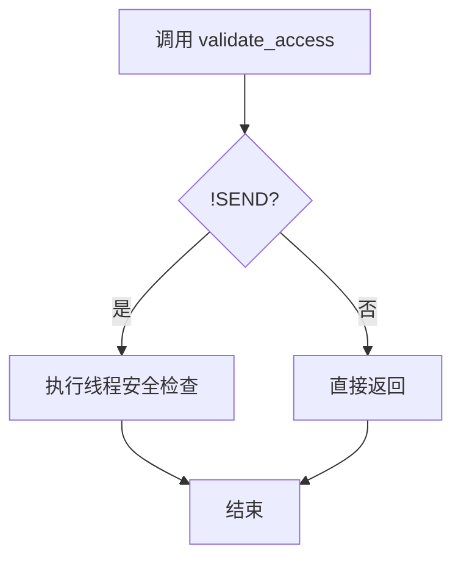

+++
title = "#19859 bevy_ecs: remove use of needless_return"
date = "2025-06-29T00:00:00"
draft = false
template = "pull_request_page.html"
in_search_index = false

[extra]
current_language = "zh-cn"
available_languages = {"en" = { name = "English", url = "/pull_request/bevy/2025-06/pr-19859-en-20250629" }, "zh-cn" = { name = "中文", url = "/pull_request/bevy/2025-06/pr-19859-zh-cn-20250629" }}
+++

# bevy_ecs: remove use of needless_return

## Basic Information
- **标题**: bevy_ecs: remove use of needless_return
- **PR 链接**: https://github.com/bevyengine/bevy/pull/19859
- **作者**: mockersf
- **状态**: 已合并
- **标签**: C-Code-Quality, S-Ready-For-Final-Review
- **创建时间**: 2025-06-29T10:31:40Z
- **合并时间**: 2025-06-29T17:31:46Z
- **合并人**: alice-i-cecile

## 描述翻译
### 目标
- bevy_ecs 存在一个既需要又不需要的预期 lint

### 解决方案
- 修改逻辑使其始终不需要该 lint

### 测试
`cargo clippy -p bevy_ecs --no-default-features --no-deps -- -D warnings`

## PR 的技术分析

### 问题背景
在 `bevy_ecs` 的资源存储模块中，`validate_access` 函数包含一个针对 `clippy::needless_return` lint 的 `#[expect]` 属性。这个属性原本用于在 `no_std` 环境下抑制关于不必要 return 语句的警告，但在标准库环境下又会产生实际的 lint 警告。这种矛盾状态导致代码需要特殊处理来满足不同编译条件下的 lint 要求，增加了维护复杂性。

### 解决方案
开发者重构了 `validate_access` 函数的控制流，将原本针对 `SEND` 条件的提前返回逻辑，改为只处理 `!SEND` 条件的情况。这种重构完全消除了对 `return` 语句的需求，从而移除了 `#[expect(clippy::needless_return)]` 属性及其相关注释。

### 实现细节
核心修改在 `ResourceData::validate_access` 方法中。原实现先检查 `SEND` 条件，若为 true 则立即返回，这在不支持多线程的 `no_std` 环境下是冗余操作。重构后改为直接检查 `!SEND` 条件，仅在此条件下执行线程安全检查：

```rust
// 修改前:
if SEND {
    #[cfg_attr(
        not(feature = "std"),
        expect(
            clippy::needless_return,
            reason = "needless until no_std is addressed (see below)",
        )
    )]
    return;
}

// ...非 SEND 情况下的线程检查代码...
```

```rust
// 修改后:
if !SEND {
    #[cfg(feature = "std")]
    if self.origin_thread_id != Some(std::thread::current().id()) {
        panic!(...);
    }
    // no_std 处理说明保持不变
}
```

### 技术考量
1. **控制流简化**：通过反转条件检查逻辑，消除了函数中的提前退出点，使代码更线性化
2. **Lint 消除**：移除 `return` 语句后，不再需要特殊处理 `clippy::needless_return`
3. **条件编译**：保留 `#[cfg(feature = "std")]` 确保线程检查仅在标准库环境下生效
4. **向后兼容**：`no_std` 环境的处理逻辑和注释保持不变，不影响现有功能

### 影响与改进
1. **代码质量提升**：减少 9 行代码，消除不必要的编译属性
2. **维护性增强**：移除针对特定 lint 的特殊处理，降低未来修改的认知负担
3. **行为不变**：功能逻辑完全保持原样，仅改变代码组织方式
4. **测试验证**：通过 `cargo clippy` 验证无新警告产生，确保修改安全性

## 可视化表示



## 关键文件变更

### `crates/bevy_ecs/src/storage/resource.rs`
**变更说明**：重构资源访问验证逻辑，消除不必要的 return 语句和 lint 抑制属性

**代码对比**：
```rust
// 修改前:
fn validate_access(&self) {
    if SEND {
        #[cfg_attr(
            not(feature = "std"),
            expect(
                clippy::needless_return,
                reason = "needless until no_std is addressed (see below)",
            )
        )]
        return;
    }

    #[cfg(feature = "std")]
    if self.origin_thread_id != Some(std::thread::current().id()) {
        panic!(...);
    }
    
    // no_std 处理注释...
}
```

```rust
// 修改后:
fn validate_access(&self) {
    if !SEND {
        #[cfg(feature = "std")]
        if self.origin_thread_id != Some(std::thread::current().id()) {
            panic!(...);
        }
        
        // no_std 处理注释保持不变
    }
}
```

**关联性**：这是本 PR 的唯一修改，直接解决目标中描述的 lint 问题

## 延伸阅读
1. [Clippy 的 needless_return lint 文档](https://rust-lang.github.io/rust-clippy/master/index.html#needless_return)
2. [Rust 的条件编译属性](https://doc.rust-lang.org/reference/conditional-compilation.html)
3. [Bevy ECS 资源系统文档](https://docs.rs/bevy_ecs/latest/bevy_ecs/system/resource/index.html)

## 完整代码变更
```diff
diff --git a/crates/bevy_ecs/src/storage/resource.rs b/crates/bevy_ecs/src/storage/resource.rs
index 29752ae2e5518..1a90cc511ccc0 100644
--- a/crates/bevy_ecs/src/storage/resource.rs
+++ b/crates/bevy_ecs/src/storage/resource.rs
@@ -64,32 +64,23 @@ impl<const SEND: bool> ResourceData<SEND> {
     /// If `SEND` is false, this will panic if called from a different thread than the one it was inserted from.
     #[inline]
     fn validate_access(&self) {
-        if SEND {
-            #[cfg_attr(
-                not(feature = "std"),
-                expect(
-                    clippy::needless_return,
-                    reason = "needless until no_std is addressed (see below)",
-                )
-            )]
-            return;
-        }
+        if !SEND {
+            #[cfg(feature = "std")]
+            if self.origin_thread_id != Some(std::thread::current().id()) {
+                // Panic in tests, as testing for aborting is nearly impossible
+                panic!(
+                    "Attempted to access or drop non-send resource {} from thread {:?} on a thread {:?}. This is not allowed. Aborting.",
+                    self.type_name,
+                    self.origin_thread_id,
+                    std::thread::current().id()
+                );
+            }
 
-        #[cfg(feature = "std")]
-        if self.origin_thread_id != Some(std::thread::current().id()) {
-            // Panic in tests, as testing for aborting is nearly impossible
-            panic!(
-                "Attempted to access or drop non-send resource {} from thread {:?} on a thread {:?}. This is not allowed. Aborting.",
-                self.type_name,
-                self.origin_thread_id,
-                std::thread::current().id()
-            );
+            // TODO: Handle no_std non-send.
+            // Currently, no_std is single-threaded only, so this is safe to ignore.
+            // To support no_std multithreading, an alternative will be required.
+            // Remove the #[expect] attribute above when this is addressed.
         }
-
-        // TODO: Handle no_std non-send.
-        // Currently, no_std is single-threaded only, so this is safe to ignore.
-        // To support no_std multithreading, an alternative will be required.
-        // Remove the #[expect] attribute above when this is addressed.
     }
 
     /// Returns true if the resource is populated.
```