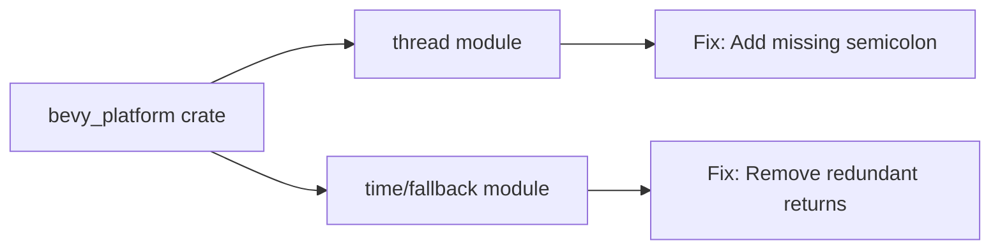

+++
title = "#19860 Fixing Clippy Warnings in bevy_platform Without Default Features"
date = "2025-06-29T00:00:00"
draft = false
template = "pull_request_page.html"
in_search_index = true

[taxonomies]
list_display = ["show"]

[extra]
current_language = "en"
available_languages = {"en" = { name = "English", url = "/pull_request/bevy/2025-06/pr-19860-en-20250629" }, "zh-cn" = { name = "中文", url = "/pull_request/bevy/2025-06/pr-19860-zh-cn-20250629" }}
labels = ["C-Code-Quality"]
+++

### Title: Fixing Clippy Warnings in bevy_platform Without Default Features

## Basic Information
- **Title**: bevy_platform: clippy without default features
- **PR Link**: https://github.com/bevyengine/bevy/pull/19860
- **Author**: mockersf
- **Status**: MERGED
- **Labels**: C-Code-Quality, S-Ready-For-Final-Review
- **Created**: 2025-06-29T10:40:16Z
- **Merged**: 2025-06-29T17:32:02Z
- **Merged By**: alice-i-cecile

## Description Translation
### Objective
- bevy_platform has clippy warnings when building without default features

### Solution
- Fix them

### Testing
`cargo clippy -p bevy_platform --no-default-features --no-deps -- -D warnings`

## The Story of This Pull Request
The developer encountered Clippy warnings when building `bevy_platform` with default features disabled. These warnings violated the project's code quality standards and could potentially mask more serious issues. The goal was to maintain a clean build output and enforce consistent coding patterns across the codebase.

Two categories of issues were identified:
1. A missing semicolon in a busy-wait loop that caused an "unused unit value" warning
2. Unnecessary `return` statements in platform-specific time measurement code

The fixes were straightforward but important for maintaining code hygiene. For the first issue, adding a semicolon made the unit return value explicit. For the second, removing redundant `return` keywords made the control flow more idiomatic in Rust. Both changes followed Clippy's recommendations to write clearer and more conventional Rust code.

The solution was verified by running `cargo clippy` with `--no-default-features` to ensure the warnings were resolved without introducing new issues. This approach maintained compatibility across all supported platforms while improving code quality.

## Visual Representation



## Key Files Changed

### 1. `crates/bevy_platform/src/thread.rs`
**Change**: Added missing semicolon in spin loop  
**Why**: Fix "unused unit value" Clippy warning  
**Diff**:
```diff
--- a/crates/bevy_platform/src/thread.rs
+++ b/crates/bevy_platform/src/thread.rs
@@ -21,7 +21,7 @@ crate::cfg::switch! {
                 let start = Instant::now();
 
                 while start.elapsed() < dur {
-                    spin_loop()
+                    spin_loop();
                 }
             }
         }
```

### 2. `crates/bevy_platform/src/time/fallback.rs`
**Change**: Removed redundant `return` statements in platform-specific time getters  
**Why**: Follow idiomatic Rust where last expression is implicitly returned  
**Diff**:
```diff
--- a/crates/bevy_platform/src/time/fallback.rs
+++ b/crates/bevy_platform/src/time/fallback.rs
@@ -155,14 +155,14 @@ fn unset_getter() -> Duration {
             let nanos = unsafe {
                 core::arch::x86::_rdtsc()
             };
-            return Duration::from_nanos(nanos);
+            Duration::from_nanos(nanos)
         }
         #[cfg(target_arch = "x86_64")] => {
             // SAFETY: standard technique for getting a nanosecond counter on x86_64
             let nanos = unsafe {
                 core::arch::x86_64::_rdtsc()
             };
-            return Duration::from_nanos(nanos);
+            Duration::from_nanos(nanos)
         }
         #[cfg(target_arch = "aarch64")] => {
             // SAFETY: standard technique for getting a nanosecond counter of aarch64
@@ -171,7 +171,7 @@ fn unset_getter() -> Duration {
                 core::arch::asm!("mrs {}, cntvct_el0", out(reg) ticks);
                 ticks
             };
-            return Duration::from_nanos(nanos);
+            Duration::from_nanos(nanos)
         }
         _ => {
             panic!("An elapsed time getter has not been provided to `Instant`. Please use `Instant::set_elapsed(...)` before calling `Instant::now()`")
```

## Further Reading
1. [Clippy Documentation](https://doc.rust-lang.org/clippy/)
2. [Rust Style Guide](https://github.com/rust-dev-tools/fmt-rfcs/blob/master/guide/guide.md)
3. [Rust Performance Book: Inline Assembly](https://nnethercote.github.io/perf-book/inline-assembly.html)

## Full Code Diff
```diff
diff --git a/crates/bevy_platform/src/thread.rs b/crates/bevy_platform/src/thread.rs
index 6e4650382ef8a..7fc7413bc6e43 100644
--- a/crates/bevy_platform/src/thread.rs
+++ b/crates/bevy_platform/src/thread.rs
@@ -21,7 +21,7 @@ crate::cfg::switch! {
                 let start = Instant::now();
 
                 while start.elapsed() < dur {
-                    spin_loop()
+                    spin_loop();
                 }
             }
         }
diff --git a/crates/bevy_platform/src/time/fallback.rs b/crates/bevy_platform/src/time/fallback.rs
index c649f6a49deb6..2964c9d980a1f 100644
--- a/crates/bevy_platform/src/time/fallback.rs
+++ b/crates/bevy_platform/src/time/fallback.rs
@@ -155,14 +155,14 @@ fn unset_getter() -> Duration {
             let nanos = unsafe {
                 core::arch::x86::_rdtsc()
             };
-            return Duration::from_nanos(nanos);
+            Duration::from_nanos(nanos)
         }
         #[cfg(target_arch = "x86_64")] => {
             // SAFETY: standard technique for getting a nanosecond counter on x86_64
             let nanos = unsafe {
                 core::arch::x86_64::_rdtsc()
             };
-            return Duration::from_nanos(nanos);
+            Duration::from_nanos(nanos)
         }
         #[cfg(target_arch = "aarch64")] => {
             // SAFETY: standard technique for getting a nanosecond counter of aarch64
@@ -171,7 +171,7 @@ fn unset_getter() -> Duration {
                 core::arch::asm!("mrs {}, cntvct_el0", out(reg) ticks);
                 ticks
             };
-            return Duration::from_nanos(nanos);
+            Duration::from_nanos(nanos)
         }
         _ => {
             panic!("An elapsed time getter has not been provided to `Instant`. Please use `Instant::set_elapsed(...)` before calling `Instant::now()`")
```