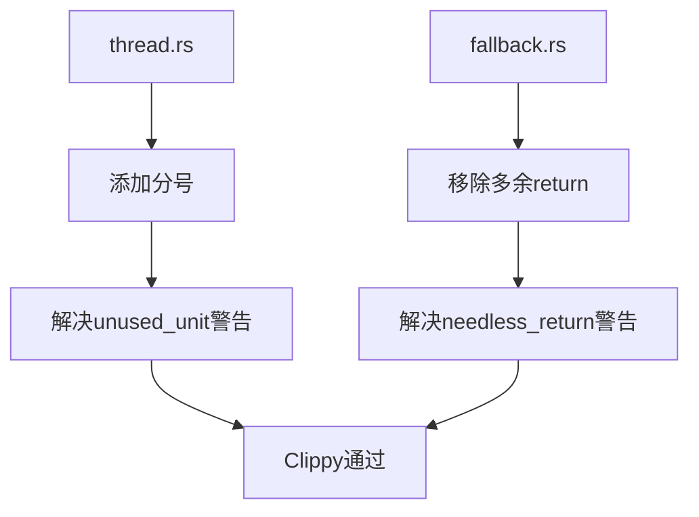

+++
title = "#19860 bevy_platform: clippy without default features"
date = "2025-06-29T00:00:00"
draft = false
template = "pull_request_page.html"
in_search_index = false

[extra]
current_language = "zh-cn"
available_languages = {"en" = { name = "English", url = "/pull_request/bevy/2025-06/pr-19860-en-20250629" }, "zh-cn" = { name = "中文", url = "/pull_request/bevy/2025-06/pr-19860-zh-cn-20250629" }}
+++

# 技术分析报告：PR #19860 - bevy_platform: clippy without default features

## 基本信息
- **标题**: bevy_platform: clippy without default features
- **PR链接**: https://github.com/bevyengine/bevy/pull/19860
- **作者**: mockersf
- **状态**: 已合并
- **标签**: C-Code-Quality, S-Ready-For-Final-Review
- **创建时间**: 2025-06-29T10:40:16Z
- **合并时间**: 2025-06-29T17:32:02Z
- **合并人**: alice-i-cecile

## 描述翻译
### 目标
- 在禁用默认特性时构建 bevy_platform 会产生 clippy 警告

### 解决方案
- 修复这些警告

### 测试
`cargo clippy -p bevy_platform --no-default-features --no-deps -- -D warnings`

## PR的技术叙事

### 问题背景
在Rust项目中，Clippy是重要的静态分析工具，用于捕捉代码质量和潜在错误。当开发者mockersf在禁用默认特性(--no-default-features)的情况下运行`cargo clippy`检查bevy_platform模块时，发现两个需要修复的警告。这些警告虽然不影响功能，但违反项目的代码质量标准（标签C-Code-Quality），因此需要解决。

### 解决方案分析
该PR采用直接修复策略，处理两类问题：
1. **多余的分号问题**：在spin_loop调用后添加缺失的分号
2. **冗余返回语句**：移除不必要(return)关键字，改用表达式返回值

这些修改不改变代码逻辑，但使代码更符合Rust惯用模式，同时消除clippy警告。

### 具体实现
修改集中在两个文件，每处修改都对应解决特定clippy警告：

#### 1. 线程休眠实现修复
在`thread.rs`中，spin_loop()调用后缺少分号：
```diff
// crates/bevy_platform/src/thread.rs
 while start.elapsed() < dur {
-    spin_loop()
+    spin_loop();
 }
```
此修改解决[unused_unit](https://rust-lang.github.io/rust-clippy/master/#unused_unit)警告。spin_loop()返回()类型，但作为独立表达式时Rust期望语句以分号结束。

#### 2. 时间获取实现优化
在`fallback.rs`中，三处架构特定实现移除多余(return)：
```diff
// crates/bevy_platform/src/time/fallback.rs
 #[cfg(target_arch = "x86")] => {
     let nanos = unsafe { core::arch::x86::_rdtsc() };
-    return Duration::from_nanos(nanos);
+    Duration::from_nanos(nanos)
 }
```
类似修改也应用于x86_64和aarch64分支。这解决[needless_return](https://rust-lang.github.io/rust-clippy/master/#needless_return)警告。在Rust匹配分支中，直接使用表达式作为返回值更符合惯用模式。

### 技术影响
1. **代码质量提升**：消除特定构建配置下的clippy警告
2. **风格一致性**：使代码更符合Rust惯用模式
3. **维护性增强**：减少静态分析干扰，便于问题识别
4. **无功能变更**：所有修改保持原有行为不变

### 验证方法
作者使用精确命令验证修复效果：
```bash
cargo clippy -p bevy_platform --no-default-features --no-deps -- -D warnings
```
该命令确保：
- 仅检查目标模块(-p bevy_platform)
- 禁用默认特性(--no-default-features)
- 忽略依赖项(--no-deps)
- 将警告视为错误(-D warnings)

## 组件关系图


## 关键文件变更

### 1. `crates/bevy_platform/src/thread.rs`
**变更描述**：在spin_loop()调用后添加分号，解决未使用单元值警告  
**代码差异**：
```diff
@@ -21,7 +21,7 @@ crate::cfg::switch! {
                 let start = Instant::now();
 
                 while start.elapsed() < dur {
-                    spin_loop()
+                    spin_loop();
                 }
             }
         }
```

### 2. `crates/bevy_platform/src/time/fallback.rs`
**变更描述**：三处移除多余(return)关键字，改用表达式返回值  
**代码差异**：
```diff
@@ -155,14 +155,14 @@ fn unset_getter() -> Duration {
             let nanos = unsafe {
                 core::arch::x86::_rdtsc()
             };
-            return Duration::from_nanos(nanos);
+            Duration::from_nanos(nanos)
         }
         #[cfg(target_arch = "x86_64")] => {
             // SAFETY: standard technique for getting a nanosecond counter on x86_64
             let nanos = unsafe {
                 core::arch::x86_64::_rdtsc()
             };
-            return Duration::from_nanos(nanos);
+            Duration::from_nanos(nanos)
         }
         #[cfg(target_arch = "aarch64")] => {
             // SAFETY: standard technique for getting a nanosecond counter of aarch64
@@ -171,7 +171,7 @@ fn unset_getter() -> Duration {
                 core::arch::asm!("mrs {}, cntvct_el0", out(reg) ticks);
                 ticks
             };
-            return Duration::from_nanos(nanos);
+            Duration::from_nanos(nanos)
         }
         _ => {
             panic!("An elapsed time getter has not been provided to `Instant`. Please use `Instant::set_elapsed(...)` before calling `Instant::now()`")
```

## 完整代码差异
```diff
diff --git a/crates/bevy_platform/src/thread.rs b/crates/bevy_platform/src/thread.rs
index 6e4650382ef8a..7fc7413bc6e43 100644
--- a/crates/bevy_platform/src/thread.rs
+++ b/crates/bevy_platform/src/thread.rs
@@ -21,7 +21,7 @@ crate::cfg::switch! {
                 let start = Instant::now();
 
                 while start.elapsed() < dur {
-                    spin_loop()
+                    spin_loop();
                 }
             }
         }
diff --git a/crates/bevy_platform/src/time/fallback.rs b/crates/bevy_platform/src/time/fallback.rs
index c649f6a49deb6..2964c9d980a1f 100644
--- a/crates/bevy_platform/src/time/fallback.rs
+++ b/crates/bevy_platform/src/time/fallback.rs
@@ -155,14 +155,14 @@ fn unset_getter() -> Duration {
             let nanos = unsafe {
                 core::arch::x86::_rdtsc()
             };
-            return Duration::from_nanos(nanos);
+            Duration::from_nanos(nanos)
         }
         #[cfg(target_arch = "x86_64")] => {
             // SAFETY: standard technique for getting a nanosecond counter on x86_64
             let nanos = unsafe {
                 core::arch::x86_64::_rdtsc()
             };
-            return Duration::from_nanos(nanos);
+            Duration::from_nanos(nanos)
         }
         #[cfg(target_arch = "aarch64")] => {
             // SAFETY: standard technique for getting a nanosecond counter of aarch64
@@ -171,7 +171,7 @@ fn unset_getter() -> Duration {
                 core::arch::asm!("mrs {}, cntvct_el0", out(reg) ticks);
                 ticks
             };
-            return Duration::from_nanos(nanos);
+            Duration::from_nanos(nanos)
         }
         _ => {
             panic!("An elapsed time getter has not been provided to `Instant`. Please use `Instant::set_elapsed(...)` before calling `Instant::now()`")
```

## 延伸阅读
1. [Rust Clippy官方文档](https://doc.rust-lang.org/clippy/)  
2. [Rust表达式与语句区别](https://doc.rust-lang.org/book/ch03-03-how-functions-work.html#function-bodies-contain-statements-and-expressions)  
3. [Bevy引擎贡献指南](https://github.com/bevyengine/bevy/blob/main/CONTRIBUTING.md#code-quality)  
4. [needless_return警告说明](https://rust-lang.github.io/rust-clippy/master/#needless_return)  
5. [unused_unit警告说明](https://rust-lang.github.io/rust-clippy/master/#unused_unit)