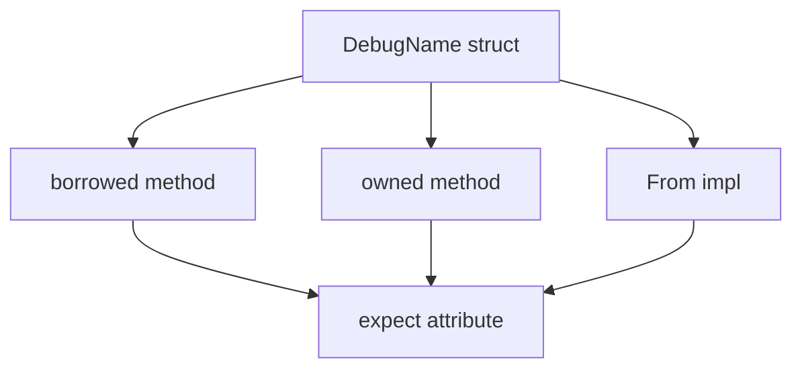

+++
title = "#19861 bevy_utils: clippy without debug feature enabled"
date = "2025-06-29T00:00:00"
draft = false
template = "pull_request_page.html"
in_search_index = false

[extra]
current_language = "zh-cn"
available_languages = {"en" = { name = "English", url = "/pull_request/bevy/2025-06/pr-19861-en-20250629" }, "zh-cn" = { name = "中文", url = "/pull_request/bevy/2025-06/pr-19861-zh-cn-20250629" }}
labels = ["C-Code-Quality"]
+++

# bevy_utils: clippy without debug feature enabled

## Basic Information
- **Title**: bevy_utils: clippy without debug feature enabled
- **PR Link**: https://github.com/bevyengine/bevy/pull/19861
- **Author**: mockersf
- **Status**: MERGED
- **Labels**: C-Code-Quality, S-Ready-For-Final-Review
- **Created**: 2025-06-29T10:51:10Z
- **Merged**: 2025-06-29T17:32:47Z
- **Merged By**: alice-i-cecile

## Description Translation
### 目标

- 当未启用 debug feature 时，bevy_utils 存在 Clippy 警告

### 解决方案

- 修复这些警告

### 测试方法

`cargo clippy -p bevy_utils  --no-deps -- -D warnings`

## 本 PR 的技术分析

在 `bevy_utils` 模块中，`debug_info.rs` 文件实现了一个 `DebugName` 结构体，用于在启用调试功能时提供类型名称的调试信息。问题出现在当项目编译时未启用 `debug` feature 的情况下，运行 Clippy 静态分析工具会产生两类警告：冗余的静态生命周期声明和未使用的变量警告。

首先解决的是 `FEATURE_DISABLED` 常量中的冗余静态生命周期声明。原始代码中显式声明了 `&'static str`，这在 Rust 中是冗余的，因为常量字符串切片默认具有静态生命周期。Clippy 会对此产生警告：

```rust
// 修改前
const FEATURE_DISABLED: &'static str = "Enable the debug feature to see the name";

// 修改后
const FEATURE_DISABLED: &str = "Enable the debug feature to see the name";
```

更主要的修改集中在处理条件编译中的未使用变量问题。当未启用 `debug` feature 时，`DebugName::borrowed()`, `DebugName::owned()` 和 `From<Cow<'static, str>>` 实现中的 `value` 参数不会被使用，触发 Clippy 的 `unused_variables` 警告。原始解决方案使用 `expect` 属性抑制警告，但缺乏解释原因：

```rust
// 原始方案
#[cfg_attr(not(feature = "debug"), expect(unused_variables))]
```

改进后的方案为每个 `expect` 属性添加了明确的理由说明，解释该变量在特定条件下被有意忽略的原因：

```rust
#[cfg_attr(
    not(feature = "debug"),
    expect(
        unused_variables,
        reason = "The value will be ignored if the `debug` feature is not enabled"
    )
)]
```

这种修改模式被统一应用到三个相关位置：
1. `DebugName::borrowed()` 构造函数
2. `DebugName::owned()` 构造函数
3. `From<Cow<'static, str>>` trait 实现

添加 `reason` 字段显著提升了代码可维护性，让后续开发者能立即理解该 lint 例外的设计意图，避免误判为代码缺陷。

最终的验证通过命令 `cargo clippy -p bevy_utils --no-deps -- -D warnings` 完成，该命令确保在禁用 `debug` feature 的情况下，对 `bevy_utils` 进行严格 lint 检查且零警告。

## 组件关系



## 关键文件变更

### `crates/bevy_utils/src/debug_info.rs`
**变更说明**：修复在未启用 `debug` feature 时的 Clippy 警告，包括冗余生命周期声明和未使用变量警告。

**关键代码变更**：
```rust
// 修复冗余静态生命周期声明
- const FEATURE_DISABLED: &'static str = "Enable the debug feature to see the name";
+ const FEATURE_DISABLED: &str = "Enable the debug feature to see the name";

// 为未使用变量警告添加原因说明
- #[cfg_attr(not(feature = "debug"), expect(unused_variables))]
+ #[cfg_attr(
+    not(feature = "debug"),
+    expect(
+        unused_variables,
+        reason = "The value will be ignored if the `debug` feature is not enabled"
+    )
+ )]
```

## 延伸阅读
1. [Rust Clippy 官方文档](https://doc.rust-lang.org/stable/clippy/) - Clippy lint 工具的使用指南
2. [条件编译(conditional compilation)](https://doc.rust-lang.org/reference/conditional-compilation.html) - `#[cfg]` 属性的工作原理
3. [Expect 属性](https://doc.rust-lang.org/rustc/lints/levels.html#expect) - 管理 lint 警告的进阶方法
4. [Rust 生命周期省略规则](https://doc.rust-lang.org/nomicon/lifetime-elision.html) - 函数签名中的生命周期处理机制