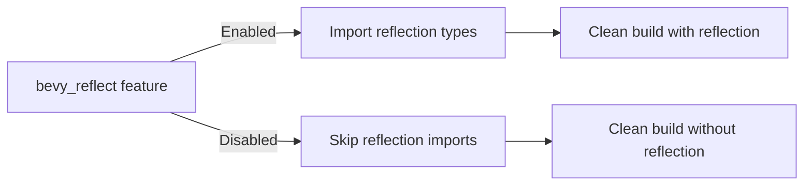

+++
title = "#19862 bevy_input: build warnings without bevy_reflect"
date = "2025-06-29T00:00:00"
draft = false
template = "pull_request_page.html"
in_search_index = true

[taxonomies]
list_display = ["show"]

[extra]
current_language = "en"
available_languages = {"en" = { name = "English", url = "/pull_request/bevy/2025-06/pr-19862-en-20250629" }, "zh-cn" = { name = "中文", url = "/pull_request/bevy/2025-06/pr-19862-zh-cn-20250629" }}
labels = ["C-Code-Quality"]
+++

# Technical Analysis of PR #19862: bevy_input: build warnings without bevy_reflect

## Basic Information
- **Title**: bevy_input: build warnings without bevy_reflect
- **PR Link**: https://github.com/bevyengine/bevy/pull/19862
- **Author**: mockersf
- **Status**: MERGED
- **Labels**: C-Code-Quality, S-Ready-For-Final-Review
- **Created**: 2025-06-29T10:58:04Z
- **Merged**: 2025-06-29T17:32:47Z
- **Merged By**: alice-i-cecile

## Description Translation
# Objective

- bevy_input has build warnings when bevy_reflect isn't enabled

## Solution

- Fix them

## Testing

`cargo build -p bevy_input --no-default-features --features bevy_math/libm`

## The Story of This Pull Request

The problem surfaced when building bevy_input without the bevy_reflect feature enabled. Without this feature, certain gamepad-related structs and enums weren't being used, triggering Rust compiler warnings about unused imports. These warnings were problematic because they:
1. Cluttered build output
2. Violated Bevy's policy of warning-free builds
3. Could mask legitimate issues in future development

The core issue was that bevy_input unconditionally imported several gamepad-related types (`GamepadAxis`, `GamepadButton`, `GamepadConnection`, `GamepadInput`, `GamepadSettings`) regardless of whether bevy_reflect was enabled. These types are only required when reflection features are active, as they implement reflection capabilities.

The solution approach was straightforward: conditionally import these reflection-dependent types only when the bevy_reflect feature is active. This required:
1. Splitting the existing gamepad import into two sections
2. Adding a #[cfg(feature = "bevy_reflect")] attribute to the reflection-dependent imports
3. Maintaining all non-reflection imports unconditionally

This approach preserves existing functionality when bevy_reflect is enabled while eliminating build warnings when it's disabled. The implementation required minimal changes - just reorganizing imports with proper conditional compilation attributes.

Testing was performed using the command:
`cargo build -p bevy_input --no-default-features --features bevy_math/libm`
This verified the build completes without warnings when bevy_reflect is disabled.

The impact of this change is:
- Cleaner build output for users not needing reflection
- Maintained functionality for reflection users
- Better adherence to Rust best practices for conditional compilation
- Elimination of technical debt from unused imports

## Visual Representation



## Key Files Changed

### `crates/bevy_input/src/lib.rs` (+6/-5)

**What changed**: Reorganized gamepad imports to conditionally include reflection-dependent types only when the bevy_reflect feature is enabled.

**Why changed**: To eliminate build warnings when compiling without bevy_reflect.

**Code changes**:
```rust
// Before:
use gamepad::{
    gamepad_connection_system, gamepad_event_processing_system, GamepadAxis,
    GamepadAxisChangedEvent, GamepadButton, GamepadButtonChangedEvent,
    GamepadButtonStateChangedEvent, GamepadConnection, GamepadConnectionEvent, GamepadEvent,
    GamepadInput, GamepadRumbleRequest, GamepadSettings, RawGamepadAxisChangedEvent,
    RawGamepadButtonChangedEvent, RawGamepadEvent,
};

// After:
use gamepad::{
    gamepad_connection_system, gamepad_event_processing_system, GamepadAxisChangedEvent,
    GamepadButtonChangedEvent, GamepadButtonStateChangedEvent, GamepadConnectionEvent,
    GamepadEvent, GamepadRumbleRequest, RawGamepadAxisChangedEvent, RawGamepadButtonChangedEvent,
    RawGamepadEvent,
};
#[cfg(feature = "bevy_reflect")]
use gamepad::{GamepadAxis, GamepadButton, GamepadConnection, GamepadInput, GamepadSettings};
```

**Relationship to PR purpose**: This is the core change that eliminates the build warnings by conditionally importing reflection-dependent types.

## Further Reading
- [Rust Conditional Compilation](https://doc.rust-lang.org/reference/conditional-compilation.html)
- [Bevy Features Documentation](https://github.com/bevyengine/bevy/blob/main/docs/plugins_guidelines.md#features)
- [Rust Unused Import Warnings](https://doc.rust-lang.org/rustc/lints/listing/warn-by-default.html#unused-imports)