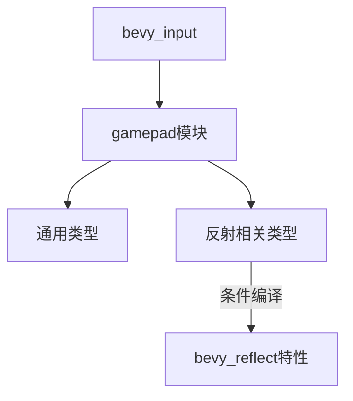

+++
title = "#19862 bevy_input: build warnings without bevy_reflect"
date = "2025-06-29T00:00:00"
draft = false
template = "pull_request_page.html"
in_search_index = false

[extra]
current_language = "zh-cn"
available_languages = {"en" = { name = "English", url = "/pull_request/bevy/2025-06/pr-19862-en-20250629" }, "zh-cn" = { name = "中文", url = "/pull_request/bevy/2025-06/pr-19862-zh-cn-20250629" }}
+++

## 技术分析报告：PR #19862 - bevy_input模块的条件编译优化

### 基本数据
- **标题**: bevy_input: build warnings without bevy_reflect
- **PR链接**: https://github.com/bevy_input/src/lib.rs
- **作者**: mockersf
- **状态**: 已合并
- **标签**: C-Code-Quality, S-Ready-For-Final-Review
- **创建时间**: 2025-06-29T10:58:04Z
- **合并时间**: 2025-06-29T17:32:47Z
- **合并者**: alice-i-cecile

### 描述翻译
# 目标
- 当未启用bevy_reflect时，bevy_input模块会出现构建警告

## 解决方案
- 修复这些警告

## 测试
`cargo build -p bevy_input --no-default-features --features bevy_math/libm`

---

### 问题与解决方案分析

#### 问题背景
在Bevy引擎的输入处理模块(bevy_input)中，存在条件编译问题：当用户在不启用`bevy_reflect`功能的情况下编译项目时，编译器会产生"unused import"警告。这些警告源于对`Gamepad`系列类型(GamepadAxis, GamepadButton等)的无条件导入，而这些类型实际上只在启用`bevy_reflect`时才需要。

#### 技术解决方案
通过重构导入语句，将原本无条件的类型导入改为条件编译：
1. 将仅在`bevy_reflect`启用时需要的类型(GamepadAxis, GamepadButton等)移到`#[cfg(feature = "bevy_reflect")]`块内
2. 保留通用类型(GamepadEvent, GamepadRumbleRequest等)在常规导入区
3. 维持事件处理系统的原有结构不变

#### 实现细节
修改集中在输入模块的主文件(lib.rs)，通过精细调整use声明的作用域来解决编译警告问题。关键点是识别哪些类型实际依赖反射功能，哪些是通用输入处理所需的核心类型。

#### 质量影响
1. 消除特定配置下的编译警告
2. 保持代码在不同功能组合下的编译通过性
3. 明确区分反射依赖与非反射依赖的边界
4. 不改变运行时行为或公共API

### 关键文件变更

#### `crates/bevy_input/src/lib.rs`
**修改目的**：解决条件编译导致的未使用导入警告

```rust
// 修改前:
use gamepad::{
    gamepad_connection_system, gamepad_event_processing_system, GamepadAxis,
    GamepadAxisChangedEvent, GamepadButton, GamepadButtonChangedEvent,
    GamepadButtonStateChangedEvent, GamepadConnection, GamepadConnectionEvent, GamepadEvent,
    GamepadInput, GamepadRumbleRequest, GamepadSettings, RawGamepadAxisChangedEvent,
    RawGamepadButtonChangedEvent, RawGamepadEvent,
};

// 修改后:
use gamepad::{
    gamepad_connection_system, gamepad_event_processing_system, GamepadAxisChangedEvent,
    GamepadButtonChangedEvent, GamepadButtonStateChangedEvent, GamepadConnectionEvent,
    GamepadEvent, GamepadRumbleRequest, RawGamepadAxisChangedEvent, RawGamepadButtonChangedEvent,
    RawGamepadEvent,
};
#[cfg(feature = "bevy_reflect")]
use gamepad::{GamepadAxis, GamepadButton, GamepadConnection, GamepadInput, GamepadSettings};
```

**变更说明**：
1. 将反射相关类型(GamepadAxis等)移入条件编译块
2. 保留通用事件类型在全局导入区
3. 调整后当`bevy_reflect`禁用时不再导入未使用类型

### 组件关系图



### 技术要点总结
1. **条件编译边界**：精确控制特性门控(feature-gating)的作用范围
2. **编译警告消除**：通过作用域管理解决未使用导入问题
3. **模块化维护**：保持核心功能与可选功能的清晰分离
4. **零成本抽象**：修改不增加运行时开销，纯编译期优化

### 扩展阅读
1. [Rust条件编译文档](https://doc.rust-lang.org/reference/conditional-compilation.html)
2. [Cargo特性指南](https://doc.rust-lang.org/cargo/reference/features.html)
3. [Bevy模块系统设计](https://bevyengine.org/learn/book/getting-started/ecs/)