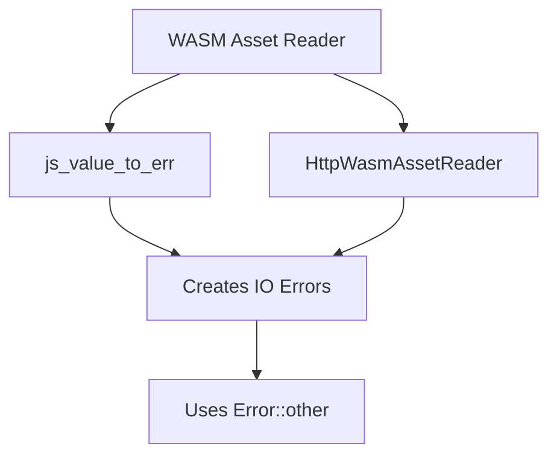

+++
title = "#19865 Fixing a Clippy Warning in Bevy's WASM Asset Handling"
date = "2025-06-29T00:00:00"
draft = false
template = "pull_request_page.html"
in_search_index = true

[taxonomies]
list_display = ["show"]

[extra]
current_language = "en"
available_languages = {"en" = { name = "English", url = "/pull_request/bevy/2025-06/pr-19865-en-20250629" }, "zh-cn" = { name = "中文", url = "/pull_request/bevy/2025-06/pr-19865-zh-cn-20250629" }}
labels = ["C-Code-Quality"]
+++

## Title: Fixing a Clippy Warning in Bevy's WASM Asset Handling

## Basic Information
- **Title**: bevy_asset: fix clippy in wasm
- **PR Link**: https://github.com/bevyengine/bevy/pull/19865
- **Author**: mockersf
- **Status**: MERGED
- **Labels**: C-Code-Quality, S-Ready-For-Final-Review
- **Created**: 2025-06-29T20:19:04Z
- **Merged**: 2025-06-29T20:57:38Z
- **Merged By**: alice-i-cecile

## Description Translation
# Objective

- bevy_asset has a clippy warning in wasm: [`clippy::io_other_error`](https://rust-lang.github.io/rust-clippy/master/index.html#io_other_error)

```
error: this can be `std::io::Error::other(_)`
  --> crates/bevy_asset/src/io/wasm.rs:50:9
   |
50 |         std::io::Error::new(std::io::ErrorKind::Other, message)
   |         ^^^^^^^^^^^^^^^^^^^^^^^^^^^^^^^^^^^^^^^^^^^^^^^^^^^^^^^
   |
   = help: for further information visit https://rust-lang.github.io/rust-clippy/master/index.html#io_other_error
   = note: `-D clippy::io-other-error` implied by `-D warnings`
   = help: to override `-D warnings` add `#[allow(clippy::io_other_error)]`
help: use `std::io::Error::other`
   |
50 -         std::io::Error::new(std::io::ErrorKind::Other, message)
50 +         std::io::Error::other(message)
```

## Solution

- Fix it

## Testing

`cargo clippy --target wasm32-unknown-unknown -p bevy_asset --no-deps -- -D warnings`

## The Story of This Pull Request

### The Problem and Context
During routine maintenance of Bevy's WebAssembly (WASM) support, a Clippy warning surfaced in the asset system. Specifically, when building for the `wasm32-unknown-unknown` target, Clippy flagged two instances where `std::io::Error` was being constructed using `Error::new(ErrorKind::Other, message)` instead of the more concise `Error::other(message)` helper introduced in Rust 1.74. This violated the `io_other_error` lint rule, which aims to promote cleaner error handling patterns.

The warning was problematic because:
1. Bevy enforces a strict "no warnings" policy in CI builds
2. WASM is a first-class target for Bevy applications
3. The warnings could mask more serious issues in future builds

### The Solution Approach
The fix was straightforward: replace the verbose error construction with the recommended `Error::other()` helper. This approach:
- Maintained identical functionality
- Reduced boilerplate code
- Aligned with modern Rust error handling patterns
- Eliminated the lint violation

No alternatives were considered since the Clippy suggestion directly addressed the issue with no downsides. The change was localized to two error sites in the WASM asset reader implementation.

### The Implementation
The modifications occurred in two locations within the WASM asset reader:
1. The error conversion utility (`js_value_to_err`)
2. The HTTP asset reader implementation (`HttpWasmAssetReader`)

Both changes replaced the explicit `Error::new()` construction with the more concise `Error::other()` helper. The new method internally uses `ErrorKind::Other` but provides a cleaner API surface.

### Technical Insights
Key technical aspects:
1. **`std::io::Error::other()`**: Introduced in Rust 1.74, this helper creates IO errors with `ErrorKind::Other` while reducing boilerplate
2. **Error Handling in WASM**: Bevy's WASM asset system converts JavaScript exceptions to Rust IO errors
3. **Clippy Integration**: The fix demonstrates Bevy's commitment to maintaining lint-clean code across all targets

The changes required no modifications to error propagation or handling logic since the underlying error type and kind remained identical.

### The Impact
These changes:
1. Eliminated specific Clippy warnings in WASM builds
2. Improved code readability by reducing verbosity
3. Maintained consistency with modern Rust error handling patterns
4. Preserved existing error behavior and semantics
5. Ensured Bevy's WASM support remains warning-free

The minimal nature of the changes reduced review overhead and eliminated any risk of behavioral changes or performance impacts.

## Visual Representation



## Key Files Changed

### `crates/bevy_asset/src/io/wasm.rs`
This file contains Bevy's WASM-specific asset I/O implementation. The changes modernize error construction while maintaining identical functionality.

**Key modifications:**
```rust
// Before:
std::io::Error::new(std::io::ErrorKind::Other, message)

// After:
std::io::Error::other(message)
```

```rust
// Before:
let error = std::io::Error::new(
    std::io::ErrorKind::Other,
    "Unsupported JavaScript global context",
);

// After:
let error = std::io::Error::other("Unsupported JavaScript global context");
```

These changes directly address the Clippy warning by using Rust's canonical error construction method while reducing code verbosity. The functionality remains identical since `Error::other()` internally uses `ErrorKind::Other`.

## Further Reading
1. [Rust Clippy: `io_other_error`](https://rust-lang.github.io/rust-clippy/master/index.html#io_other_error)
2. [`std::io::Error::other` documentation](https://doc.rust-lang.org/std/io/struct.Error.html#method.other)
3. [Bevy's WASM Asset Handling](https://github.com/bevyengine/bevy/blob/main/crates/bevy_asset/src/io/wasm.rs)

## Full Code Diff
```diff
diff --git a/crates/bevy_asset/src/io/wasm.rs b/crates/bevy_asset/src/io/wasm.rs
index 4080e03ecd39e..4ed7162d2bafc 100644
--- a/crates/bevy_asset/src/io/wasm.rs
+++ b/crates/bevy_asset/src/io/wasm.rs
@@ -47,7 +47,7 @@ fn js_value_to_err(context: &str) -> impl FnOnce(JsValue) -> std::io::Error + '_
             }
         };
 
-        std::io::Error::new(std::io::ErrorKind::Other, message)
+        std::io::Error::other(message)
     }
 }
 
@@ -62,10 +62,7 @@ impl HttpWasmAssetReader {
             let worker: web_sys::WorkerGlobalScope = global.unchecked_into();
             worker.fetch_with_str(path.to_str().unwrap())
         } else {
-            let error = std::io::Error::new(
-                std::io::ErrorKind::Other,
-                "Unsupported JavaScript global context",
-            );
+            let error = std::io::Error::other("Unsupported JavaScript global context");
             return Err(AssetReaderError::Io(error.into()));
         };
         let resp_value = JsFuture::from(promise)
```