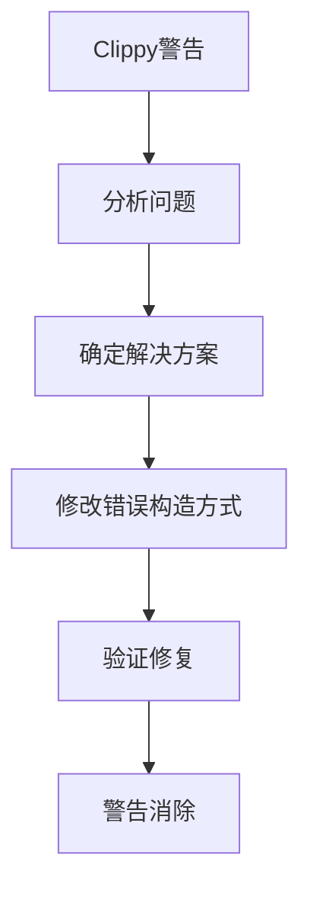

+++
title = "#19865 bevy_asset: fix clippy in wasm"
date = "2025-06-29T00:00:00"
draft = false
template = "pull_request_page.html"
in_search_index = false

[extra]
current_language = "zh-cn"
available_languages = {"en" = { name = "English", url = "/pull_request/bevy/2025-06/pr-19865-en-20250629" }, "zh-cn" = { name = "中文", url = "/pull_request/bevy/2025-06/pr-19865-zh-cn-20250629" }}
+++

## bevy_asset: fix clippy in wasm

### 基本信息
- **标题**: bevy_asset: fix clippy in wasm
- **PR链接**: https://github.com/bevyengine/bevy/pull/19865
- **作者**: mockersf
- **状态**: 已合并
- **标签**: C-Code-Quality, S-Ready-For-Final-Review
- **创建时间**: 2025-06-29T20:19:04Z
- **合并时间**: 2025-06-29T20:57:38Z
- **合并者**: alice-i-cecile

### 描述翻译
#### 目标
- bevy_asset 在 wasm 编译目标下出现 Clippy 警告 [`clippy::io_other_error`](https://rust-lang.github.io/rust-clippy/master/index.html#io_other_error)

```
error: this can be `std::io::Error::other(_)`
  --> crates/bevy_asset/src/io/wasm.rs:50:9
   |
50 |         std::io::Error::new(std::io::ErrorKind::Other, message)
   |         ^^^^^^^^^^^^^^^^^^^^^^^^^^^^^^^^^^^^^^^^^^^^^^^^^^^^^^^
   |
   = help: for further information visit https://rust-lang.github.io/rust-clippy/master/index.html#io_other_error
   = note: `-D clippy::io-other-error` implied by `-D warnings`
   = help: to override `-D warnings` add `#[allow(clippy::io_other_error)]`
help: use `std::io::Error::other`
   |
50 -         std::io::Error::new(std::io::ErrorKind::Other, message)
50 +         std::io::Error::other(message)
```

#### 解决方案
- 修复该警告

#### 测试
`cargo clippy --target wasm32-unknown-unknown -p bevy_asset --no-deps -- -D warnings`

### 本次PR的技术分析

#### 问题背景
在 wasm 目标下构建 bevy_asset 模块时，Clippy 静态分析工具报告了 `io_other_error` 警告。该警告指出使用 `std::io::Error::new(std::io::ErrorKind::Other, message)` 创建IO错误的方式不符合最新Rust标准库的最佳实践。Rust 1.74版本引入了更简洁的 `std::io::Error::other()` 构造函数，专门用于创建 `ErrorKind::Other` 类型的错误。

#### 解决方案
解决方案直接遵循Clippy的建议：将两处创建IO错误的代码从旧式构造方式替换为新的 `std::io::Error::other()` 辅助函数。这种修改：
1. 符合Rust标准库的最新实践
2. 减少代码冗余
3. 保持完全相同的功能行为
4. 消除wasm目标下的编译警告

#### 具体实现
修改集中在 `wasm.rs` 文件中处理wasm环境下的资源读取逻辑。关键变化有两处：

1. **错误处理函数重构**  
   将JS值转换为IO错误的闭包中，错误构造方式更新：

```rust
// Before:
std::io::Error::new(std::io::ErrorKind::Other, message)

// After:
std::io::Error::other(message)
```

2. **全局上下文错误处理**  
   在检测到不支持的JavaScript全局上下文时，错误创建方式同步更新：

```rust
// Before:
let error = std::io::Error::new(
    std::io::ErrorKind::Other,
    "Unsupported JavaScript global context",
);

// After:
let error = std::io::Error::other("Unsupported JavaScript global context");
```

#### 技术影响
1. **代码质量提升**：遵循标准库最佳实践，使用专用错误构造函数
2. **警告消除**：修复后wasm目标下Clippy警告消失
3. **维护性增强**：统一错误创建方式，减少认知负荷
4. **零功能变更**：纯重构，不影响运行时行为

#### 测试验证
通过执行Clippy针对wasm目标的检查命令验证修复：
```bash
cargo clippy --target wasm32-unknown-unknown -p bevy_asset --no-deps -- -D warnings
```
该命令确认修复后不再出现 `io_other_error` 警告。

### 可视化表示



### 关键文件更改

#### crates/bevy_asset/src/io/wasm.rs
**变更描述**：更新IO错误创建方式以符合Clippy建议和Rust最新标准库实践

```rust
// 修改前
fn js_value_to_err(context: &str) -> impl FnOnce(JsValue) -> std::io::Error + '_ {
    move |value| {
        let message = match value.as_string() {
            Some(value) => format!("Failed to {context}: {value}"),
            None => format!("Failed to {context}"),
        };

        std::io::Error::new(std::io::ErrorKind::Other, message)
    }
}

// ...其他代码...

let req = if let Some(global) = js_sys::global().dyn_into::<web_sys::WorkerGlobalScope>().ok() {
    // 使用Worker作用域
} else {
    let error = std::io::Error::new(
        std::io::ErrorKind::Other,
        "Unsupported JavaScript global context",
    );
    return Err(AssetReaderError::Io(error.into()));
};
```

```rust
// 修改后
fn js_value_to_err(context: &str) -> impl FnOnce(JsValue) -> std::io::Error + '_ {
    move |value| {
        let message = match value.as_string() {
            Some(value) => format!("Failed to {context}: {value}"),
            None => format!("Failed to {context}"),
        };

        std::io::Error::other(message)
    }
}

// ...其他代码...

let req = if let Some(global) = js_sys::global().dyn_into::<web_sys::WorkerGlobalScope>().ok() {
    // 使用Worker作用域
} else {
    let error = std::io::Error::other("Unsupported JavaScript global context");
    return Err(AssetReaderError::Io(error.into()));
};
```

### 完整代码变更

```diff
diff --git a/crates/bevy_asset/src/io/wasm.rs b/crates/bevy_asset/src/io/wasm.rs
index 4080e03ecd39e..4ed7162d2bafc 100644
--- a/crates/bevy_asset/src/io/wasm.rs
+++ b/crates/bevy_asset/src/io/wasm.rs
@@ -47,7 +47,7 @@ fn js_value_to_err(context: &str) -> impl FnOnce(JsValue) -> std::io::Error + '_
             }
         };
 
-        std::io::Error::new(std::io::ErrorKind::Other, message)
+        std::io::Error::other(message)
     }
 }
 
@@ -62,10 +62,7 @@ impl HttpWasmAssetReader {
             let worker: web_sys::WorkerGlobalScope = global.unchecked_into();
             worker.fetch_with_str(path.to_str().unwrap())
         } else {
-            let error = std::io::Error::new(
-                std::io::ErrorKind::Other,
-                "Unsupported JavaScript global context",
-            );
+            let error = std::io::Error::other("Unsupported JavaScript global context");
             return Err(AssetReaderError::Io(error.into()));
         };
         let resp_value = JsFuture::from(promise)
```

### 延伸阅读
1. [Rust std::io::Error::other 文档](https://doc.rust-lang.org/std/io/struct.Error.html#method.other)
2. [Clippy的io_other_error规则说明](https://rust-lang.github.io/rust-clippy/master/index.html#io_other_error)
3. [Bevy引擎的WASM支持文档](https://bevyengine.org/learn/book/getting-started/setup/#wasm-support)