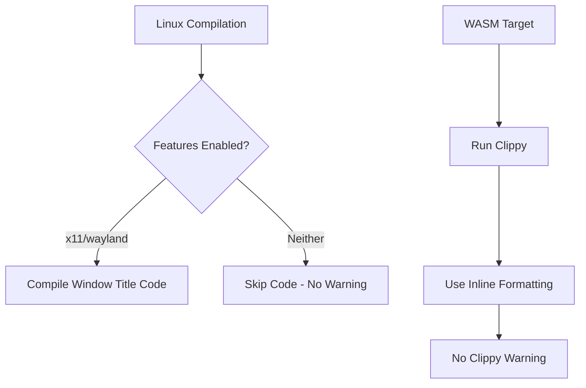

+++
title = "#19869 bevy_winit: fix compile and clippy on wasm"
date = "2025-06-29T00:00:00"
draft = false
template = "pull_request_page.html"
in_search_index = true

[taxonomies]
list_display = ["show"]

[extra]
current_language = "en"
available_languages = {"en" = { name = "English", url = "/pull_request/bevy/2025-06/pr-19869-en-20250629" }, "zh-cn" = { name = "中文", url = "/pull_request/bevy/2025-06/pr-19869-zh-cn-20250629" }}
labels = ["C-Code-Quality"]
+++

# Analysis of PR #19869: bevy_winit: fix compile and clippy on wasm

## Basic Information
- **Title**: bevy_winit: fix compile and clippy on wasm
- **PR Link**: https://github.com/bevyengine/bevy/pull/19869
- **Author**: mockersf
- **Status**: MERGED
- **Labels**: C-Code-Quality, S-Ready-For-Final-Review
- **Created**: 2025-06-29T21:13:33Z
- **Merged**: 2025-06-29T21:50:12Z
- **Merged By**: alice-i-cecile

## Description Translation
# Objective

- bevy_winit has a warning when compiling without default feature on linux
- bevy_winit has a clippy warning when compiling in wasm

## Solution

- Fix them

## Testing

```
cargo build -p bevy_winit --no-default-features --features winit/x11
cargo clippy --target wasm32-unknown-unknown -p bevy_winit --no-deps -- -D warnings
```

## The Story of This Pull Request

### The Problem and Context
When compiling `bevy_winit` for Linux without default features, specifically using the `winit/x11` feature, developers encountered a warning about an unused variable. This occurred because a code block intended for X11/Wayland environments was being compiled unconditionally on Unix-like systems, even when the required features weren't enabled. 

Simultaneously, when compiling for WebAssembly (wasm) targets, Clippy flagged a non-idiomatic string concatenation in a panic message. The original code used manual string formatting where Rust's built-in formatting could be used more efficiently.

### The Solution Approach
The solution required two distinct fixes:
1. **Conditional Compilation Refinement**: Adjust the conditional compilation attributes to only include the problematic code block when both:
   - The target OS is a Unix-like system (Linux, BSD variants) OR Windows
   - AND the required display server features (x11 or wayland) are enabled
   
2. **Clippy Compliance**: Replace manual string concatenation with Rust's inline string formatting syntax to resolve the Clippy warning.

### The Implementation
The changes were localized to `winit_windows.rs`, where two key modifications were made:

**1. Refined Conditional Compilation**  
The original `#[cfg]` block was too broad, activating on all Unix-like systems regardless of feature flags. This caused the unused variable warning when building without x11/wayland features. The solution nests feature checks within OS checks using `all` and `any` combinators:

```rust
// Before
#[cfg(any(
    target_os = "linux",
    target_os = "dragonfly",
    target_os = "freebsd",
    target_os = "netbsd",
    target_os = "openbsd",
    target_os = "windows"
))]

// After
#[cfg(any(
    all(
        any(feature = "wayland", feature = "x11"),
        any(
            target_os = "linux",
            target_os = "dragonfly",
            target_os = "freebsd",
            target_os = "netbsd",
            target_os = "openbsd",
        )
    ),
    target_os = "windows"
))]
```

This ensures the code block only compiles when:
- Building for Windows (unchanged)
- OR building for Unix-like systems WITH x11/wayland features enabled

**2. Idiomatic String Formatting**  
The wasm-specific Clippy warning was addressed by replacing concatenated string formatting with inline syntax:

```rust
// Before
panic!("Cannot find element: {}.", selector);

// After
panic!("Cannot find element: {selector}.");
```

This uses Rust's "captured identifiers in format strings" feature introduced in Rust 1.58, which is more concise and avoids intermediate string allocations.

### Technical Insights
The conditional compilation fix demonstrates proper use of Rust's attribute combinators:
- `all()` requires all conditions to be true
- `any()` requires at least one condition to be true
- Nesting allows creating complex feature/OS matrices

The panic message fix highlights Rust's evolving formatting capabilities. The `{selector}` syntax is:
- More readable than `{}` with separate arguments
- More efficient (avoids temporary string allocation)
- Explicit about which variable is being formatted

### The Impact
These changes:
1. Eliminate compiler warnings for Linux builds without default features
2. Resolve Clippy warnings for wasm targets
3. Maintain identical runtime behavior
4. Improve code quality through more precise conditional compilation
5. Modernize string formatting to current Rust standards

The fixes are minimal and localized, posing no risk to existing functionality while improving the development experience.

## Visual Representation



## Key Files Changed

**File: crates/bevy_winit/src/winit_windows.rs**  
**Changes**: Fixed conditional compilation for Unix systems and updated panic formatting for WASM

```rust
// Before:
#[cfg(any(
    target_os = "linux",
    target_os = "dragonfly",
    target_os = "freebsd",
    target_os = "netbsd",
    target_os = "openbsd",
    target_os = "windows"
))]
if let Some(name) = &window.name {
    winit_window_builder = winit_window_builder.with_title(name);
}

// ... 

} else {
    panic!("Cannot find element: {}.", selector);
}
```

```rust
// After:
#[cfg(any(
    all(
        any(feature = "wayland", feature = "x11"),
        any(
            target_os = "linux",
            target_os = "dragonfly",
            target_os = "freebsd",
            target_os = "netbsd",
            target_os = "openbsd",
        )
    ),
    target_os = "windows"
))]
if let Some(name) = &window.name {
    winit_window_builder = winit_window_builder.with_title(name);
}

// ... 

} else {
    panic!("Cannot find element: {selector}.");
}
```

## Further Reading
1. [Rust Conditional Compilation](https://doc.rust-lang.org/reference/conditional-compilation.html)
2. [Rust Formatting Syntax](https://doc.rust-lang.org/std/fmt/)
3. [Clippy Lint Documentation](https://rust-lang.github.io/rust-clippy/master/)
4. [Bevy's WASM Support](https://bevyengine.org/learn/book/getting-started/setup/#wasm)