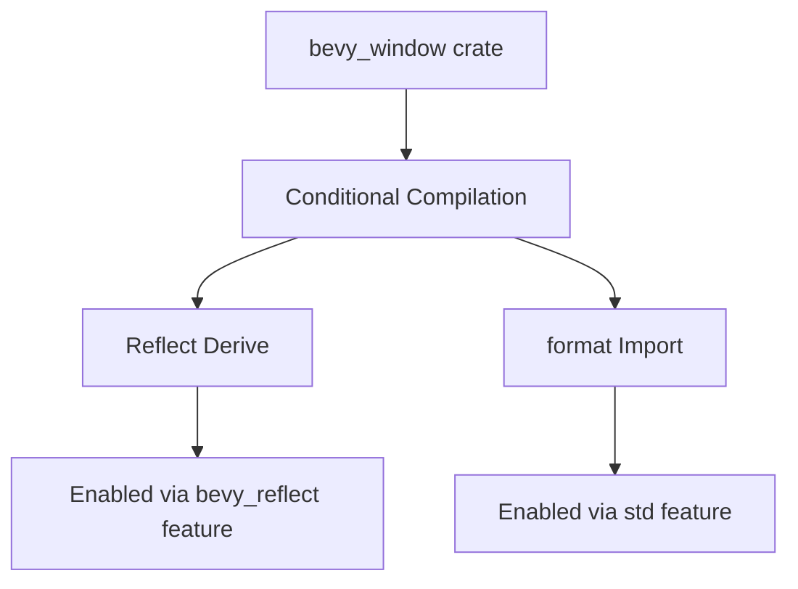

+++
title = "#19870"
date = "2025-06-30T00:00:00"
draft = false
template = "pull_request_page.html"
in_search_index = true

[taxonomies]
list_display = ["show"]

[extra]
current_language = "en"
available_languages = {"en" = { name = "English", url = "/pull_request/bevy/2025-06/pr-19870-en-20250630" }, "zh-cn" = { name = "中文", url = "/pull_request/bevy/2025-06/pr-19870-zh-cn-20250630" }}
+++

## The Story of This Pull Request

This PR addresses a straightforward but critical build issue in the bevy_window crate when compiled without default features. The problem manifested as a compilation failure due to missing dependencies and a warning about unused imports, both of which were blocking development workflows for users working with minimal feature sets.

The core issue stemmed from two distinct but related problems in the window.rs module. First, the `ScreenEdge` enum unconditionally derived the `Reflect` trait, which requires the bevy_reflect feature to be enabled. This caused compilation failures when building without default features since the reflection system wasn't available. Second, the `format` macro from the alloc crate was unconditionally imported but only used in std-enabled contexts, triggering an unused import warning.

The solution implemented two targeted changes. For the `Reflect` derivation, we added conditional compilation using `cfg_attr` to only include the derive when the bevy_reflect feature is enabled. For the import issue, we conditionally imported the `format` macro only when the std feature is active since it's only needed in that context. These changes maintain existing functionality while making the code more robust for different compilation scenarios.

```rust
// Before (problematic unconditional imports/derives)
use alloc::{borrow::ToOwned, format, string::String};
#[derive(Default, Debug, Clone, Copy, PartialEq, Eq, Hash, Reflect)]

// After (conditional handling)
#[cfg(feature = "std")]
use alloc::format;
use alloc::{borrow::ToOwned, string::String};
#[derive(Default, Debug, Clone, Copy, PartialEq, Eq, Hash)]
#[cfg_attr(feature = "bevy_reflect", derive(Reflect))]
```

The implementation demonstrates proper use of Rust's conditional compilation system. The `cfg_attr` approach is particularly effective here as it cleanly separates the reflection capability from the core type definition while maintaining the derive's visibility when appropriate. The import restructuring efficiently isolates the std-dependent functionality without affecting other alloc utilities.

These changes have immediate practical impact - they unblock development workflows for users who need to compile Bevy without default features, such as those targeting resource-constrained environments or specialized platforms. The fix also eliminates compiler noise from unused imports, maintaining clean build outputs. The testing approach (`cargo build -p bevy_window --no-default-features --features bevy_math/libm`) directly verifies the solution in the affected configuration.

## Visual Representation



## Key Files Changed

### `crates/bevy_window/src/window.rs` (+5/-2)

**Purpose**: Fix compilation errors when building without default features  
**Changes**:
1. Conditionally imported `format` macro only when std feature is enabled
2. Conditionally derived `Reflect` trait only when bevy_reflect feature is enabled

```rust
// Before:
use alloc::{borrow::ToOwned, format, string::String};
// ...
#[derive(Default, Debug, Clone, Copy, PartialEq, Eq, Hash, Reflect)]
#[cfg_attr(feature = "serialize", derive(serde::Serialize, serde::Deserialize))]

// After:
#[cfg(feature = "std")]
use alloc::format;
use alloc::{borrow::ToOwned, string::String};
// ...
#[derive(Default, Debug, Clone, Copy, PartialEq, Eq, Hash)]
#[cfg_attr(feature = "bevy_reflect", derive(Reflect))]
#[cfg_attr(feature = "serialize", derive(serde::Serialize, serde::Deserialize))]
```

## Further Reading

1. [Rust Conditional Compilation Documentation](https://doc.rust-lang.org/reference/conditional-compilation.html)  
2. [The Bevy Engine's Feature Flags Guide](https://bevyengine.org/learn/book/getting-started/features/)  
3. [Conditional Derivation with cfg_attr](https://doc.rust-lang.org/reference/attributes.html#conditional-compilation)  
4. [Rust's Alloc Crate for No-Std Environments](https://doc.rust-lang.org/alloc/)