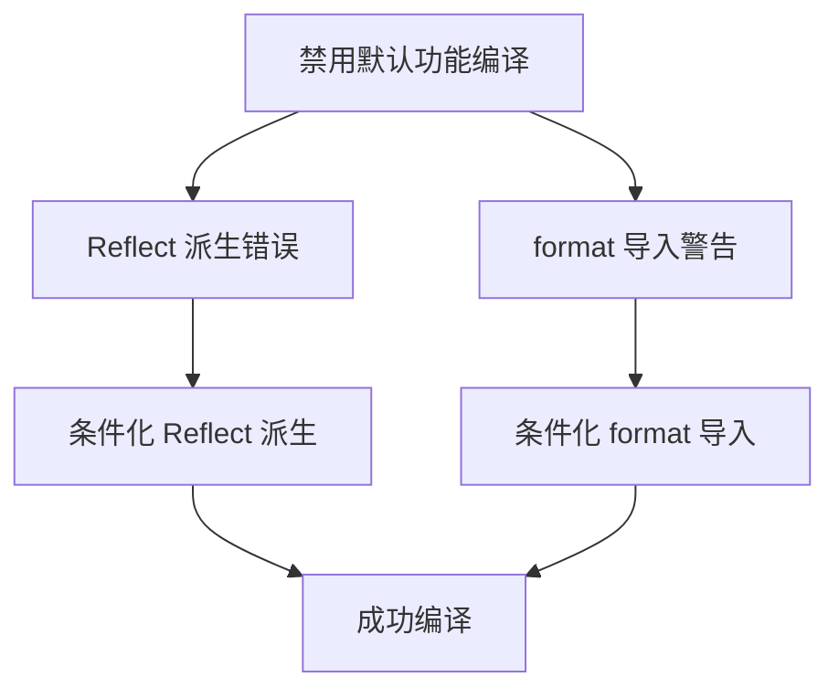

+++
title = "#19870 bevy_window: fix compilation without default features (保留原始英文标题)"
date = "2025-06-30T00:00:00"
draft = false
template = "pull_request_page.html"
in_search_index = false

[extra]
current_language = "zh-cn"
available_languages = {"en" = { name = "English", url = "/pull_request/bevy/2025-06/pr-19870-en-20250630" }, "zh-cn" = { name = "中文", url = "/pull_request/bevy/2025-06/pr-19870-zh-cn-20250630" }}
+++

# bevy_window: fix compilation without default features

## 基本信息
- **标题**: bevy_window: fix compilation without default features (保留原始英文标题)
- **PR链接**: https://github.com/bevyengine/bevy/pull/19870
- **作者**: mockersf
- **状态**: 已合并
- **标签**: C-Code-Quality, S-Ready-For-Final-Review
- **创建时间**: 2025-06-29T21:27:26Z
- **合并时间**: 2025-06-30T21:12:28Z
- **合并人**: mockersf

## 描述翻译
### Objective (目标)
- 在禁用默认功能(default features)时，bevy_window 无法编译

```
error: cannot find derive macro `Reflect` in this scope
    --> crates/bevy_window/src/window.rs:1474:60
     |
1474 | #[derive(Default, Debug, Clone, Copy, PartialEq, Eq, Hash, Reflect)]
     |                                                            ^^^^^^^

warning: unused import: `format`
 --> crates/bevy_window/src/window.rs:1:30
  |
1 | use alloc::{borrow::ToOwned, format, string::String};
  |                              ^^^^^^
  |
  = note: `#[warn(unused_imports)]` on by default

warning: `bevy_window` (lib) generated 1 warning
error: could not compile `bevy_window` (lib) due to 1 previous error; 1 warning emitted
```

### Solution (解决方案)
- 修复这些问题

### Testing (测试)
`cargo build -p bevy_window --no-default-features --features bevy_math/libm`

## PR技术分析

### 问题背景
当开发者在**禁用默认功能**(default features)的情况下编译 bevy_window 模块时，会遇到两个关键问题。这种编译模式在嵌入式系统、WASM 目标或需要最小化依赖的场景中很常见。

第一个错误出现在 `window.rs` 文件的 1474 行：
```rust
#[derive(Default, Debug, Clone, Copy, PartialEq, Eq, Hash, Reflect)]
```
错误明确提示无法找到 `Reflect` 派生宏，这是因为当 `bevy_reflect` 功能未启用时，相应的反射系统不会被包含在编译中。

第二个问题是编译器警告：
```rust
use alloc::{borrow::ToOwned, format, string::String};
              // 此处 ^^^^^^ 被标记为未使用
```
在非标准库环境(no_std)下，`format` 宏未被实际使用，导致编译器产生"unused import"警告。虽然警告不影响编译，但在严格的构建配置中（如 CI/CD 管道），此类警告常被视为错误处理。

### 解决方案实现
PR 通过两处精准修改解决上述问题：

1. **条件化反射支持**  
   修改前：
   ```rust
   #[derive(Default, Debug, Clone, Copy, PartialEq, Eq, Hash, Reflect)]
   ```
   修改后：
   ```rust
   #[derive(Default, Debug, Clone, Copy, PartialEq, Eq, Hash)]
   #[cfg_attr(feature = "bevy_reflect", derive(Reflect))]
   ```
   使用 `#[cfg_attr]` 属性实现条件编译，仅在启用 `bevy_reflect` 功能时包含 `Reflect` 派生。这种模式在 Rust 中称为条件派生(conditional derivation)，是处理可选依赖的常规做法。

2. **优化内存分配导入**  
   修改前：
   ```rust
   use alloc::{borrow::ToOwned, format, string::String};
   ```
   修改后：
   ```rust
   #[cfg(feature = "std")]
   use alloc::format;
   use alloc::{borrow::ToOwned, string::String};
   ```
   将 `format` 导入包裹在 `#[cfg(feature = "std")]` 属性中，确保仅在启用标准库支持时才导入该宏。同时保留其他必要的 alloc 类型，维持非标准库环境的功能完整性。

### 技术影响
这些修改带来三个关键改进：
1. **编译可靠性**：修复了在禁用默认功能时的硬性编译错误
2. **警告消除**：解决了未使用导入的编译器警告
3. **功能隔离**：通过条件编译确保功能边界清晰，避免隐式依赖

### 测试验证
作者通过以下命令验证修复效果：
```bash
cargo build -p bevy_window --no-default-features --features bevy_math/libm
```
此命令明确禁用默认功能，同时启用 `bevy_math/libm` 作为必要依赖，模拟了目标编译环境。

## 变更关系图



## 关键文件变更

### `crates/bevy_window/src/window.rs`
**变更描述**：修复条件编译问题，确保在禁用默认功能时能正确编译

**变更前**：
```rust
use alloc::{borrow::ToOwned, format, string::String};

// ... 其他代码 ...

#[derive(Default, Debug, Clone, Copy, PartialEq, Eq, Hash, Reflect)]
#[cfg_attr(feature = "serialize", derive(serde::Serialize, serde::Deserialize))]
pub enum ScreenEdge {
    #[default]
```

**变更后**：
```rust
#[cfg(feature = "std")]
use alloc::format;
use alloc::{borrow::ToOwned, string::String};

// ... 其他代码 ...

#[derive(Default, Debug, Clone, Copy, PartialEq, Eq, Hash)]
#[cfg_attr(feature = "bevy_reflect", derive(Reflect))]
#[cfg_attr(feature = "serialize", derive(serde::Serialize, serde::Deserialize))]
pub enum ScreenEdge {
    #[default]
```

**关联性**：
1. 条件导入 `format` 解决未使用导入警告
2. 条件派生 `Reflect` 解决编译时宏找不到错误
3. 保持现有功能不变，仅调整编译条件

## 延伸阅读
1. [Rust 条件编译文档](https://doc.rust-lang.org/reference/conditional-compilation.html) - 官方条件编译特性指南
2. [The cfg_attr Attribute](https://doc.rust-lang.org/reference/conditional-compilation.html#the-cfg_attr-attribute) - 条件属性语法详解
3. [Bevy 功能标志实践](https://bevyengine.org/learn/book/getting-started/features/) - 引擎功能管理最佳实践

## 完整代码变更
```diff
diff --git a/crates/bevy_window/src/window.rs b/crates/bevy_window/src/window.rs
index 5ea8b72402e32..4fc039d7c7346 100644
--- a/crates/bevy_window/src/window.rs
+++ b/crates/bevy_window/src/window.rs
@@ -1,4 +1,6 @@
-use alloc::{borrow::ToOwned, format, string::String};
+#[cfg(feature = "std")]
+use alloc::format;
+use alloc::{borrow::ToOwned, string::String};
 use core::num::NonZero;
 
 use bevy_ecs::{
@@ -1471,7 +1473,8 @@ pub struct ClosingWindow;
 /// - Only used on iOS.
 ///
 /// [`winit::platform::ios::ScreenEdge`]: https://docs.rs/winit/latest/x86_64-apple-darwin/winit/platform/ios/struct.ScreenEdge.html
-#[derive(Default, Debug, Clone, Copy, PartialEq, Eq, Hash, Reflect)]
+#[derive(Default, Debug, Clone, Copy, PartialEq, Eq, Hash)]
+#[cfg_attr(feature = "bevy_reflect", derive(Reflect))]
 #[cfg_attr(feature = "serialize", derive(serde::Serialize, serde::Deserialize))]
 pub enum ScreenEdge {
     #[default]
```