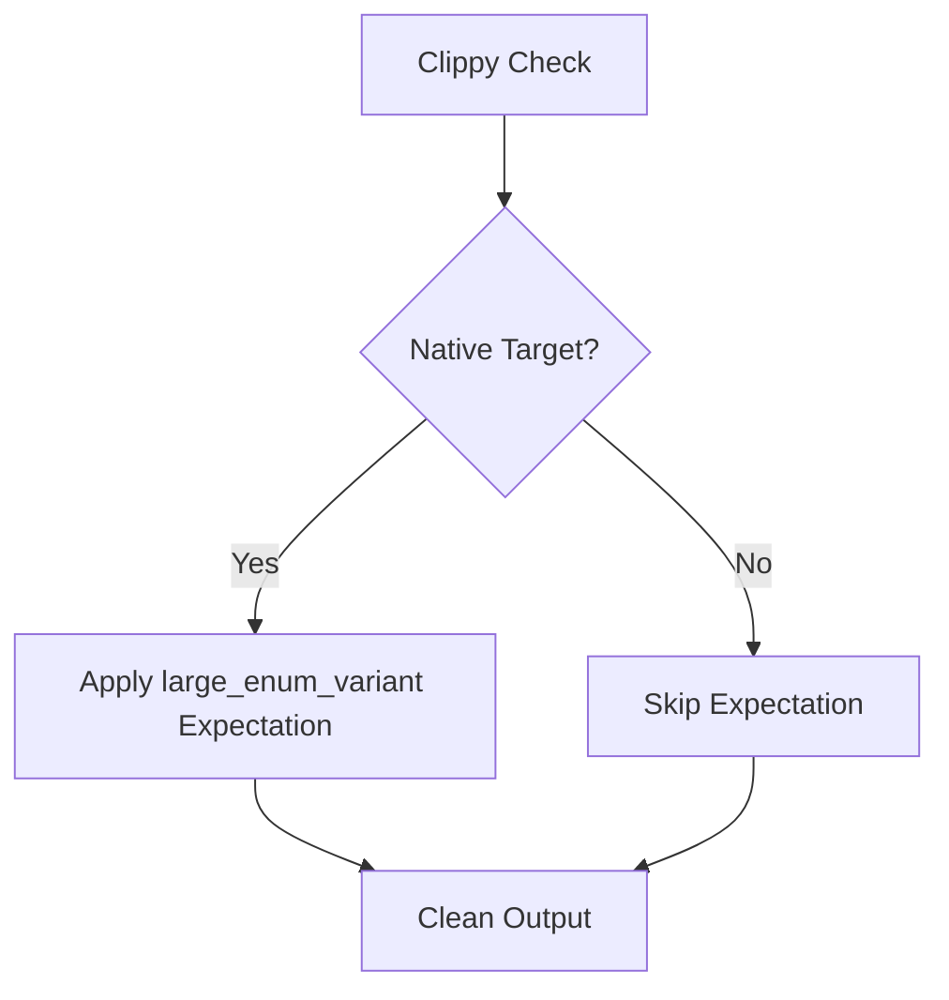

+++
title = "#19872"
date = "2025-06-29T00:00:00"
draft = false
template = "pull_request_page.html"
in_search_index = true

[taxonomies]
list_display = ["show"]

[extra]
current_language = "en"
available_languages = {"en" = { name = "English", url = "/pull_request/bevy/2025-06/pr-19872-en-20250629" }, "zh-cn" = { name = "中文", url = "/pull_request/bevy/2025-06/pr-19872-zh-cn-20250629" }}
+++

## Technical Analysis of PR #19872: bevy_render: fix clippy on wasm

### The Problem and Context
When compiling Bevy's renderer for WebAssembly (wasm) targets, Clippy warnings appeared for unfulfilled lint expectations. Specifically, the `#[expect(clippy::large_enum_variant)]` attributes were triggering warnings because the expected lint violations weren't occurring in wasm builds. This violated Bevy's policy of maintaining clean Clippy output and created noise in development workflows targeting web platforms. The core issue stemmed from differences in enum size handling between native and wasm targets, where the lint condition wasn't consistently met across platforms.

### The Solution Approach
The author implemented a targeted solution: conditionally apply the `expect` attribute only for non-wasm targets. This approach maintains the lint suppression for native builds where the enum size is problematic (as tracked in issue #19220), while avoiding false positives in wasm environments. The solution uses Rust's conditional compilation with `cfg_attr` to selectively include the Clippy directive based on the target architecture.

### The Implementation
The changes modify two enums where the original `expect` attributes caused wasm-specific warnings. The pattern is identical in both cases:

```rust
// Before:
#[expect(
    clippy::large_enum_variant,
    reason = "See https://github.com/bevyengine/bevy/issues/19220"
)]

// After:
#[cfg_attr(
    not(target_arch = "wasm32"),
    expect(
        clippy::large_enum_variant,
        reason = "See https://github.com/bevyengine/bevy/issues/19220"
    )
)]
```

This transformation wraps the expectation in a conditional that only activates on non-wasm targets. The reason documentation linking to issue #19220 is preserved for maintainability.

### Technical Insights
Key implementation details:
1. **Conditional Compilation**: Uses `cfg_attr` with `not(target_arch = "wasm32")` for precise control
2. **Lint Preservation**: Maintains the `large_enum_variant` expectation for native platforms
3. **Issue Tracking**: Retains reference to the underlying enum size issue (#19220)
4. **Minimal Impact**: Changes only affect linting behavior without modifying runtime logic

The solution acknowledges that the enum size issue (which triggers the lint) behaves differently in wasm environments, likely due to:
- Smaller pointer sizes in wasm (32-bit vs 64-bit native)
- Different struct padding behaviors
- Varying enum discriminant sizes

### The Impact
These changes:
1. Eliminate Clippy warnings for wasm builds
2. Maintain clean CI output for all targets
3. Preserve existing lint expectations for native platforms
4. Require zero runtime performance overhead
5. Keep the codebase warning-free without resolving the underlying enum size issue

The fix demonstrates proper handling of target-specific lint behaviors while maintaining documentation for future optimizations.

### Visual Representation



### Key Files Changed

1. **crates/bevy_render/src/batching/gpu_preprocessing.rs**
   - Modified enum: `PreprocessWorkItemBuffers`
   - Change: Conditional Clippy expectation
   - Purpose: Fix wasm Clippy warning for batching system

```rust
// Before:
#[expect(
    clippy::large_enum_variant,
    reason = "See https://github.com/bevyengine/bevy/issues/19220"
)]
pub enum PreprocessWorkItemBuffers { ... }

// After:
#[cfg_attr(
    not(target_arch = "wasm32"),
    expect(
        clippy::large_enum_variant,
        reason = "See https://github.com/bevyengine/bevy/issues/19220"
    )
)]
pub enum PreprocessWorkItemBuffers { ... }
```

2. **crates/bevy_render/src/render_resource/pipeline_cache.rs**
   - Modified enums: `CachedPipelineState` and `PipelineCacheError`
   - Change: Identical conditional pattern applied twice
   - Purpose: Fix wasm Clippy warnings in pipeline management

```rust
// Example of one modified enum:
#[cfg_attr(
    not(target_arch = "wasm32"),
    expect(
        clippy::large_enum_variant,
        reason = "See https://github.com/bevyengine/bevy/issues/19220"
    )
)]
pub enum CachedPipelineState { ... }
```

### Further Reading
1. [Rust Conditional Compilation](https://doc.rust-lang.org/reference/conditional-compilation.html)
2. [Clippy Lint Expectations](https://doc.rust-lang.org/rustc/lints/levels.html#expect)
3. [Bevy Issue #19220](https://github.com/bevyengine/bevy/issues/19220) (enum size optimization)
4. [WebAssembly Rust Targets](https://rustwasm.github.io/docs/book/reference/js-ffi.html)