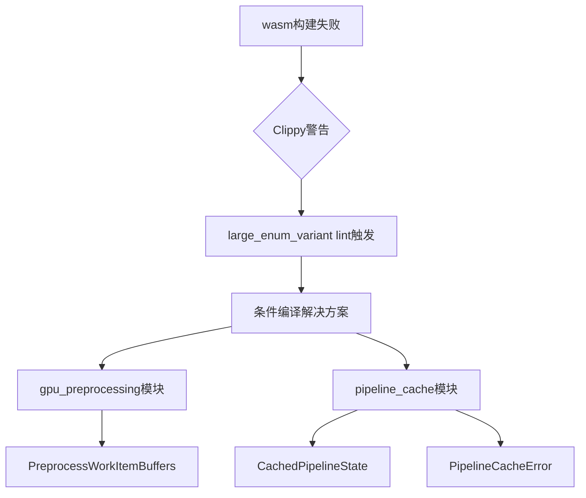

+++
title = "#19872 bevy_render: fix clippy on wasm"
date = "2025-06-29T00:00:00"
draft = false
template = "pull_request_page.html"
in_search_index = false

[extra]
current_language = "zh-cn"
available_languages = {"en" = { name = "English", url = "/pull_request/bevy/2025-06/pr-19872-en-20250629" }, "zh-cn" = { name = "中文", url = "/pull_request/bevy/2025-06/pr-19872-zh-cn-20250629" }}
+++

## 技术报告：PR #19872 - bevy_render: fix clippy on wasm

### 基础信息
- **标题**: bevy_render: fix clippy on wasm
- **PR链接**: https://github.com/bevyengine/bevy/pull/19872
- **作者**: mockersf
- **状态**: 已合并
- **标签**: C-Code-Quality
- **创建时间**: 2025-06-29T21:52:20Z
- **合并时间**: 2025-06-29T22:29:24Z
- **合并者**: alice-i-cecile

### 描述翻译
#### 目标
- bevy_render 在 wasm 环境下存在未满足的 clippy lint 预期

#### 解决方案
- 在 wasm 环境下不启用这些 lint 预期

#### 测试
`cargo clippy --target wasm32-unknown-unknown -p bevy_render --no-deps -- -D warnings`

---

### PR技术分析

#### 问题背景
在 wasm32-unknown-unknown 目标平台构建时，bevy_render 模块中几个使用 `#[expect]` 属性标记的 Clippy lint 检查未能满足预期条件。具体涉及 `clippy::large_enum_variant` lint，该 lint 会在枚举包含过大变体时触发警告。项目原本通过 `#[expect]` 属性暂时豁免这些警告（关联 issue #19220），但在 wasm 编译目标下，这些豁免条件意外失效，导致 Clippy 抛出警告，违反了项目的 `-D warnings`（将警告视为错误）的严格检查策略。

#### 解决方案
核心解决思路是**条件编译**：仅在非 wasm 目标平台启用 `#[expect]` 属性。通过 `#[cfg_attr(not(target_arch = "wasm32"), ...)]` 属性宏实现：
1. 保留原有 `expect` 属性在桌面/移动平台的行为
2. 在 wasm 目标下完全移除该属性
3. 不改变现有代码逻辑或数据结构的实际功能

#### 实现细节
修改集中在两个模块的三处枚举定义，均采用相同的条件编译模式：

**1. GPU 预处理工作项缓冲区 (`gpu_preprocessing.rs`)**
```rust
// 修改前
#[expect(
    clippy::large_enum_variant,
    reason = "See https://github.com/bevyengine/bevy/issues/19220"
)]

// 修改后
#[cfg_attr(
    not(target_arch = "wasm32"),
    expect(
        clippy::large_enum_variant,
        reason = "See https://github.com/bevyengine/bevy/issues/19220"
    )
)]
```

**2. 管线缓存状态 (`pipeline_cache.rs`)**
```rust
// 修改前
#[expect(
    clippy::large_enum_variant,
    reason = "See https://github.com/bevyengine/bevy/issues/19220"
)]

// 修改后
#[cfg_attr(
    not(target_arch = "wasm32"),
    expect(
        clippy::large_enum_variant,
        reason = "See https://github.com/bevyengine/bevy/issues/19220"
    )
)]
```

**3. 管线缓存错误类型 (同文件)**
```rust
// 修改前
#[expect(
    clippy::large_enum_variant,
    reason = "See https://github.com/bevyengine/bevy/issues/19220"
)]

// 修改后
#[cfg_attr(
    not(target_arch = "wasm32"),
    expect(
        clippy::large_enum_variant,
        reason = "See https://github.com/bevyengine/bevy/issues/19220"
    )
)]
```

#### 技术考量
1. **最小侵入性**：仅修改属性注解，不触及实际业务逻辑
2. **条件编译精确性**：使用 `target_arch = "wasm32"` 精确匹配 WebAssembly 目标
3. **问题溯源**：保留原始 issue (#19220) 链接便于后续追踪根本解决方案
4. **跨平台一致性**：桌面/移动平台仍保持原有 lint 豁免行为

#### 验证方案
通过命令验证 wasm 目标下的 Clippy 检查：
```bash
cargo clippy --target wasm32-unknown-unknown -p bevy_render --no-deps -- -D warnings
```
此命令确保：
- 仅检查 bevy_render 模块
- 排除依赖项的干扰
- 开启警告即错误模式

#### 影响分析
1. **构建系统**：修复 wasm 目标的 Clippy 检查失败
2. **代码质量**：维持跨平台静态检查的一致性
3. **维护成本**：为 #19220 的最终解决争取时间
4. **架构影响**：零运行时开销，纯编译时属性调整

---

### 变更关系图


---

### 关键文件变更

#### 1. `crates/bevy_render/src/batching/gpu_preprocessing.rs`
**变更说明**：调整 GPU 预处理工作项缓冲区的 Clippy 属性，使其在 wasm 目标下不生效

```rust
// 修改前:
#[expect(
    clippy::large_enum_variant,
    reason = "See https://github.com/bevyengine/bevy/issues/19220"
)]
pub enum PreprocessWorkItemBuffers {

// 修改后:
#[cfg_attr(
    not(target_arch = "wasm32"),
    expect(
        clippy::large_enum_variant,
        reason = "See https://github.com/bevyengine/bevy/issues/19220"
    )
)]
pub enum PreprocessWorkItemBuffers {
```

#### 2. `crates/bevy_render/src/render_resource/pipeline_cache.rs`
**变更说明**：对管线缓存状态和错误类型应用相同的条件属性调整

```rust
// 修改前 (CachedPipelineState):
#[expect(
    clippy::large_enum_variant,
    reason = "See https://github.com/bevyengine/bevy/issues/19220"
)]

// 修改后:
#[cfg_attr(
    not(target_arch = "wasm32"),
    expect(
        clippy::large_enum_variant,
        reason = "See https://github.com/bevyengine/bevy/issues/19220"
    )
)]

// 修改前 (PipelineCacheError):
#[expect(
    clippy::large_enum_variant,
    reason = "See https://github.com/bevyengine/bevy/issues/19220"
)]

// 修改后:
#[cfg_attr(
    not(target_arch = "wasm32"),
    expect(
        clippy::large_enum_variant,
        reason = "See https://github.com/bevyengine/bevy/issues/19220"
    )
)]
```

---

### 扩展阅读
1. [Clippy 的 `large_enum_variant` lint 文档](https://rust-lang.github.io/rust-clippy/master/index.html#/large_enum_variant)
2. [Rust 条件编译属性指南](https://doc.rust-lang.org/reference/conditional-compilation.html)
3. [Bevy 跨平台开发最佳实践](https://bevyengine.org/learn/book/getting-started/platforms/)
4. [相关 issue #19220: 大型枚举变体的内存优化](https://github.com/bevyengine/bevy/issues/19220)

---

### 完整代码变更
```diff
diff --git a/crates/bevy_render/src/batching/gpu_preprocessing.rs b/crates/bevy_render/src/batching/gpu_preprocessing.rs
index ea5970431a5aa..2fb0172b219da 100644
--- a/crates/bevy_render/src/batching/gpu_preprocessing.rs
+++ b/crates/bevy_render/src/batching/gpu_preprocessing.rs
@@ -392,9 +392,12 @@ where
 }
 
 /// The buffer of GPU preprocessing work items for a single view.
-#[expect(
-    clippy::large_enum_variant,
-    reason = "See https://github.com/bevyengine/bevy/issues/19220"
+#[cfg_attr(
+    not(target_arch = "wasm32"),
+    expect(
+        clippy::large_enum_variant,
+        reason = "See https://github.com/bevyengine/bevy/issues/19220"
+    )
 )]
 pub enum PreprocessWorkItemBuffers {
     /// The work items we use if we aren't using indirect drawing.
diff --git a/crates/bevy_render/src/render_resource/pipeline_cache.rs b/crates/bevy_render/src/render_resource/pipeline_cache.rs
index ebd3229636ad5..0c75a5ca06aa5 100644
--- a/crates/bevy_render/src/render_resource/pipeline_cache.rs
+++ b/crates/bevy_render/src/render_resource/pipeline_cache.rs
@@ -80,9 +80,12 @@ pub struct CachedPipeline {
 }
 
 /// State of a cached pipeline inserted into a [`PipelineCache`].
-#[expect(
-    clippy::large_enum_variant,
-    reason = "See https://github.com/bevyengine/bevy/issues/19220"
+#[cfg_attr(
+    not(target_arch = "wasm32"),
+    expect(
+        clippy::large_enum_variant,
+        reason = "See https://github.com/bevyengine/bevy/issues/19220"
+    )
 )]
 #[derive(Debug)]
 pub enum CachedPipelineState {
@@ -1114,9 +1117,12 @@ fn create_pipeline_task(
 }
 
 /// Type of error returned by a [`PipelineCache`] when the creation of a GPU pipeline object failed.
-#[expect(
-    clippy::large_enum_variant,
-    reason = "See https://github.com/bevyengine/bevy/issues/19220"
+#[cfg_attr(
+    not(target_arch = "wasm32"),
+    expect(
+        clippy::large_enum_variant,
+        reason = "See https://github.com/bevyengine/bevy/issues/19220"
+    )
 )]
 #[derive(Error, Debug)]
 pub enum PipelineCacheError {
```