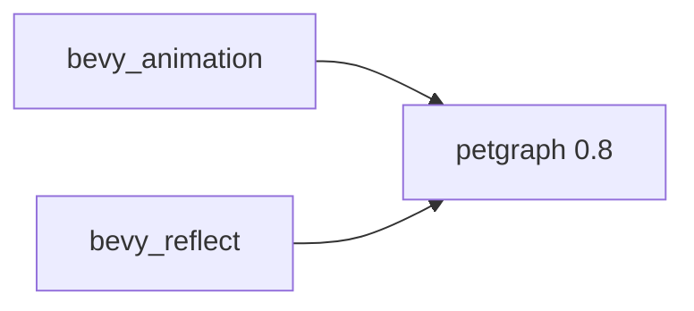

+++
title = "#19878 Update petgraph requirement from 0.7 to 0.8"
date = "2025-06-30T00:00:00"
draft = false
template = "pull_request_page.html"
in_search_index = true

[taxonomies]
list_display = ["show"]

[extra]
current_language = "en"
available_languages = {"en" = { name = "English", url = "/pull_request/bevy/2025-06/pr-19878-en-20250630" }, "zh-cn" = { name = "中文", url = "/pull_request/bevy/2025-06/pr-19878-zh-cn-20250630" }}
labels = ["C-Dependencies", "D-Straightforward"]
+++

## Analysis of PR #19878: Update petgraph requirement from 0.7 to 0.8

### Basic Information
- **Title**: Update petgraph requirement from 0.7 to 0.8
- **PR Link**: https://github.com/bevyengine/bevy/pull/19878
- **Author**: app/dependabot
- **Status**: MERGED
- **Labels**: C-Dependencies, D-Straightforward, S-Needs-Review
- **Created**: 2025-06-30T08:25:45Z
- **Merged**: 2025-06-30T17:15:40Z
- **Merged By**: mockersf

### The Story of This Pull Request

#### Context and Motivation
The PR addresses routine dependency maintenance by updating the `petgraph` library from version 0.7 to 0.8. This dependency is used in Bevy's animation and reflection systems for graph data structure operations. Keeping dependencies current is essential for several reasons:
- Accessing bug fixes and performance improvements in newer library versions
- Preventing dependency staleness which complicates future upgrades
- Maintaining compatibility with other ecosystem crates
- Addressing potential security vulnerabilities

As an automated dependency update from Dependabot, this change follows standard maintenance procedures for the project.

#### Implementation Approach
The update required minimal changes since the new version maintained API compatibility for Bevy's usage patterns. The implementation consisted of:
1. Modifying version specifiers in Cargo.toml files
2. Verifying feature compatibility (`serde-1` feature preserved)
3. Ensuring no breaking changes affected existing functionality

The changes were isolated to dependency declarations with no modifications to actual source code, indicating backward compatibility of the update. The CI pipeline would validate that all tests passed with the new dependency version.

#### Technical Impact
The primary benefits of this update include:
- Access to petgraph's performance optimizations in graph algorithms
- Potential memory usage improvements in graph operations
- Compatibility with other crates requiring petgraph ≥0.8
- Reduced technical debt through dependency currency

Since the changes were minimal and contained, the risk of regression was low. The preservation of the `serde-1` feature flag ensured serialization behavior remained consistent.

### Visual Representation



### Key Files Changed

#### 1. `crates/bevy_animation/Cargo.toml`
**Change**: Updated petgraph dependency version  
**Reason**: Ensure animation graph operations use latest stable version  
**Diff**:
```diff
# crates/bevy_animation/Cargo.toml
# Before:
petgraph = { version = "0.7", features = ["serde-1"] }

# After:
petgraph = { version = "0.8", features = ["serde-1"] }
```

#### 2. `crates/bevy_reflect/Cargo.toml`
**Change**: Updated petgraph dependency version  
**Reason**: Maintain consistency in reflection system's graph operations  
**Diff**:
```diff
# crates/bevy_reflect/Cargo.toml
# Before:
petgraph = { version = "0.7", features = ["serde-1"], optional = true }

# After:
petgraph = { version = "0.8", features = ["serde-1"], optional = true }
```

### Further Reading
1. [petgraph Changelog](https://github.com/petgraph/petgraph/blob/master/CHANGELOG.md) - Details changes between versions
2. [Dependabot Documentation](https://docs.github.com/en/code-security/dependabot) - Automated dependency management
3. [Semantic Versioning](https://semver.org/) - Understanding version number semantics
4. [Cargo Specifying Dependencies](https://doc.rust-lang.org/cargo/reference/specifying-dependencies.html) - Dependency management in Rust