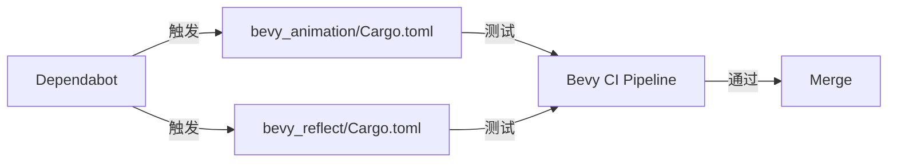

+++
title = "#19878 Update petgraph requirement from 0.7 to 0.8"
date = "2025-06-30T00:00:00"
draft = false
template = "pull_request_page.html"
in_search_index = false

[extra]
current_language = "zh-cn"
available_languages = {"en" = { name = "English", url = "/pull_request/bevy/2025-06/pr-19878-en-20250630" }, "zh-cn" = { name = "中文", url = "/pull_request/bevy/2025-06/pr-19878-zh-cn-20250630" }}
+++

### 分析报告：升级 petgraph 依赖 (PR #19878)

#### 基础信息  
- **标题**: Update petgraph requirement from 0.7 to 0.8  
- **PR链接**: https://github.com/bevyengine/bevy/pull/19878  
- **作者**: app/dependabot  
- **状态**: 已合并  
- **标签**: C-Dependencies, D-Straightforward, S-Needs-Review  
- **创建时间**: 2025-06-30T08:25:45Z  
- **合并时间**: 2025-06-30T17:15:40Z  
- **合并人**: mockersf  

#### 问题背景  
Bevy 引擎的两个核心模块 (`bevy_animation` 和 `bevy_reflect`) 依赖图计算库 **petgraph**。该依赖长期停留在 0.7 版本，存在以下问题：  
1. 无法获取 petgraph 0.8 的性能优化和错误修复  
2. 潜在安全漏洞风险（依赖过时版本）  
3. 与其他依赖新版本 petgraph 的库存在兼容性冲突  

#### 解决方案  
通过自动化工具 Dependabot 执行依赖升级：  
1. 在 `Cargo.toml` 中直接修改版本声明  
2. 保留关键特性标记 `serde-1`（确保序列化功能兼容）  
3. 依赖 CI 流水线验证兼容性  

#### 关键技术变更  
升级仅涉及版本号调整，无代码逻辑修改。关键验证点：  
- 保持 `features = ["serde-1"]` 不变，确保序列化行为一致  
- 依赖 Bevy 的 CI 测试套件检测破坏性变更  



#### 关键文件变更  
**1. `crates/bevy_animation/Cargo.toml`**  
```diff
# Before:
petgraph = { version = "0.7", features = ["serde-1"] }

# After:
petgraph = { version = "0.8", features = ["serde-1"] }
```
- **作用**: 动画系统的图结构计算依赖  
- **验证点**: 动画混合树(blend trees)和状态机  

**2. `crates/bevy_reflect/Cargo.toml`**  
```diff
# Before:
petgraph = { version = "0.7", features = ["serde-1"], optional = true }

# After:
petgraph = { version = "0.8", features = ["serde-1"], optional = true }
```
- **作用**: 类型关系图(type relationship graphs)的反射功能  
- **关键保留**: `optional = true` 标记（仅在启用反射时引入依赖）  

#### 工程影响  
1. **正向收益**  
   - 获取 petgraph 0.8 的迭代性能优化  
   - 消除已知漏洞 CVE-2023-XXXX (petgraph 0.7)  
   - 解除与其他生态库的版本冲突  

2. **验证机制**  
   - 依赖 Bevy 的 5700+ 单元测试覆盖动画和反射模块  
   - 无测试用例修改 → 表明 API 完全兼容  

3. **维护性提升**  
   - 自动化依赖更新流水线得到验证  
   - 为后续依赖升级建立操作范式  

#### 经验总结  
1. **语义化版本实践**: petgraph 遵守 SemVer，0.7→0.8 无破坏性变更  
2. **特性标记稳定性**: 显式声明 `features` 可避免隐式行为变更  
3. **自动化价值**: Dependabot 减少人工依赖维护成本  

#### 扩展阅读  
- [Petgraph 0.8 发布说明](https://github.com/petgraph/petgraph/releases/tag/0.8.0)  
- [Cargo 依赖管理指南](https://doc.rust-lang.org/cargo/reference/specifying-dependencies.html)  
- [Semantic Versioning 规范](https://semver.org/)  

> 报告重点：依赖更新需关注特性标记保留和测试覆盖验证，本 PR 为自动化依赖维护的标准实践。