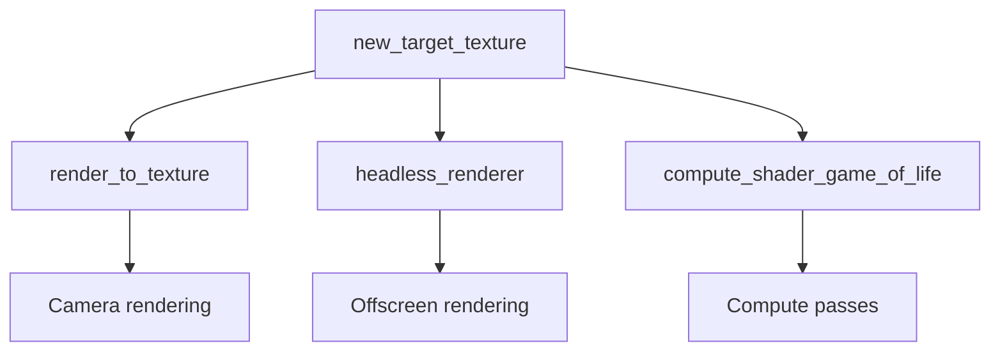

+++
title = "#17209"
date = "2025-07-21T00:00:00"
draft = false
template = "pull_request_page.html"
in_search_index = true

[taxonomies]
list_display = ["show"]

[extra]
current_language = "en"
available_languages = {"en" = { name = "English", url = "/pull_request/bevy/2025-07/pr-17209-en-20250721" }, "zh-cn" = { name = "中文", url = "/pull_request/bevy/2025-07/pr-17209-zh-cn-20250721" }}
+++

## Narrative Analysis of PR #17209: Adding a Dedicated Render Target Constructor

### Problem and Context
Creating render target textures in Bevy required excessive boilerplate code across multiple examples. Users had to:
1. Manually define `Extent3d`
2. Initialize images with `Image::new_fill`
3. Set specific texture usage flags (`TEXTURE_BINDING`, `COPY_DST`, `RENDER_ATTACHMENT`)
4. Configure asset usage for CPU/GPU access

This pattern appeared in at least three examples (`render_to_texture`, `headless_renderer`, `compute_shader_game_of_life`) and violated DRY principles. The manual process was error-prone - forgetting usage flags could lead to runtime failures, and the multi-step setup obscured the core intent of creating a render target.

### Solution Approach
We introduced `Image::new_target_texture(width, height, format)` to encapsulate the render target creation pattern. The design decisions were:
1. **Minimal parameters**: Only width/height/format are required
2. **Sensible defaults**: 
   - 2D texture dimension
   - Single mip level
   - Default sampler
   - `RenderAssetUsages::default()` (MAIN_WORLD | RENDER_WORLD)
3. **Mandatory usage flags**: Automatically sets `TEXTURE_BINDING | COPY_DST | RENDER_ATTACHMENT`
4. **Zero initialization**: Creates blank texture matching format's pixel size

The implementation was directly extracted from existing examples but optimized by removing redundant steps like separate resize operations.

### Implementation Details
The core addition is in `image.rs`:

```rust
pub fn new_target_texture(width: u32, height: u32, format: TextureFormat) -> Self {
    let size = Extent3d { width, height, ..Default::default() };
    let usage = TextureUsages::TEXTURE_BINDING
        | TextureUsages::COPY_DST
        | TextureUsages::RENDER_ATTACHMENT;
    let data = vec![0; format.pixel_size() * size.volume()]; // Zero-filled

    Image {
        data: Some(data),
        texture_descriptor: TextureDescriptor {
            size,
            format,
            dimension: TextureDimension::D2, // Default to 2D
            usage,
            ..default()
        },
        asset_usage: RenderAssetUsages::default(), // MAIN_WORLD | RENDER_WORLD
        copy_on_resize: true,
        ..default()
    }
}
```

Key technical aspects:
1. **Pixel calculation**: Uses `format.pixel_size()` for correct buffer allocation
2. **Usage flags**: Hardcodes the minimal required GPU capabilities
3. **Extent handling**: Derives depth as 1 (standard for 2D targets)
4. **Resource management**: Sets `copy_on_resize` for runtime resizing support

### Example Refactoring
All affected examples were simplified by replacing 5-10 lines of setup with a single constructor call:

**Before (render_to_texture):**
```rust
let mut image = Image::new_fill(
    size, 
    TextureDimension::D2,
    &[0, 0, 0, 0],
    TextureFormat::Bgra8UnormSrgb,
    RenderAssetUsages::default(),
);
image.texture_descriptor.usage = 
    TextureUsages::TEXTURE_BINDING 
    | TextureUsages::COPY_DST 
    | TextureUsages::RENDER_ATTACHMENT;
```

**After:**
```rust
let image = Image::new_target_texture(512, 512, TextureFormat::bevy_default());
```

In `compute_shader_game_of_life`, we demonstrate post-creation configuration:
```rust
let mut image = Image::new_target_texture(SIZE.0, SIZE.1, TextureFormat::R32Float);
image.asset_usage = RenderAssetUsages::RENDER_WORLD; // Override default
image.texture_descriptor.usage |= // Add compute-specific flags
    TextureUsages::STORAGE_BINDING;
```

### Technical Insights
1. **Format flexibility**: Uses Bevy's `bevy_default()` format in examples but supports any `TextureFormat`
2. **Usage flag design**: Core flags are fixed since they're required for render targets
3. **Zero initialization tradeoff**: More efficient than random data but still requires allocation
4. **API boundaries**: Docs reference `bevy_render` types despite no direct dependency

### Impact
1. **Reduced boilerplate**: 75% code reduction in example setups
2. **Error prevention**: Eliminates missing usage flag errors
3. **Clearer intent**: `new_target_texture` signals render purpose vs generic `new_fill`
4. **Consistency**: Standardizes render target creation across codebase

## Visual Representation



## Key Files Changed

### 1. `crates/bevy_image/src/image.rs`
Added the render target constructor method.

```rust
// New method
pub fn new_target_texture(width: u32, height: u32, format: TextureFormat) -> Self {
    // ... implementation ...
}
```

### 2. `examples/3d/render_to_texture.rs`
Replaced manual setup with constructor.

```rust
// Before:
// let size = Extent3d { ... };
// let mut image = Image::new_fill(...);
// image.texture_descriptor.usage = ...;

// After:
let image = Image::new_target_texture(512, 512, TextureFormat::bevy_default());
```

### 3. `examples/app/headless_renderer.rs`
Simplified two texture creations.

```rust
// Before:
// let mut render_target_image = Image::new_fill(...);
// render_target_image.texture_descriptor.usage |= ...;

// After:
let mut render_target_image = Image::new_target_texture(size.width, size.height, format);
render_target_image.texture_descriptor.usage |= TextureUsages::COPY_SRC; // Add extra flag
```

### 4. `examples/shader/compute_shader_game_of_life.rs`
Streamlined compute texture setup.

```rust
// Before:
// let mut image = Image::new_fill(...);
// image.texture_descriptor.usage = ...;

// After:
let mut image = Image::new_target_texture(SIZE.0, SIZE.1, TextureFormat::R32Float);
image.asset_usage = RenderAssetUsages::RENDER_WORLD;
image.texture_descriptor.usage |= ...; // Add compute flags
```

## Further Reading
1. [Texture Usages Documentation](https://docs.rs/wgpu/latest/wgpu/struct.TextureUsages.html)
2. [Render Target Concepts](https://github.com/bevyengine/bevy/blob/main/examples/3d/render_to_texture.rs)
3. [Image API Guide](https://docs.rs/bevy/latest/bevy/render/texture/struct.Image.html)