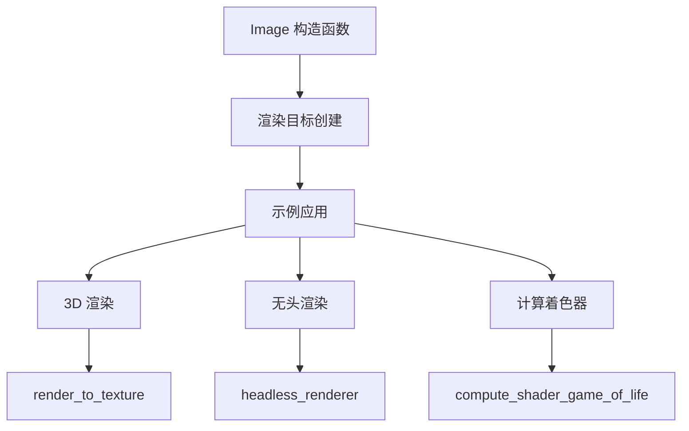

+++
title = "#17209 添加专门用于渲染到纹理的 Image 构造函数"
date = "2025-07-21T00:00:00"
draft = false
template = "pull_request_page.html"
in_search_index = false

[extra]
current_language = "zh-cn"
available_languages = {"en" = { name = "English", url = "/pull_request/bevy/2025-07/pr-17209-en-20250721" }, "zh-cn" = { name = "中文", url = "/pull_request/bevy/2025-07/pr-17209-zh-cn-20250721" }}
+++

# Add Image constructor specialised for rendering to a texture

## Basic Information
- **标题**: 添加专门用于渲染到纹理的 Image 构造函数
- **PR 链接**: https://github.com/bevyengine/bevy/pull/17209
- **作者**: tigregalis
- **状态**: 已合并
- **标签**: A-Rendering, C-Usability, S-Ready-For-Final-Review, D-Straightforward
- **创建时间**: 2025-01-07T05:50:01Z
- **合并时间**: 2025-07-21T22:43:13Z
- **合并者**: alice-i-cecile

## 描述翻译
### 目标
修复 #7358  
重做 #7360  

提升易用性。现有的创建渲染目标纹理的代码存在大量难以理解的样板代码，这些可以通过简化外部用户API来改进。

### 解决方案
- 提取 render_to_target 示例的部分代码，将其转化为 `Image` 的新构造函数，仅需在 `Default` 实现基础上做最小修改
- 更新 render_to_target 示例使用新 API

严格来说，构造函数和示例有两个小区别：
1. 示例在初始化 `Image` 时设置 `size`，然后调用 `resize`，但 `resize` 本身会设置 `size`，因此无需额外步骤  
2. 示例设置 `Image.texture_descriptor.format` 为 `TextureFormat::Bgra8UnormSrgb`，但默认实现通过 `wgpu::TextureFormat::bevy_default()` 设置为 `TextureFormat::Rgba8UnormSrgb`。不确定具体影响，但在测试环境中正常工作

有意识只将 `width` 和 `height` 作为参数，但考虑其他属性是否也应作为参数暴露。

### 变更日志
#### 新增
添加 `Image::new_target_texture` 构造函数，简化渲染目标纹理的创建

### 备注
- 这是对 https://github.com/bevyengine/bevy/pull/7360 的重做 - 包含相关代码风格讨论
- 方法文档需要引用 `bevy_render::camera::Camera` 和 `bevy_render::camera::RenderTarget::Image`。`bevy_image` 曾属于 `bevy_render` 后被拆分，且 `bevy_image` 不依赖 `bevy_render`。建议如何解决？

## PR 技术分析

### 问题背景
在 Bevy 引擎中创建渲染目标纹理（render target textures）存在明显的易用性问题。开发者需要手动配置多个属性：
1. 显式设置纹理尺寸
2. 填充零值数据
3. 配置正确的纹理使用标志（texture usage flags）
4. 设置纹理维度（texture dimension）
5. 指定资源用途（asset usage）

现有方法 `Image::new_fill` 需要开发者理解底层细节，导致类似以下冗长代码：

```rust
let mut image = Image::new_fill(
    Extent3d { width: 512, height: 512, ..default() },
    TextureDimension::D2,
    &[0, 0, 0, 0],
    TextureFormat::Bgra8UnormSrgb,
    RenderAssetUsages::default(),
);
image.texture_descriptor.usage = 
    TextureUsages::TEXTURE_BINDING | 
    TextureUsages::COPY_DST | 
    TextureUsages::RENDER_ATTACHMENT;
```

多个示例中重复此模式，违反 DRY 原则并增加错误风险。问题 #7358 专门指出此痛点，需要简化渲染目标创建流程。

### 解决方案设计
核心方案是引入专用构造函数 `Image::new_target_texture`，封装渲染目标的通用配置：
1. 仅需三个参数：宽度、高度和纹理格式
2. 自动计算纹理尺寸和体积
3. 预配置关键使用标志
4. 初始化零值数据缓冲区
5. 设置合理的默认值（单 mip 层级、单采样等）

设计决策：
- **参数最小化**：仅暴露必要参数（width, height, format），其他属性使用合理默认值
- **安全默认值**：自动配置 `RENDER_ATTACHMENT` 等关键使用标志
- **数据初始化**：用零值填充缓冲区，确保可预测的初始状态
- **资源用途**：默认启用 `MAIN_WORLD | RENDER_WORLD` 确保 CPU/GPU 可访问

替代方案考虑：
1. 扩展 `Image::new_fill` 增加可选参数 - 会破坏现有调用点
2. 创建独立类型 `RenderTargetImage` - 增加类型系统复杂度
最终选择专用构造函数作为侵入性最小的解决方案

### 技术实现
在 `crates/bevy_image/src/image.rs` 新增构造函数：

```rust
pub fn new_target_texture(width: u32, height: u32, format: TextureFormat) -> Self {
    let size = Extent3d {
        width,
        height,
        ..Default::default()
    };
    let usage = TextureUsages::TEXTURE_BINDING
        | TextureUsages::COPY_DST
        | TextureUsages::RENDER_ATTACHMENT;
    let data = vec![0; format.pixel_size() * size.volume()];

    Image {
        data: Some(data),
        data_order: TextureDataOrder::default(),
        texture_descriptor: TextureDescriptor {
            size,
            format,
            dimension: TextureDimension::D2,
            label: None,
            mip_level_count: 1,
            sample_count: 1,
            usage,
            view_formats: &[],
        },
        sampler: ImageSampler::Default,
        texture_view_descriptor: None,
        asset_usage: RenderAssetUsages::default(),
        copy_on_resize: true,
    }
}
```

关键实现细节：
1. **尺寸计算**：通过 `size.volume()` 计算缓冲区大小
2. **格式处理**：`format.pixel_size()` 确保正确字节对齐
3. **使用标志**：强制包含 `RENDER_ATTACHMENT` 等必要标志
4. **默认值**：
   - 2D 纹理维度（TextureDimension::D2）
   - 单 mip 层级（mip_level_count: 1）
   - 默认采样器（ImageSampler::Default）
   - 启用调整大小复制（copy_on_resize: true）

### 示例更新
三个示例更新展示新 API 的使用简化：

**示例 1: 3D 渲染到纹理 (before)**
```rust
let mut image = Image::new_fill(
    size,
    TextureDimension::D2,
    &[0, 0, 0, 0],
    TextureFormat::Bgra8UnormSrgb,
    RenderAssetUsages::default(),
);
image.texture_descriptor.usage =
    TextureUsages::TEXTURE_BINDING | 
    TextureUsages::COPY_DST | 
    TextureUsages::RENDER_ATTACHMENT;
```

**示例 1: 3D 渲染到纹理 (after)**
```rust
let image = Image::new_target_texture(512, 512, TextureFormat::bevy_default());
```

**示例 2: 无头渲染器**
```rust
// 创建渲染目标
let mut render_target_image =
    Image::new_target_texture(size.width, size.height, TextureFormat::bevy_default());
render_target_image.texture_descriptor.usage |= TextureUsages::COPY_SRC;

// 创建拷贝目标
let cpu_image =
    Image::new_target_texture(size.width, size.height, TextureFormat::bevy_default());
```

**示例 3: 计算着色器**
```rust
let mut image = Image::new_target_texture(SIZE.0, SIZE.1, TextureFormat::R32Float);
image.asset_usage = RenderAssetUsages::RENDER_WORLD;
image.texture_descriptor.usage =
    TextureUsages::COPY_DST | 
    TextureUsages::STORAGE_BINDING | 
    TextureUsages::TEXTURE_BINDING;
```

### 技术影响
1. **代码简化**：示例代码减少 50-80%，如 render_to_texture.rs 从 23 行减至 2 行
2. **错误预防**：强制设置关键使用标志，避免遗漏必要配置
3. **一致性**：统一渲染目标创建模式，降低认知负荷
4. **文档价值**：构造函数文档明确说明适用场景（镜子、UI、图像导出）

潜在改进点：
- 可考虑增加更多参数控制（如 mip_level_count）
- 支持 3D 纹理目标
- 优化零值初始化性能

## 组件关系图


## 关键文件变更
### crates/bevy_image/src/image.rs (+52/-0)
新增渲染目标专用构造函数：
```rust
pub fn new_target_texture(width: u32, height: u32, format: TextureFormat) -> Self {
    let size = Extent3d { width, height, ..Default::default() };
    let usage = TextureUsages::TEXTURE_BINDING
        | TextureUsages::COPY_DST
        | TextureUsages::RENDER_ATTACHMENT;
    let data = vec![0; format.pixel_size() * size.volume()];
    
    Image {
        data: Some(data),
        texture_descriptor: TextureDescriptor {
            size,
            format,
            dimension: TextureDimension::D2,
            mip_level_count: 1,
            sample_count: 1,
            usage,
            ..default()
        },
        asset_usage: RenderAssetUsages::default(),
        ..default()
    }
}
```

### examples/3d/render_to_texture.rs (+2/-21)
简化渲染目标创建：
```rust
// Before:
let mut image = Image::new_fill(size, TextureDimension::D2, &[0,0,0,0], ...);
image.texture_descriptor.usage = ...;

// After:
let image = Image::new_target_texture(512, 512, TextureFormat::bevy_default());
```

### examples/app/headless_renderer.rs (+9/-20)
统一使用新构造函数：
```rust
// 渲染目标
let mut render_target_image = Image::new_target_texture(...);
render_target_image.texture_descriptor.usage |= ...;

// CPU 图像
let cpu_image = Image::new_target_texture(...);
```

### examples/shader/compute_shader_game_of_life.rs (+2/-11)
简化计算着色器目标设置：
```rust
// Before:
let mut image = Image::new_fill(Extent3d {...}, ...);

// After:
let mut image = Image::new_target_texture(SIZE.0, SIZE.1, TextureFormat::R32Float);
image.asset_usage = ...;
image.texture_descriptor.usage = ...;
```

## 延伸阅读
1. [WebGPU Texture Usages 文档](https://gpuweb.github.io/gpuweb/#gputextureusage)
2. [Bevy 渲染管线架构](https://bevy-cheatbook.github.io/programming/render-pipelines.html)
3. [WGPU 纹理格式详解](https://sotrh.github.io/learn-wgpu/beginner/tutorial5-textures/#texture-formats)
4. [渲染目标最佳实践](https://github.com/bevyengine/bevy/discussions/6870)