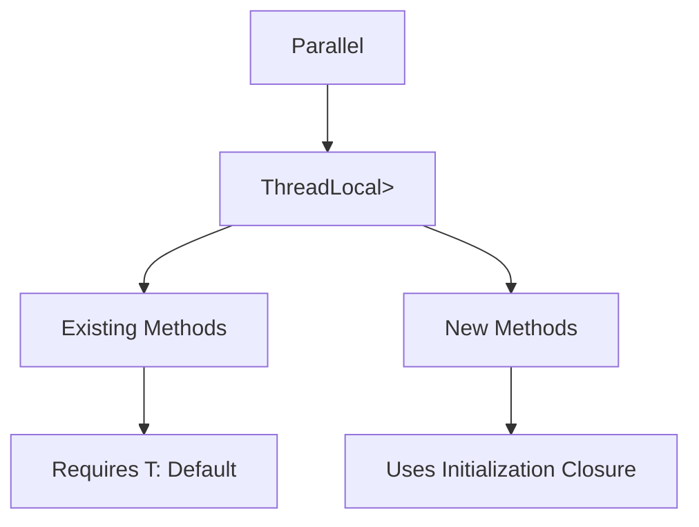

+++
title = "#17943 Make `Parallel<T>` more `T: !Default` accessible"
date = "2025-07-07T00:00:00"
draft = false
template = "pull_request_page.html"
in_search_index = true

[taxonomies]
list_display = ["show"]

[extra]
current_language = "en"
available_languages = {"en" = { name = "English", url = "/pull_request/bevy/2025-07/pr-17943-en-20250707" }, "zh-cn" = { name = "中文", url = "/pull_request/bevy/2025-07/pr-17943-zh-cn-20250707" }}
labels = ["C-Usability", "A-Utils", "D-Straightforward"]
+++

## Make `Parallel<T>` more `T: !Default` accessible

### Basic Information
- **Title**: Make `Parallel<T>` more `T: !Default` accessible
- **PR Link**: https://github.com/bevyengine/bevy/pull/17943
- **Author**: ItsDoot
- **Status**: MERGED
- **Labels**: C-Usability, S-Ready-For-Final-Review, A-Utils, D-Straightforward
- **Created**: 2025-02-20T05:36:30Z
- **Merged**: 2025-07-07T20:57:58Z
- **Merged By**: alice-i-cecile

### Description Translation
**Objective**  
`ThreadLocal::<T>::default()` doesn't require `T: Default`, so `Parallel<T>` shouldn't require it either.  

**Solution**  
- Replaced the `Default` derive with a manually specified impl.  
- Added `Parallel::borrow_local_mut_or` as a non-`T: Default`-requiring alternative to `borrow_local_mut`.  
- Added `Parallel::scope_or` as a non-`T: Default`-requiring alternative to `scope`.

---

### The Story of This Pull Request
The `Parallel<T>` utility was unnecessarily restrictive due to its reliance on `T: Default` for initialization. The original implementation derived `Default` for `Parallel<T>`, which implicitly required `T: Default`. However, the underlying `ThreadLocal` type doesn't require this constraint for its default initialization. This limitation prevented users from working with thread-local values for types that didn't implement `Default`.

To resolve this, the `Default` derive was replaced with a manual implementation that constructs `Parallel` using `ThreadLocal::default()`, which doesn't require `T: Default`. The core of the solution involved introducing two new methods:
1. `borrow_local_mut_or` - Takes a closure to initialize non-`Default` types
2. `scope_or` - Provides initialization flexibility through a closure parameter

These new methods serve as generalized alternatives to the existing `borrow_local_mut` and `scope` methods. The existing methods were refactored to use the new implementations with `Default::default`, preserving backward compatibility while eliminating the trait constraint at the struct level. This approach maintains the existing API surface while extending functionality to support non-`Default` types.

The changes demonstrate a clear pattern: when a type's functionality depends on initialization logic, providing closure-based initialization parameters offers greater flexibility than trait-based constraints. This is particularly valuable for utility types like `Parallel` that need to accommodate diverse use cases.

---

### Visual Representation


---

### Key Files Changed
**File:** `crates/bevy_utils/src/parallel_queue.rs`  
**Changes:**  
1. Removed automatic `Default` derivation  
2. Added closure-based initialization methods  
3. Implemented `Default` manually  
4. Refactored existing methods to use new primitives  

**Code Highlights:**  
```rust
// Before: Default derivation required T: Default
#[derive(Default)]
pub struct Parallel<T: Send> { ... }

// After: Manual Default implementation
impl<T: Send> Default for Parallel<T> {
    fn default() -> Self {
        Self {
            locals: ThreadLocal::default(),
        }
    }
}
```
```rust
// New closure-based initialization
pub fn scope_or<R>(&self, create: impl FnOnce() -> T, f: impl FnOnce(&mut T) -> R) -> R {
    f(&mut self.borrow_local_mut_or(create))
}

pub fn borrow_local_mut_or(
    &self,
    create: impl FnOnce() -> T,
) -> impl DerefMut<Target = T> + '_ {
    self.locals.get_or(|| RefCell::new(create())).borrow_mut()
}
```
```rust
// Existing methods refactored
impl<T: Default + Send> Parallel<T> {
    pub fn scope<R>(&self, f: impl FnOnce(&mut T) -> R) -> R {
        self.scope_or(Default::default, f)
    }

    pub fn borrow_local_mut(&self) -> impl DerefMut<Target = T> + '_ {
        self.borrow_local_mut_or(Default::default)
    }
}
```

---

### Further Reading
1. [ThreadLocal documentation](https://docs.rs/thread-local/latest/thread_local/)  
2. [Rust Default trait](https://doc.rust-lang.org/std/default/trait.Default.html)  
3. [Bevy's Parallel Queue implementation](https://github.com/bevyengine/bevy/blob/main/crates/bevy_utils/src/parallel_queue.rs)  
4. [Rust Closure Types](https://doc.rust-lang.org/book/ch13-01-closures.html)