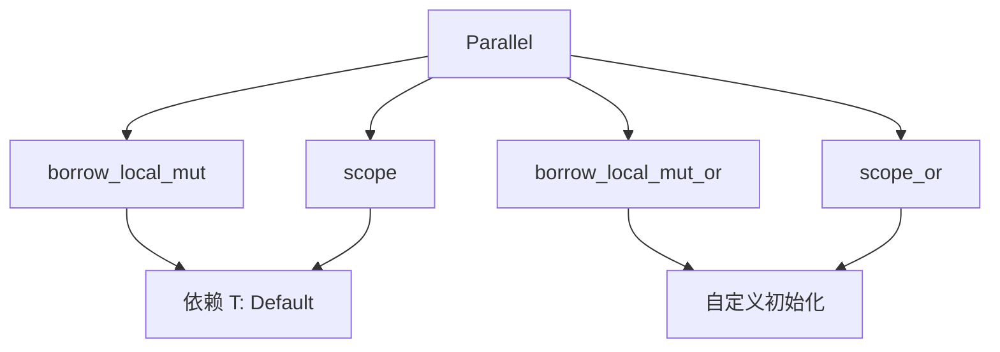

+++
title = "#17943 Make `Parallel<T>` more `T: !Default` accessible"
date = "2025-07-07T00:00:00"
draft = false
template = "pull_request_page.html"
in_search_index = false

[extra]
current_language = "zh-cn"
available_languages = {"en" = { name = "English", url = "/pull_request/bevy/2025-07/pr-17943-en-20250707" }, "zh-cn" = { name = "中文", url = "/pull_request/bevy/2025-07/pr-17943-zh-cn-20250707" }}
labels = ["C-Usability", "A-Utils", "D-Straightforward"]
+++

# Make `Parallel<T>` more `T: !Default` accessible

## Basic Information
- **Title**: Make `Parallel<T>` more `T: !Default` accessible
- **PR Link**: https://github.com/bevyengine/bevy/pull/17943
- **Author**: ItsDoot
- **Status**: MERGED
- **Labels**: C-Usability, S-Ready-For-Final-Review, A-Utils, D-Straightforward
- **Created**: 2025-02-20T05:36:30Z
- **Merged**: 2025-07-07T20:57:58Z
- **Merged By**: alice-i-cecile

## Description Translation
### 目标 (Objective)

`ThreadLocal::<T>::default()` 不需要 `T: Default`，因此 `Parallel<T>` 也不应该要求它。

### 解决方案 (Solution)

- 将 `Default` 派生替换为手动实现的 impl
- 添加 `Parallel::borrow_local_mut_or` 作为不需要 `T: Default` 的 `borrow_local_mut` 替代方案
- 添加 `Parallel::scope_or` 作为不需要 `T: Default` 的 `scope` 替代方案

## The Story of This Pull Request

### 问题背景
`Parallel<T>` 结构体用于管理线程本地存储（Thread-Local Storage），但其实现强制要求泛型类型 `T` 实现 `Default` trait。这种设计带来了不必要的约束：
```rust
#[derive(Default)]  // 强制要求 T: Default
pub struct Parallel<T: Send> {
    locals: ThreadLocal<RefCell<T>>,
}
```
底层依赖的 `thread_local::ThreadLocal` 本身并不需要 `T: Default`，这意味着 `Parallel<T>` 的限制是人为添加的。对于无法合理实现 `Default` 的类型（例如需要显式初始化的资源句柄），这种限制会阻碍 API 的使用。

### 解决方案实现
核心解决思路是移除 `T: Default` 的强制要求，同时保持向后兼容。具体实现分为三个关键部分：

1. **移除 Default 派生**
   首先删除自动派生的 `Default` 实现，避免编译器自动添加 `T: Default` 约束：
   ```diff
   - #[derive(Default)]
   pub struct Parallel<T: Send> {
   ```

2. **添加无约束替代方法**
   新增两个方法，通过闭包参数提供初始化逻辑，完全移除 `T: Default` 要求：
   ```rust
   pub fn scope_or<R>(&self, create: impl FnOnce() -> T, f: impl FnOnce(&mut T) -> R) -> R {
       f(&mut self.borrow_local_mut_or(create))
   }
   
   pub fn borrow_local_mut_or(
       &self,
       create: impl FnOnce() -> T,
   ) -> impl DerefMut<Target = T> + '_ {
       self.locals.get_or(|| RefCell::new(create())).borrow_mut()
   }
   ```
   其中 `create` 闭包允许调用方自定义初始化逻辑，例如 `|| MyType::new("config")`。

3. **重构现有方法**
   修改原有的 `scope` 和 `borrow_local_mut` 方法，使其复用新方法，保持向后兼容：
   ```rust
   pub fn scope<R>(&self, f: impl FnOnce(&mut T) -> R) -> R {
       self.scope_or(Default::default, f)
   }
   
   pub fn borrow_local_mut(&self) -> impl DerefMut<Target = T> + '_ {
       self.borrow_local_mut_or(Default::default)
   }
   ```
   这些方法仍要求 `T: Default`，但实现已简化为对新方法的包装。

4. **手动实现 Default**
   为避免破坏现有代码，手动实现不依赖 `T: Default` 的 `Default` trait：
   ```rust
   impl<T: Send> Default for Parallel<T> {
       fn default() -> Self {
           Self {
               locals: ThreadLocal::default(),
           }
       }
   }
   ```

### 技术影响
1. **API 灵活性提升**：非 `Default` 类型现在可通过 `borrow_local_mut_or` 和 `scope_or` 使用线程本地存储
2. **零成本抽象**：新方法在 `T: Default` 场景下性能与原实现相同
3. **向后兼容**：所有现有使用 `scope`/`borrow_local_mut` 的代码无需修改
4. **实现简化**：通过方法复用减少了重复代码（DRY 原则）

## Visual Representation



## Key Files Changed

### crates/bevy_utils/src/parallel_queue.rs
1. **移除自动派生 Default**  
   避免强制要求 `T: Default`，允许非默认类型使用
   ```diff
   - #[derive(Default)]
   pub struct Parallel<T: Send> {
   ```

2. **新增灵活初始化方法**  
   提供自定义初始化能力，消除 `T: Default` 约束
   ```rust
   pub fn scope_or<R>(&self, create: impl FnOnce() -> T, f: impl FnOnce(&mut T) -> R) -> R {
       f(&mut self.borrow_local_mut_or(create))
   }
   
   pub fn borrow_local_mut_or(
       &self,
       create: impl FnOnce() -> T,
   ) -> impl DerefMut<Target = T> + '_ {
       self.locals.get_or(|| RefCell::new(create())).borrow_mut()
   }
   ```

3. **重构现有方法**  
   保持向后兼容的同时简化实现
   ```rust
   pub fn scope<R>(&self, f: impl FnOnce(&mut T) -> R) -> R {
       self.scope_or(Default::default, f)
   }
   
   pub fn borrow_local_mut(&self) -> impl DerefMut<Target = T> + '_ {
       self.borrow_local_mut_or(Default::default)
   }
   ```

4. **手动实现 Default**  
   确保结构体本身仍可默认初始化
   ```rust
   impl<T: Send> Default for Parallel<T> {
       fn default() -> Self {
           Self {
               locals: ThreadLocal::default(),
           }
       }
   }
   ```

## Further Reading
1. [Rust 闭包特性](https://doc.rust-lang.org/book/ch13-01-closures.html)
2. [线程本地存储模式](https://doc.rust-lang.org/std/thread/struct.LocalKey.html)
3. [零成本抽象原则](https://blog.rust-lang.org/2015/05/11/traits.html)