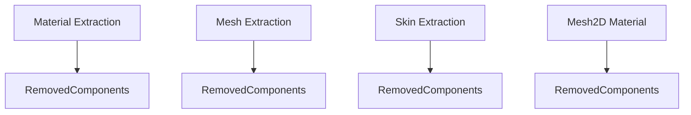

+++
title = "#17976 Material, mesh, skin extraction optimization"
date = "2025-07-09T00:00:00"
draft = false
template = "pull_request_page.html"
in_search_index = true

[taxonomies]
list_display = ["show"]

[extra]
current_language = "en"
available_languages = {"en" = { name = "English", url = "/pull_request/bevy/2025-07/pr-17976-en-20250709" }, "zh-cn" = { name = "中文", url = "/pull_request/bevy/2025-07/pr-17976-zh-cn-20250709" }}
labels = ["A-Rendering", "C-Performance"]
+++

## Material, Mesh, Skin Extraction Optimization

### Basic Information
- **Title**: Material, mesh, skin extraction optimization
- **PR Link**: https://github.com/bevyengine/bevy/pull/17976
- **Author**: brianreavis
- **Status**: MERGED
- **Labels**: A-Rendering, C-Performance, S-Needs-Review
- **Created**: 2025-02-21T19:31:34Z
- **Merged**: 2025-07-09T06:43:40Z
- **Merged By**: superdump

### Description Translation
#### Objective

The extraction systems for materials, meshes, and skins previously iterated over `RemovedComponents<ViewVisibility>` in addition to more specific variants like `RemovedComponents<MeshMaterial3d<M>>`. This caused each system to loop through and check many irrelevant despawned entities—sometimes multiple times. With many material types, this overhead added up and became noticeable in frames with many despawns.


#### Solution

This PR removes superfluous `RemovedComponents` iteration for `ViewVisibility` and `GlobalTransform`, ensuring that we only iterate over the most specific `RemovedComponents` relevant to the system (e.g., material components, mesh components). This is guaranteed to match what the system originally collected.

#### Before (red) / After (yellow):

Log plot to highlight the long tail that this PR is addressing.

---

### The Story of This Pull Request

The extraction systems for materials, meshes, and skins were causing performance issues due to inefficient handling of despawned entities. Each system was processing multiple removal queries for different component types, including both specific render components and more general components like `ViewVisibility` and `GlobalTransform`. This resulted in redundant iterations over irrelevant entities, particularly noticeable in scenes with high entity turnover.

The core problem stemmed from how removal detection was implemented. Extraction systems were using chains of removal queries like:

```rust
for entity in removed_visibilities_query
    .read()
    .chain(removed_global_transforms_query.read())
    .chain(removed_meshes_query.read())
{
    // Processing logic
}
```

This approach caused three performance issues:
1. Multiple queries were processed even when only one was relevant
2. The same entity might appear in multiple removal queries
3. Systems processed despawned entities that weren't relevant to their specific responsibilities

The solution refactors these systems to only process the most specific removal query relevant to their functionality. For example, the mesh extraction system now only checks for removed `Mesh3d` components instead of also checking `ViewVisibility` and `GlobalTransform` removals. This works because:
- Removal of a specific render component (like `Mesh3d`) already implies the entity is no longer relevant
- More general component removals don't necessarily indicate the entity should be removed from render systems
- This avoids duplicate processing of the same entity across multiple removal queries

The changes affect four key extraction systems across the rendering pipeline:

1. Material instance cleanup now uses `RemovedComponents<Mesh3d>` instead of `RemovedComponents<ViewVisibility>`
2. Mesh extraction only checks `RemovedComponents<Mesh3d>`
3. Skin extraction only checks `RemovedComponents<SkinnedMesh>`
4. 2D material extraction only checks `RemovedComponents<MeshMaterial2d>`

The implementation maintains correctness through two key mechanisms:
1. Systems still process all relevant entities through their primary queries
2. Removal cleanup only happens when a component is actually removed, not when related components change
3. The change preserves existing logic for handling re-added components in the same frame

Performance measurements show significant improvement, particularly in scenes with many despawning entities. The before/after comparison demonstrates reduced frame times and elimination of the long tail in extraction system execution times.

### Visual Representation



### Key Files Changed

#### 1. `crates/bevy_pbr/src/render/mesh.rs`
- **Purpose**: Optimizes mesh extraction by removing unnecessary removal queries
- **Changes**:
  - Removed `RemovedComponents<ViewVisibility>` and `RemovedComponents<GlobalTransform>` queries
  - Simplified removal processing to only use `RemovedComponents<Mesh3d>`
- **Code Comparison**:
```diff
pub fn extract_meshes_for_gpu_building(
    // ...
-    mut removed_visibilities_query: Extract<RemovedComponents<ViewVisibility>>,
-    mut removed_global_transforms_query: Extract<RemovedComponents<GlobalTransform>>,
     mut removed_meshes_query: Extract<RemovedComponents<Mesh3d>>,
     // ...
 ) {
     // ...
-    for entity in removed_visibilities_query
-        .read()
-        .chain(removed_global_transforms_query.read())
-        .chain(removed_meshes_query.read())
-    {
+    for entity in removed_meshes_query.read() {
         // Removal processing logic
     }
 }
```

#### 2. `crates/bevy_pbr/src/render/skin.rs`
- **Purpose**: Optimizes skin extraction by removing unnecessary removal queries
- **Changes**:
  - Removed `RemovedComponents<ViewVisibility>` query
  - Simplified removal processing to only use `RemovedComponents<SkinnedMesh>`
- **Code Comparison**:
```diff
pub fn extract_skins(
     // ...
-    mut removed_visibilities_query: Extract<RemovedComponents<ViewVisibility>>,
     mut removed_skinned_meshes_query: Extract<RemovedComponents<SkinnedMesh>>,
 ) {
     // ...
-    for skinned_mesh_entity in removed_visibilities_query
-        .read()
-        .chain(removed_skinned_meshes_query.read())
-    {
+    for skinned_mesh_entity in removed_skinned_meshes_query.read() {
         // Removal processing logic
     }
 }
```

#### 3. `crates/bevy_sprite/src/mesh2d/material.rs`
- **Purpose**: Optimizes 2D material extraction by removing unnecessary removal queries
- **Changes**:
  - Removed `RemovedComponents<ViewVisibility>` query
  - Simplified removal processing to only use `RemovedComponents<MeshMaterial2d<M>>`
- **Code Comparison**:
```diff
pub fn extract_mesh_materials_2d<M: Material2d>(
     // ...
-    mut removed_visibilities_query: Extract<RemovedComponents<ViewVisibility>>,
     mut removed_materials_query: Extract<RemovedComponents<MeshMaterial2d<M>>>,
 ) {
     // ...
-    for entity in removed_visibilities_query
-        .read()
-        .chain(removed_materials_query.read())
-    {
+    for entity in removed_materials_query.read() {
         // Removal processing logic
     }
 }
```

#### 4. `crates/bevy_pbr/src/material.rs`
- **Purpose**: Optimizes material instance cleanup
- **Changes**:
  - Switched from `RemovedComponents<ViewVisibility>` to `RemovedComponents<Mesh3d>`
  - More accurate tracking of when material instances should be cleaned up
- **Code Comparison**:
```diff
fn late_sweep_material_instances(
     mut material_instances: ResMut<RenderMaterialInstances>,
-    mut removed_visibilities_query: Extract<RemovedComponents<ViewVisibility>>,
+    mut removed_meshes_query: Extract<RemovedComponents<Mesh3d>>,
 ) {
     // ...
-    for entity in removed_visibilities_query.read() {
+    for entity in removed_meshes_query.read() {
         if let Entry::Occupied(occupied_entry) = material_instances.instances.entry(entity.into()) {
             // Cleanup logic
         }
     }
 }
```

### Further Reading
1. [Bevy ECS: Removal Detection Documentation](https://docs.rs/bevy_ecs/latest/bevy_ecs/removal/struct.RemovedComponents.html) - Official docs for removal detection
2. [System Query Parameters in Bevy](https://bevy-cheatbook.github.io/programming/system-param.html) - Guide to different query types
3. [Bevy Render Pipeline Architecture](https://github.com/bevyengine/bevy/blob/main/crates/bevy_render/src/renderer/mod.rs) - Source code for render pipeline