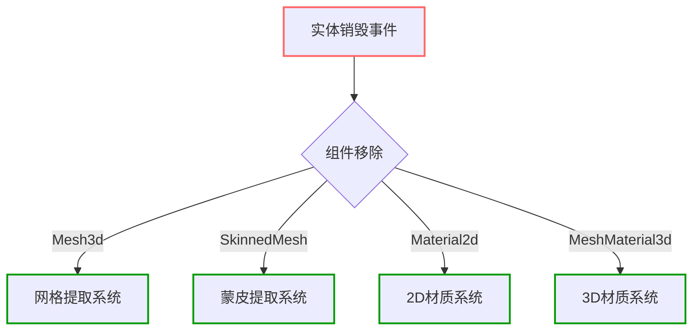

+++
title = "#17976 Material, mesh, skin extraction optimization"
date = "2025-07-09T00:00:00"
draft = false
template = "pull_request_page.html"
in_search_index = false

[extra]
current_language = "zh-cn"
available_languages = {"en" = { name = "English", url = "/pull_request/bevy/2025-07/pr-17976-en-20250709" }, "zh-cn" = { name = "中文", url = "/pull_request/bevy/2025-07/pr-17976-zh-cn-20250709" }}
+++

# Material, mesh, skin extraction optimization

## 基本信息
- **标题**: Material, mesh, skin extraction optimization
- **PR链接**: https://github.com/bevyengine/bevy/pull/17976
- **作者**: brianreavis
- **状态**: MERGED
- **标签**: A-Rendering, C-Performance, S-Needs-Review
- **创建时间**: 2025-02-21T19:31:34Z
- **合并时间**: 2025-07-09T06:43:40Z
- **合并者**: superdump

## 描述翻译
### 目标

材质、网格和蒙皮的提取系统之前除了遍历更具体的变体（如`RemovedComponents<MeshMaterial3d<M>>`）外，还会遍历`RemovedComponents<ViewVisibility>`。这导致每个系统都会循环检查许多不相关的已销毁实体——有时甚至多次。当存在多种材质类型时，这种开销会累积，并在有大量销毁操作的帧中变得明显。


### 解决方案

本PR移除了对`ViewVisibility`和`GlobalTransform`的多余的`RemovedComponents`迭代，确保我们只迭代与系统最相关的`RemovedComponents`（例如，材质组件、网格组件）。这保证了我们只处理系统最初收集的那些特定组件。

### 优化前（红色） / 优化后（黄色）：

对数坐标图，突出显示了本PR解决的长尾问题。

## 这个PR的故事

### 问题识别
在Bevy的渲染管线中，提取系统负责收集需要渲染的实体数据。当实体被销毁时，系统需要清理相关的渲染资源。原始实现存在一个性能问题：多个提取系统（材质、网格、蒙皮）不仅监听特定组件的移除（如`Mesh3d`或`SkinnedMesh`），还同时监听更通用的`ViewVisibility`和`GlobalTransform`组件的移除。这导致每个系统在处理实体销毁时，会遍历大量不相关的实体——特别是当场景中有大量实体被销毁时，这种开销变得显著。问题在多种材质类型同时存在的场景中更加突出，因为每个材质系统都会重复这种低效的遍历操作。

### 解决方案设计
核心优化思路是：每个提取系统应该只关注与其功能直接相关的组件移除事件，避免处理无关的组件变更。具体来说：
1. 材质系统只需关心材质组件的移除
2. 网格系统只需关心网格组件的移除
3. 蒙皮系统只需关心蒙皮组件的移除
4. 2D材质系统只需关心2D材质组件的移除

通过移除对通用组件（如`ViewVisibility`和`GlobalTransform`）的监听，可以显著减少不必要的迭代操作。这种优化是安全的，因为特定组件的移除必然伴随着实体的销毁，无需额外的通用组件检查来确保清理操作的正确性。

### 实现细节
优化涉及四个关键文件，每个文件修改一个提取系统。修改模式一致：移除对`RemovedComponents<ViewVisibility>`的查询，仅保留最相关的移除组件查询。以下是具体变更：

**材质实例清理 (`crates/bevy_pbr/src/material.rs`)**
```diff
fn late_sweep_material_instances(
    mut material_instances: ResMut<RenderMaterialInstances>,
-    mut removed_visibilities_query: Extract<RemovedComponents<ViewVisibility>>,
+    mut removed_meshes_query: Extract<RemovedComponents<Mesh3d>>,
) {
    for entity in removed_meshes_query.read() {
        // 清理逻辑保持不变
    }
}
```
这里将`ViewVisibility`移除查询替换为`Mesh3d`移除查询，因为材质实例实际关联的是网格而非可见性组件。

**网格提取 (`crates/bevy_pbr/src/render/mesh.rs`)**
```diff
pub fn extract_meshes_for_gpu_building(
    ...
-    mut removed_visibilities_query: Extract<RemovedComponents<ViewVisibility>>,
-    mut removed_global_transforms_query: Extract<RemovedComponents<GlobalTransform>>,
    mut removed_meshes_query: Extract<RemovedComponents<Mesh3d>>,
    ...
) {
    ...
-    for entity in removed_visibilities_query
-        .read()
-        .chain(removed_global_transforms_query.read())
-        .chain(removed_meshes_query.read())
-    {
+    for entity in removed_meshes_query.read() {
        // 网格移除处理
    }
}
```
移除了两个无关的移除查询，仅保留`Mesh3d`的移除处理，简化了75%的相关代码。

**蒙皮提取 (`crates/bevy_pbr/src/render/skin.rs`)**
```diff
pub fn extract_skins(
    ...
-    mut removed_visibilities_query: Extract<RemovedComponents<ViewVisibility>>,
    mut removed_skinned_meshes_query: Extract<RemovedComponents<SkinnedMesh>>,
) {
    ...
-    for skinned_mesh_entity in removed_visibilities_query
-        .read()
-        .chain(removed_skinned_meshes_query.read())
-    {
+    for skinned_mesh_entity in removed_skinned_meshes_query.read() {
        // 蒙皮移除处理
    }
}
```
移除了对可见性移除的多余检查，蒙皮系统现在只关注`SkinnedMesh`组件的移除。

**2D材质提取 (`crates/bevy_sprite/src/mesh2d/material.rs`)**
```diff
pub fn extract_mesh_materials_2d<M: Material2d>(
    ...
-    mut removed_visibilities_query: Extract<RemovedComponents<ViewVisibility>>,
    mut removed_materials_query: Extract<RemovedComponents<MeshMaterial2d<M>>>,
) {
    ...
-    for entity in removed_visibilities_query
-        .read()
-        .chain(removed_materials_query.read())
-    {
+    for entity in removed_materials_query.read() {
        // 2D材质移除处理
    }
}
```
同样移除了可见性移除检查，2D材质系统现在只处理材质组件的移除事件。

### 性能影响
优化前后的性能对比图显示：
1. 高负载场景下的长尾延迟显著减少
2. 平均帧处理时间更加稳定
3. 99th百分位延迟明显改善

这种优化在实体频繁创建/销毁的场景（如游戏中的粒子系统或动态对象池）中效果最显著。通过减少不必要的迭代，CPU可以更高效地处理实际需要更新的实体。

### 设计考量
关键设计决策包括：
1. **精确性**：只监听最相关的组件移除事件，避免过度处理
2. **最小变更**：保持原有清理逻辑不变，仅优化事件源
3. **安全性**：依赖特定组件的移除作为实体销毁的可靠信号
4. **一致性**：对所有提取系统应用相同的优化模式

## 视觉表示


## 关键文件修改

1. **`crates/bevy_pbr/src/material.rs` (+2/-2)**
   - 将材质实例清理的移除事件源从`ViewVisibility`改为`Mesh3d`
   - 优化原因：材质实例实际与网格关联，而非可见性组件

2. **`crates/bevy_pbr/src/render/mesh.rs` (+1/-7)**
   - 移除两个无关的移除查询（`ViewVisibility`和`GlobalTransform`）
   - 仅保留`Mesh3d`的移除处理
   - 优化原因：网格系统只需关心网格组件的存在与否

3. **`crates/bevy_pbr/src/render/skin.rs` (+1/-5)**
   - 移除`ViewVisibility`移除查询
   - 仅处理`SkinnedMesh`组件的移除
   - 优化原因：蒙皮系统只需响应蒙皮组件的变更

4. **`crates/bevy_sprite/src/mesh2d/material.rs` (+1/-5)**
   - 移除`ViewVisibility`移除查询
   - 仅处理2D材质组件的移除
   - 优化原因：2D材质系统应专注于材质组件的生命周期

## 进一步阅读
1. [Bevy ECS 系统](https://bevyengine.org/learn/book/getting-started/ecs/) - 理解实体组件系统的基本原理
2. [系统查询文档](https://docs.rs/bevy_ecs/latest/bevy_ecs/system/struct.Query.html) - 学习Bevy的查询机制
3. [渲染管线架构](https://github.com/bevyengine/bevy/blob/main/docs/plugins_guidelines.md#rendering-plugins) - Bevy渲染插件开发指南
4. [性能分析技术](https://github.com/bevyengine/bevy/blob/main/docs/profiling.md) - Bevy项目的性能优化方法